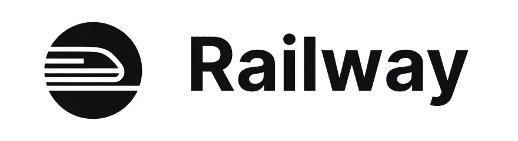
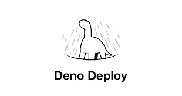
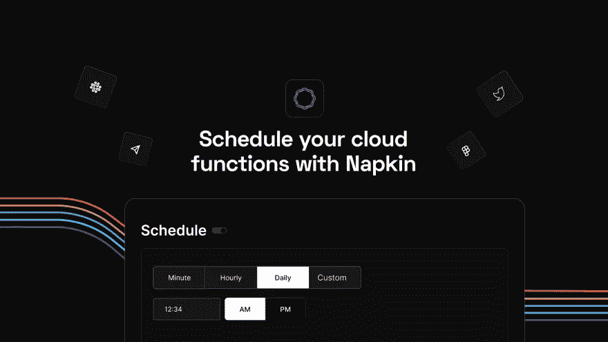

# Heroku 的免费替代品

> 原文：<https://javascript.plainenglish.io/free-alternatives-to-heroku-c7669af7912f?source=collection_archive---------6----------------------->

Heroku 长期以来一直是可扩展应用部署和管理的首选云平台即服务(PaaS)。它通过提供基于订阅的基于云的托管环境，为开发人员省去设置服务器和支持基础设施的麻烦。

尽管 Heroku 很受欢迎，但它刚刚宣布将停止所有免费服务，迫使用户升级到高级订阅。从 11 月 28 日开始，Salesforce 拥有的云平台即服务将停止免费产品计划并关闭免费数据服务，并将很快(10 月 26 日)开始为闲置一年以上的帐户删除休眠帐户和相关存储。

对于学生和主持爱好项目来说，这可能不再是一个理想的选择，因此要准备好 Heroku 的其他好的替代品。

各种 PaaS 公司都试图与 Heroku 竞争，有些公司成功了。在本文中，我们将看看一些与前者非常接近的替代方案。

# 铁路

Railway 是一个基础设施平台，允许您提供基础设施，在本地开发，然后部署到云中。1GB 磁盘，512 MB 内存，5 美元限额，或每月 500 小时免费使用。

> 链接: [railway.app](https://railway.app/)

# Fly.io

Fly 是一个面向全球分布式应用的平台。它在靠近用户的地方执行你的代码，并在你的程序最受欢迎的城市扩展计算。编写您的代码，将其打包为 Docker 映像，部署到 Fly 的平台，并让它完成剩下的工作，以保持您的应用程序平稳运行。免费的副业项目，每月 10 美元的服务信贷，适用于任何付费服务。如果您运行非常小的虚拟机，信用也将大有帮助。

> 链接: [fly.io](https://fly.io/)

# Deno 部署

在边缘运行 JavaScript、TypeScript 和 WebAssembly 的全球分布式系统。免费层包括 100，000 个每日请求和每月 100 GiB 的数据传输。

> 链接:【deno.com/deploy 

# Koyeb

Koyeb 是一个面向全球应用部署的开发人员友好的无服务器平台。借助基于 git 的部署、本机自动伸缩、全球边缘网络以及内置的服务网格和发现，您可以轻松托管 Docker 容器、web 应用和 API。凭借其永久免费层，Koyeb 提供了两种纳米服务来运行您的应用程序，并以免费资源赞助开源项目。

> 链接:[koyeb.com](https://www.koyeb.com/)

# 餐巾

从浏览器即时创建和部署无服务器云操作。轻松添加 API 身份验证、计划任务和重放事件。一个内存为 1Gb 的 FaaS，默认超时为 15 秒，每月有 1，000，000 个免费 API 调用。

> 链接:[餐巾. io](https://www.napkin.io/)

# 二亚乙基三胺

让您的 Python 和 Node.js 应用程序和 API 在几秒钟内上线。不同于 Heroku，它允许你操作最多两个免费的 dynos，Deta 允许你构建无限数量的 micros。但是，应用程序的源代码和依赖项的大小不能超过 250MB。德塔永远免费。

> 链接: [deta.sh](https://www.deta.sh/)

# 流星云

银河主机。Meteor 的平台即服务，提供免费的 MongoDB 共享主机和自动化 SSL。在专为您的 Meteor 应用设计的唯一平台上构建、监控和托管您的应用。

> 链接:【meteor.com 

# 结论

这是所有的乡亲👨‍🏫谢谢你能走到这一步。提到的所有资源不仅仅是唯一可用的资源，我相信肯定还有很多其他令人惊叹的项目。这些是我真正发现有用的，并且经常让我沉迷其中的。👨🏻‍💻✌和平🏼

*更多内容看* [***说白了就是 io***](https://plainenglish.io/) *。报名参加我们的* [***免费周报***](http://newsletter.plainenglish.io/) *。关注我们关于* [***推特***](https://twitter.com/inPlainEngHQ) ， [***领英***](https://www.linkedin.com/company/inplainenglish/) *，*[***YouTube***](https://www.youtube.com/channel/UCtipWUghju290NWcn8jhyAw)*[***不和***](https://discord.gg/GtDtUAvyhW) *。对增长黑客感兴趣？检查* [***电路***](https://circuit.ooo/) *。**