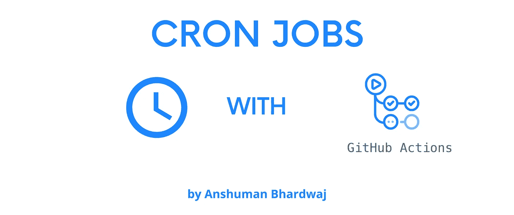
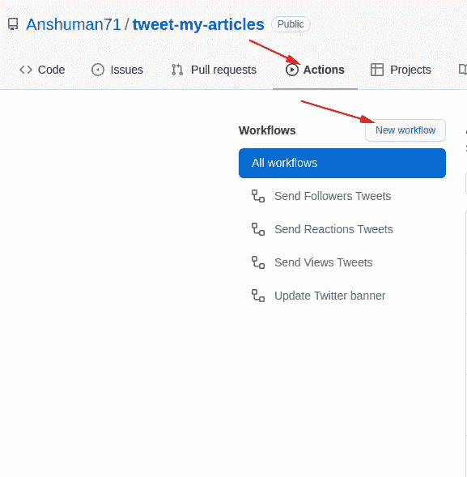
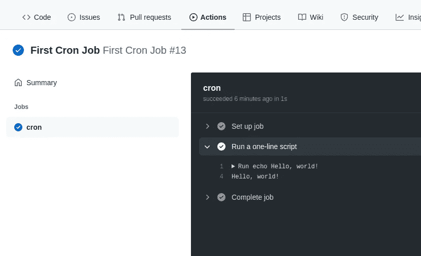
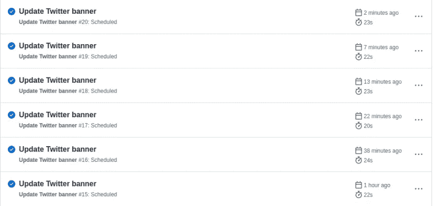

# 使用 GitHub 操作释放 Cron 作业

> 原文：<https://javascript.plainenglish.io/free-cron-jobs-with-github-actions-d05273692c99?source=collection_archive---------17----------------------->

## 通过使用 Cron 作业调度任务，轻松实现工作自动化。



Cron Jobs with Github Actions

调度任务是自动化工作的一种便捷方式，Cron Jobs 就是这样做的。我们都有一个经常性的任务，我们希望它可以自动完成，不需要人工干预。别忘了，“那也是免费的”。

Cron 作业旨在执行定期计划的操作，如备份、报告生成等。这些任务中的每一个都应该被配置为无限循环(例如:每天/每周/每月一次)；您可以在该时间间隔内定义作业开始的时间点。

# 什么是 Cron 工作？

cron 作业是按照 Cron 表达式(* * * * *)定义的给定计划定期运行的任务。

```
# ┌────────── minute (0 - 59)
# │ ┌────────── hour (0 - 23)
# │ │ ┌────────── day of the month (1 - 31)
# │ │ │ ┌────────── month (1 - 12)
# │ │ │ │ ┌────────── day of the week (0 - 6)
# │ │ │ │ │                                  
# │ │ │ │ │
# │ │ │ │ │
# * * * * *
```

不要担心语法，我们可以使用 [Crontab Guru](https://crontab.guru/) 非常容易地创建一个。

# 如何设置 Cron 作业？

有很多方法可以设置 Cron 作业

# 在操作系统级别

1.  你可以使用内置的[窗口调度器](https://www.windowscentral.com/how-create-automated-task-using-task-scheduler-windows-10)
2.  如果你在 Ubuntu 上，你可以使用 [Cron 工具](https://www.digitalocean.com/community/tutorials/how-to-use-cron-to-automate-tasks-ubuntu-1804)

但大多数情况下，您可能希望让它远离操作系统，而在离您的应用更近的地方，我们可以使用

# 在应用程序级别

1.  使用像 [Cron](https://www.npmjs.com/package/cron) 这样的包在 NodeJS 应用程序中创建 Cron 作业，但是这不能在无服务器的堆栈上运行
2.  使用类似于 [AWS Lambda](https://docs.aws.amazon.com/AmazonCloudWatch/latest/events/RunLambdaSchedule.html) 的无服务器解决方案，但是它需要大量的设置和信用卡
3.  使用 Firebase cloud 函数进行调度，这比 AWS 简单得多，但需要信用卡。
4.  使用 SAAS 工具，如 [EasyCron](https://www.easycron.com)

# 我们的赢家(GitHub 行动)

虽然以上都是很好的解决方案，但对于业余爱好项目来说，最简单的方法是使用 GitHub actions，因为它

1.  易于通过代码进行设置，并与应用程序代码本身相结合
2.  公开回购是免费的
3.  提供高达 4000 分钟/月的私人回购(极难消费)
4.  允许我们创建无限的作业和计划

我相信现在你一定在问


# GitHub 动作有什么帮助？

GitHub Actions 现在拥有世界一流的 CI/CD，可以轻松实现所有软件工作流程的自动化。直接从 GitHub 构建、测试和部署您的代码。按照您想要的方式进行代码审查、分支管理和问题分类。你可以在这里阅读更多关于他们的信息。

现在要使用 GitHub 操作来设置自己的 Cron 作业，

1.  转到您的 GitHub 存储库(如果需要，创建一个)。
2.  转到“活动”选项卡，创建新的活动工作流。



3.将您的 Cron 计划和任务添加到其中。提交更改。

```
 # This is a basic workflow to help you get started with Actionsname: First Cron Job# Controls when the workflow will run
on:
  # Triggers the workflow every 5 minutes
  schedule:
    - cron: "*/5 * * * *"# A workflow run is made up of one or more jobs that can run sequentially or in parallel
jobs:
  # This workflow contains a single job called "cron"
  cron:
    # The type of runner that the job will run on
    runs-on: ubuntu-latest# Steps represent a sequence of tasks that will be executed as part of the job
    steps:
      # Runs a single command using the runners shell
      - name: Run a one-line script
        run: echo Hello, world!
```

这将运行一个作业来回应“你好，世界！”每 5 分钟一次。

转到 Actions 选项卡，等待日志出现。当你点击任何执行，你会看到这样的细节



这就是如何使用 GitHub 操作来调度 Cron 作业。

> 注意:在 GitHub Actions 工作流运行的高负载期间，计划的事件可能会延迟。高负载时间包括每个小时的开始。要减少延迟的机会，请将工作流安排在一个小时的不同时间运行。



查看计划每 5 分钟运行一次的作业是如何被延迟几次的。请注意你如何使用免费资源。

# 我如何在 GitHub 操作中使用 Cron Jobs？

我使用 GitHub Actions 定期更新我的 Twitter 横幅，更新最新的开发人员关注人数和 Tweet 里程碑，如一篇文章的 500 次浏览或我的开发人员帐户达到 100 名关注者。

你可以在这里阅读我解释上述用例[的文章。](https://dev.to/anshuman_bhardwaj/automatically-tweet-popular-article-from-dev-246f)

你可以在这里找到 GitHub 回购。请随意使用您的个人资料。

# 合理使用

虽然 GitHub 操作是免费的，但是我们应该明智地使用它们，尊重提供商的努力。在这个先进技术的时代，GitHub 和 Vercel 这样的巨头让我们非常容易起步，所以我们有责任不滥用这些工具。

暂时就这样了。希望这篇文章对你有帮助！如果您有任何反馈或问题，请随时在下面的评论中提出，我很乐意听到并解决它们。

更多此类内容，请关注我。

> *直到下一次*


*原载于 2022 年 2 月 7 日*[*https://theanshuman . dev*](https://theanshuman.dev/articles/free-cron-jobs-with-github-actions-31d6)*。*