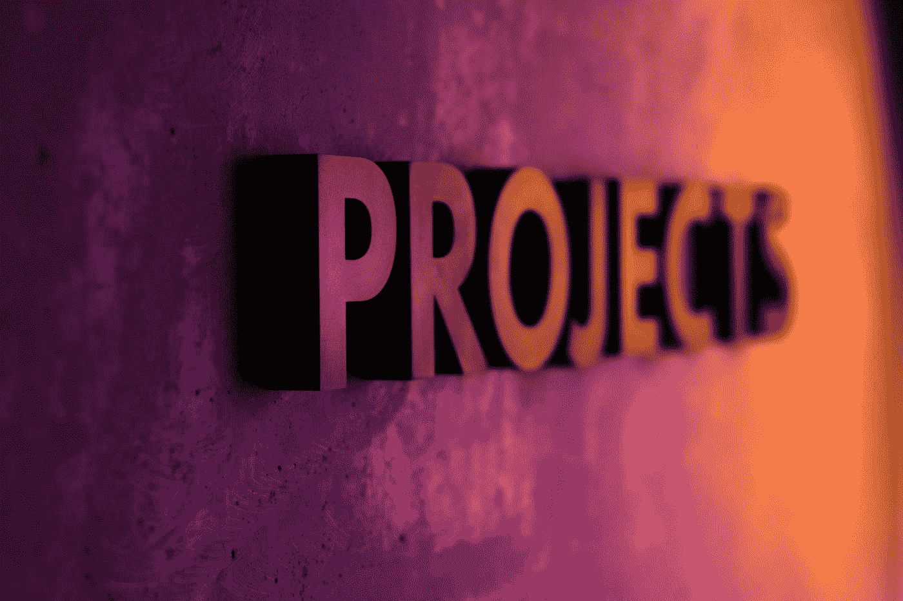

# 免费 JavaScript 项目和 YouTube 教程来提升你的技能 2022

> 原文：<https://javascript.plainenglish.io/free-javascript-projects-youtube-tutorials-boost-your-skills-2022-keep-updated-15d29c966ea9?source=collection_archive---------10----------------------->

## 这些免费的教程和项目可以帮助你在 2022 年提高 JavaScript 开发者的技能。

Photo by [Octavian Dan](https://unsplash.com/@octadan?utm_source=medium&utm_medium=referral) on [Unsplash](https://unsplash.com?utm_source=medium&utm_medium=referral)

学习 JavaScript 是一个终生的过程。学习了 JavaScript 基础知识，可以足够好的阅读 JavaScript 代码，但是如何用真实的项目去实践，才能在前端开发者的道路上走的更远？这对我来说一直是个谜。

我一直在搜索与 JavaScript 相关的内容和由伟大的开发人员构建的项目。他们之所以神奇，是因为他们与他人分享自己的知识，并激励他们踏入这个领域。

我每天都在 YouTube 上浏览大量免费教程。在这篇文章中，我整理了一个最近的视频列表，这些视频是我在编程过程中观看的。

以下是一些在我的 JavaScript 开发之旅中对我有所帮助的视频:

1.  **从精通 JavaScript 开始 2 小时学习 JavaScript**

有限的时间，更好的把握最重要的事情。

**2。12 小时完整课程 2022 JS 教程来自聪明的程序员**

这是我打算看的最新的一部。是 2022 年的全程。这是 12 个小时，所以准备好你的咖啡因剂量。

3.我喜欢 Dev Ed 的 JS 教程。这是一次有趣的旅行。

如果你是初学者，你一定要看看**倒计时**和**模拟时钟**项目。看到这一点，从“数字”中学习。

4.**带有 JS 的进度条**由 Dec 编辑

我早些时候很容易就找到了**插件构建进度**栏。

看看这篇文章: [*NProgress —涓滴动画进度条*](https://diyifang.medium.com/nprogress-trickle-animation-progress-bar-235ee69171a1) *。*

5. **JavaScript 内存卡游戏教程**编著

6.Ed 用 Javascript 编写的恐怖迷宫游戏

7.用 JavaScript 构建一个购物车

8.**如何用 JavaScript 发送推送通知**由 Web dev 简化

我喜欢他简单地解释知识的方式。

9.**高级 JavaScript 游戏构建教程**

10.**捆绑项目**视频

11.**在 10 小时内构建和部署 5 个 JavaScript & React API 项目—全程| RapidAPI** 精通 JavaScript

学习 JavaScript 很难，但它是前端开发人员的核心优势。因此，请阅读克里斯·肖恩的《**如果我能重新开始，如何学习编码》**。

> 每当我发现新的视频就更新。如果你找到好东西，请给我送一些。谢谢大家！
> 
> 继续做你想做的事。在通往顶峰的路上向我们所有人问好。
> 
> 请跟随并成为我的学习伙伴。和平。✌️

*更多内容请看*[***plain English . io***](https://plainenglish.io/)*。报名参加我们的* [***免费周报***](http://newsletter.plainenglish.io/) *。关注我们关于*[***Twitter***](https://twitter.com/inPlainEngHQ)[***LinkedIn***](https://www.linkedin.com/company/inplainenglish/)*[***YouTube***](https://www.youtube.com/channel/UCtipWUghju290NWcn8jhyAw)*[***不和***](https://discord.gg/GtDtUAvyhW) *。对增长黑客感兴趣？检查* [***电路***](https://circuit.ooo/) *。***