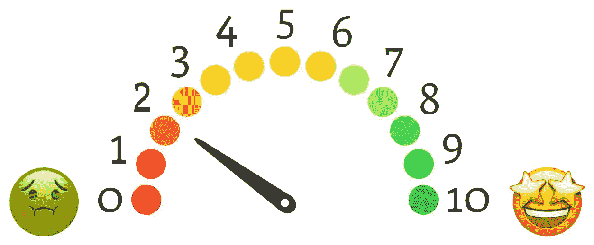
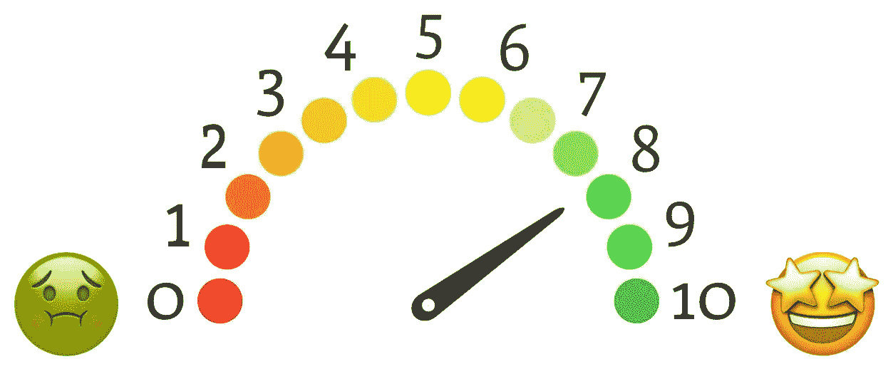

# 从讨厌打字稿到相信打字稿的用户

> 原文：<https://javascript.plainenglish.io/from-typescript-hater-to-typescript-convinced-user-85cd0179c6aa?source=collection_archive---------16----------------------->

## 从服务器端的角度看，我是如何从一个讨厌 TypeScript 的人变成一个相信 TypeScript 的用户的。

让我们来看看打字稿的比例:

几年前，我在 2/10 左右。

在这篇文章中，我将主要从服务器端的角度来谈。

不久前，我还不是谈论 TypeScript 的最佳伙伴。我脑子里总是想着同样的话:

*   它将**在您的本地开发环境和 CI 中添加一个编译步骤**，这会减慢速度。
*   如果你依赖于来自[的类型](https://github.com/DefinitelyTyped/DefinitelyTyped)和**其中一个变得不同步**，你的编译步骤一直对你大喊大叫**你完全被卡住了**。
*   “你最终会**更多地关注你的类型**而不是你的代码，这是完成事情的一个切线。”摘自本期 Github:[https://github.com/staltz/ama/issues/49](https://github.com/staltz/ama/issues/49)
*   如果你想要类型，就使用不同的编程语言，让我们 JavaScript 开发者享受我们的自由吧！

我总是热衷于寻找和阅读这样的帖子:

*   [关于静态类型的令人震惊的秘密](https://medium.com/javascript-scene/the-shocking-secret-about-static-types-514d39bf30a3)摘自 Eric Elliott(2016)
    *TL；dr:* “说到 bug 减少，我觉得可以这么说:**静态类型被高估了。**
*   Axel Rauschmayer 博士的《[JavaScript vs . TypeScript vs . reason ml](https://2ality.com/2018/03/javascript-typescript-reasonml.html)》(2018)(评论也值得一读)。
    阅读时想起的例子:“那些附加类型系统**只支持语言的一部分**，它们有很多很多的 bug。”(来自 [LionessLover](https://disqus.com/by/LionessLover/) 的第一条评论)
*   迈克尔·克拉斯诺夫(2020)的“7 个不使用打字稿的好理由”
*   克里斯·古兹曼(2020)的“请把打字稿放下一会儿”

并会毫不犹豫地与任何和我聊天的人分享。(我过去在 OCTO 的一些同事可能还记得……)

我也不喜欢 **Angular** 强迫整个社区转用 TS 的方式。(嗯，不是“被迫”，而是好运在 JS 中找到有棱角的代码片段)

因此，对我来说，平衡显然是不利的一面，而不是有利的一面。

*让我们及时跳跃，若干年后……*

# **2022 年，让我们重新考虑**

今年早些时候，一个新项目摆在我面前。

我的一些同事是打字爱好者，大多数是年轻人。我不是在评判，恰恰相反，我忍不住好奇。
在阅读各种科技新闻的时候，我很清楚地意识到 **TypeScript 已经越来越受欢迎**。

但是正如所料，我开始用… JavaScript 引导我的新 Node.js 项目！我是当时唯一的开发者，事情进展顺利，我在进步，数据库+ ORM 的选择来了。

长话短说，我下定决心 PostgreSQL + **Prisma** 。(更多细节见上一篇文章:“ [Prisma 与我的 DB](https://medium.com/nerd-for-tech/prisma-to-interact-with-my-db-13da91562600) 交互”。)
我开始意识到 Prisma 的一大优势是它生成的所有 ts 类型。

这看起来像是给打字稿一次机会的好机会，不是吗？我知道这一天会到来，我没有理由不去尝试。

然后我添加 TS 作为开发依赖项，并开始在我的 DAOs(数据访问对象)中使用一些 Prisma 类型。
我的 IDE 看起来更智能，通过检查我的 Prisma 查询，它立即让我获得了价值。让我们更进一步，在上面一层添加一些类型脚本:调用 DAOs 的逻辑函数。

几个月后，**我整个节点服务器几乎只有 TypeScript** 。

很明显，我也遇到过神秘的类型错误，我仍然觉得它们太冗长，但是我预料会有更难的问题阻止我将文件切换到 TypeScript。事实并非如此。

# 我热衷的是

*   现在越来越多的工具和库是用打字稿编写的，并且附带了它们的声明。(因此，不同步类型的风险要低得多)
*   ide 包括一些只有在 TypeScript 代码库中才有的智能。
*   它打开了一个更广阔的生态系统，而不仅仅是 JavaScript 生态系统。
*   使用 TypeScript 给了我重新考虑 lodash 的另一个理由。的确，lodash 和 TypeScript 不是好朋友。我已经从包大小的角度考虑过了。

# 再次出现在打字稿上

所以在打字稿的比例上，我现在是 8/10 左右。

不是 9 或 10，我仍然缺乏必要的耐心在一个小时的会议中与同事讨论复杂的类型。

简而言之，我会说是否使用 TypeScript，在某种程度上取决于您使用或计划使用的框架/工具/库。如果没有 Prisma，这个故事可能会不同。

所以在某种程度上，谢谢 Prisma 给我这个机会重新思考，改变我对 TypeScript 的看法。🙂

*更多内容尽在* [***说白了. io***](https://plainenglish.io/) *。报名参加我们的* [***免费周报***](http://newsletter.plainenglish.io/) *。关注我们关于* [***推特***](https://twitter.com/inPlainEngHQ) *和*[***LinkedIn***](https://www.linkedin.com/company/inplainenglish/)*。加入我们的* [***社区不和谐***](https://discord.gg/GtDtUAvyhW) *。*