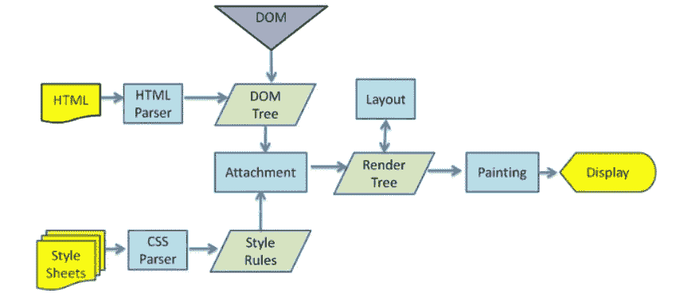

# 前端 CSR、SSR、SSG——你真的能区分它们吗？

> 原文：<https://javascript.plainenglish.io/front-end-csr-ssr-ssg-can-you-really-tell-the-difference-8ddedc9c05d6?source=collection_archive---------9----------------------->

## 许多人无法区分客户端渲染(CSR)、服务器端渲染(SSR)和静态站点生成(SSG)。

Photo by [Dave Hoefler](https://unsplash.com/@davehoefler?utm_source=medium&utm_medium=referral) on [Unsplash](https://unsplash.com?utm_source=medium&utm_medium=referral)

许多人无法区分客户端渲染(CSR)、服务器端渲染(SSR)和静态站点生成(SSG)。下面简单介绍一下各自的特点。看完之后，相信你一定能清晰地感受到它们之间的区别。

## 页面的呈现过程

在开始之前，让我们回顾一下页面最基本的呈现过程是如何工作的。

*   浏览器通过请求获取 HTML 文本。
*   呈现过程解析 HTML 文本并构建 DOM 树。
*   当浏览器解析 HTML 时，如果遇到内嵌样式或样本样式，它会下载并构建样式规则。如果遇到 JavaScript 脚本，则下载并执行该脚本。
*   构建 DOM 树和样式规则后，渲染过程会将它们合并到一个渲染树中。
*   渲染过程从布局渲染树开始，创建布局树。
*   渲染过程绘制布局树并生成绘图记录。
*   渲染过程将布局树分层，分别光栅化每一层并获得复合帧。
*   渲染过程将复合帧发送到 GPU，然后将图像绘制到页面上。

正如你所看到的，页面渲染实际上是浏览器将 HTML 文本转换为页面框架的过程，我们将在下面介绍刚才提到的技术。

## 企业社会责任

现在我们的 web 应用大多使用 JavaScript 框架(Vue、React、Angular)进行页面渲染，页面上的 DOM 元素大多是通过 JavaScript 插入的。换句话说，在 JavaScript 脚本执行之前，HTML 页面就已经解析好了，DOM 树也已经构建好了，JavaScript 脚本只是动态改变 DOM 树的结构，让页面变成你想要的样子。这种渲染方式称为动态渲染，通常称为客户端渲染(CSR)。

下面的代码是浏览器在请求 React 编写的单页应用页面时响应的 HTML 文档，实际上只是一个空壳，没有具体的文本内容。

## 苏维埃社会主义共和国

顾名思义，服务器端渲染就是当浏览器请求页面 URL 时，服务器组装我们需要的 HTML 文本并返回给浏览器。浏览器解析完这个 HTML 文本后，就可以直接构建所需的 DOM 树并显示在页面上，而不需要经过 JavaScript 脚本下载过程。这个服务器端 HTML 组装的过程称为服务器端呈现(SSR)。

下面是服务器端渲染返回的 HTML 文档。由于代码量太多，只保留了代码的符号部分，但是很容易发现服务器端渲染返回的 HTML 文档中有页面的核心文本。

## SSG

React 官网上用的技术是这样的，和 SSR 一样的是对应的服务器端也是直接把合并后的 HTML 文档返回给客户端，所以客户端还是不需要下载 Javascript 文件来渲染整个页面。有什么区别？

当使用 SSG 技术构建网站时，每个页面都对应于项目构建包中的 HTML 文档。用户请求时，服务器不需要发送其他请求和二次组装，直接向客户端响应 HTML 文档即可。客户端和服务器的通信变得更加简单！

但是很容易发现它有几个致命的弱点。

*   由于项目打包时 HTML 文档已经生成，所有用户只能看到同一个页面，就像一个静态的网站，这就是这项技术的关键词——静态
*   每次内容更改时都需要构建和部署应用程序，这使得它非常有限，不适合内容经常更改的网站。

但是每种技术都有自己的场景。我们不能因为一项技术的缺点而否定它，也不能因为一项技术的优点而滥用它！该技术仍有一些应用场景。如果你想建立一个充满静态内容的网站，如个人博客、项目使用文档和其他 Web 应用程序，使用 SSG 再合适不过了。使用这项技术后，相信你一定能感受到这项技术的强大！

## 摘要

无论使用哪种呈现方法，我们都从请求一个 HTML 文本开始，但区别在于该文本是否已经由服务器组装。

*   客户端渲染还需要下载并执行额外的 JavaScript 脚本才能得到我们想要的页面效果，所以速度比服务器端渲染慢很多。
*   HTML 文档的服务器端渲染已经组装了相应的文本，浏览器请求后可以直接解析渲染，不需要下载执行额外的 JavaScript 脚本，所以速度会比客户端渲染快很多。
*   对于一些内容变化不频繁的网站，我们甚至可以在服务器端渲染的基础上进行改进，将每次向服务器端请求渲染一个 HTML 文档变成总共只有一次渲染，这就是静态网站生成技术

***欢迎关注我上***[***Twitter***](https://twitter.com/yanghui0324)*[***LinkedIn***](https://www.linkedin.com/in/hui-yang-075076245/)***，以及***[***GitHub******！***](https://github.com/guchen-yh)*

*写作一直是我的激情所在，它给了我帮助和激励他人的快乐。如果您有任何问题，请随时联系我们！*

**更多内容看* [***说白了就是***](https://plainenglish.io/) *。报名参加我们的* [***免费周报***](http://newsletter.plainenglish.io/) *。关注我们关于* [***推特***](https://twitter.com/inPlainEngHQ) ，[***LinkedIn***](https://www.linkedin.com/company/inplainenglish/)*，*[***YouTube***](https://www.youtube.com/channel/UCtipWUghju290NWcn8jhyAw)*，以及* [***不和***](https://discord.gg/GtDtUAvyhW)*