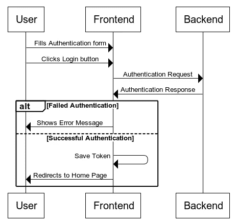
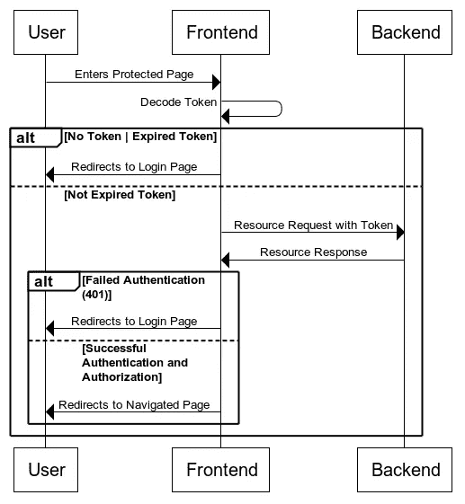
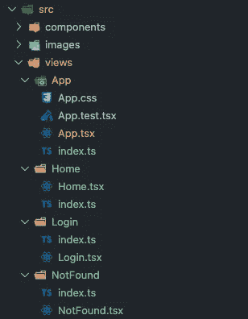

# 使用 GraphQL API 为 React 应用程序实现完全基于 JWT 的身份验证

> 原文：<https://javascript.plainenglish.io/full-jwt-based-auth-implementation-for-your-react-apps-using-a-graphql-api-a8b83ad285f5?source=collection_archive---------1----------------------->

## 关于如何通过 GraphQL API 使用 JWT 为我们的 React 项目实现认证端到端解决方案的指南。


Photo by [olieman.eth](https://unsplash.com/@moneyphotos?utm_source=medium&utm_medium=referral) on [Unsplash](https://unsplash.com?utm_source=medium&utm_medium=referral)

> 更新:在我发表这篇文章后，我收到了一些评论，告诉我不要使用本地存储来存储 JWT，因为这是一个潜在的安全风险，他们是正确的。我还可以进一步说，你不应该在内部实现你自己的认证系统，因为这样做有很多警告，你可能会进入一个兔子洞。如果可能的话，你应该总是选择使用像 Auth0、Okta 或类似的服务。也就是说，我相信这篇文章仍然是有用的，因为它的结构对于认证服务来说是最不可思议的，您只需在代码中做一些修改就可以更改它。

在这篇文章中，我们将看到如何通过 GraphQL API 使用 JWT 为 React 项目实现一个端到端的认证解决方案。

接下来的工具、库和概念将用于构建应用程序:

*   [CRA](https://create-react-app.dev/)
*   [打字稿](https://www.typescriptlang.org/)
*   [反应路由器](https://reactrouter.com/)
*   [阿波罗客户端](https://www.apollographql.com/docs/react/)
*   [上下文 API](https://reactjs.org/docs/context.html)
*   [代码拆分](https://reactjs.org/docs/code-splitting.html#reactlazy)
*   [定制挂钩](https://reactjs.org/docs/hooks-custom.html)

但是在编写一行代码之前，让我们先了解我们将使用下面的图表构建什么。

## 注册



Sequence diagram: Login

## 受保护的资源



Sequence diagram: Subsequent requests after logging in

在这篇文章中，我们不打算关注实际的 API，我们只是假设我们已经有了一个带有下一个签名的**突变**，或者如果你没有，你可以使用类似 [MSW](https://mswjs.io/docs/getting-started/mocks/graphql-api) 的东西来模仿一个，这非常容易。

```
login(email: String!, password: String!): AuthDatatype AuthData {
 user: User
 token: String!
}type User {
  id: ID
  email: String
  firstName: String
  lastName: String
  created: Date
}
```

如您所见，我们正在发送*电子邮件*和*密码*，我们得到的响应是一个 **AuthData** 对象，其中包括一个**用户**和一个**令牌**，该令牌将用于对 API 执行以下请求。

这是使用 **MSW** 的特定签名的处理程序，以防您走那条路线。

handlers.js

# 初始设置

好了，现在我们理解了需求(我希望🤞)，我们开始吧。我将使用包含 Typescript 和其他代码质量友好工具的下一个模板，而不是从头开始。

[](https://github.com/drac94/code-quality-friendly-reactjs-template) [## GitHub-drac 94/code-quality-friendly-react js-模板

### 这个项目是用 Create React App 引导的。这个项目包括:在项目目录中，您可以运行:运行…

github.com](https://github.com/drac94/code-quality-friendly-reactjs-template) 

该模板缺少 Apollo 客户端和 React 路由器，以实现本文的预期结果，所以让我们安装它们。

```
npm install @apollo/client graphql react-router-dom@6
```

# 初始路由

我们将在应用程序中有三个视图，**登录** ( `/login`)，**主页** ( `/`)，以及一个**未找到** ( `/404`)，以防用户试图导航到未知的路线。

因此，让我们从创建三个视图开始，**登录**、**主页、**和**未找到**在*视图*文件夹内，如果您正在使用模板，您可以看到里面已经有一个**应用**文件夹(如果您使用 CRA 创建您的项目，您也会有它)，我们将使用这个视图来处理路由。

这个项目现在应该是这样的。



在 *App.tsx* 文件中导入您刚刚创建的视图，以一种懒惰的方式进行，这样它们只在需要的时候才被加载。

```
const Login = lazy(() => import(‘../Login’));
const NotFound = lazy(() => import(‘../NotFound’));
const Home = lazy(() => import(‘../Home’));
```

现在，删除渲染函数中的所有内容，并添加以下代码来配置路由，我不会解释 React Router 如何工作，但如果您对以下代码有不理解的地方，可以直接查看他们的[文档](https://reactrouter.com/)。

```
<Suspense *fallback*={<p>Loading</p>}>
  <Routes>
    <Route *path*="/login" *element*={<Login />} />
    <Route *path*="/" *element*={<Home />} />
    <Route *path*="/404" *element*={<NotFound />} />
    <Route *path*="*" *element*={<Navigate *replace* *to*="/404" />} />
  </Routes>
</Suspense>
```

您可能会在浏览器中看到一个错误，这是因为我们需要将所有这些代码包装在路由器中，所以现在转到 *src/index.tsx* 文件，并像这样包装 **App** 组件。

```
<BrowserRouter>
  <App />
</BrowserRouter>
```

不要忘记导入浏览器路由器

```
import { BrowserRouter } from 'react-router-dom';
```

就这样，你可以在`/login`、`/`和`/404`之间导航，你会看到你在这些组件中渲染的任何东西。另外，请注意，如果您导航到任何其他未定义的路线，您将被重定向到`/404` *。*

# 初始联网

现在是时候配置应用程序，使其能够向 API 发出请求，为此，使用我直接从他们的[文档](https://www.apollographql.com/docs/react/networking/basic-http-networking/)中提取的下一个代码，在 *src* 文件夹下创建一个名为 *apolloConfig.ts* 的文件。

*apolloConfig.ts*

现在转到 *src/index.tsx* ，用 **ApolloProvider** 包装所有东西。

```
import { ApolloProvider } from '@apollo/client';import { client } from './apolloConfig';...<ApolloProvider *client*={client}>
  <BrowserRouter>
    <App />
  </BrowserRouter>
</ApolloProvider>
```

# 登录视图

现在我们已经有了路由和初始网络，是时候实现**登录**视图了。因为这是一个非常基本的形式，我们将使用不受控制的组件。将下一个代码放在 *Login.tsx* 文件中。

*Login.tsx*

看看我们是如何呈现一个基本表单并直接在提交处理程序上获取输入值的，这样我们就不需要使用状态或引用了。有些挑战是我们需要在处理程序上使用的类型，但是我为你解决了这个问题。此外，看看我们如何使用本机浏览器验证电子邮件具有有效的结构，并且两个字段都是必需的，因此您不需要自己实现它们。

在处理程序内部，我们只在控制台上打印输入值，让我们实现实际的功能。

我喜欢将逻辑与视图分开，所以让我们在 **Login** 文件夹中创建两个新文件，一个名为 *Login.query.ts* ，另一个名为 *Login.compound.tsx* ，其中包含下一段代码。

Login.query.ts

Login.compound.tsx

并将 *Login.tsx* 文件更新如下

*Login.tsx*

这里似乎进行了很多工作，但实际上并没有，在 *Login.query.ts* 文件中，我们只是放入了我们将使用的 GraphQL 变异定义，在*log in . compound . tsx*文件中，我们只是使用之前定义的查询创建了 [Apollo 客户端变异](https://www.apollographql.com/docs/react/data/mutations/#executing-a-mutation)，然后在用户使用 *handleLogin* 函数单击提交按钮时触发它，传递输入值。还有，我们更新了 *Login.tsx* 文件来接收一些道具。

不要忘记将**登录**文件夹内的 *index.ts* 文件改为现在指向复合。

```
export { default } from './Login.compound';
```

# 用户上下文

在 *Login.compound.tsx* 文件的第 37 行中，我们只是将**令牌**和**用户**对象打印到控制台，但是我们想要的是存储这些信息，以便所有应用程序都可以访问它们。对于第一个目标，我们将把它们存储在本地存储中，对于第二个目标，我们将使用上下文 API 镜像这些信息，这样我们就可以获得这些信息，而不必每次都查询本地存储。

让我们在 src 下创建一个名为 *userContext.tsx* 的新文件，因为我们将开始重用一些常量和类型，所以我们也在 src 下创建两个新文件， *types.ts* 和 *constants.ts* 。

types.ts

constants.ts

*userContext.tsx*

让我们解开 *userContext.tsx* 文件，我们只是创建了一个新的上下文，它将公开三个东西，即**用户**对象，以及两个函数**登录**，它将令牌和用户存储在本地存储区和状态中，以及**注销**，它将删除这些值。此外，我们有一个 useEffect，用于在用户重新加载页面时将值从本地存储恢复到状态，还有一个自定义钩子，用于在我们使用提供者之外的上下文时防止应用程序崩溃。

现在让我们更新文件 *src/index.tsx* ,使上下文在任何地方都可用。

```
import UserContextProvider from './userContext';...<ApolloProvider *client*={client}>
  <BrowserRouter>
    <UserContextProvider>
      <App />
    </UserContextProvider>
  </BrowserRouter>
</ApolloProvider>
```

此外，让我们更新 *Login.compound.tsx* 文件，以使用新的闪亮**登录**功能。

```
import { useUserContext } from '../../userContext';...const LoginCompound = (): JSX.Element => {
  const { signIn } = useUserContext();...onCompleted: (*data*) => {
  const {
    login: { token, user },
  } = *data*;
  signIn(user, token);
  navigate('/', { replace: true });
},
```

好了，我们休息一下，总结一下我们到现在为止所建立的东西。我们已经完成了**登录**流程，我们有了**登录**视图，用户可以输入他们的凭证并提交表单，然后我们发出 API 请求，根据我们得到的响应，我们显示一个错误，或者我们将**令牌**和**用户**详细信息存储到本地存储和用户上下文中，并将用户重定向到**主页**页面。但是现在用户仍然可以导航到主页，即使它没有登录，所以让我们实现我们的第二个流。

# 受保护的路线

让我们创建两个新文件，一个在 **App** 文件夹中，名为 *ProtectedRoute.tsx* ，另一个在 src 文件夹下，名为 *auth.ts* 。

auth.ts

**isAuthenticated** 是一个简单的函数，用于从本地存储中获取令牌，并检查到期时间是否大于当前时间，如果是，则意味着令牌仍然有效。

ProtectedRoute.tsx

**ProtectedRoute** 组件利用先前的函数来知道它是否应该显示用户试图导航的视图，或者它是否应该将用户重定向到**登录**视图。**导航**组件中的*状态*属性是为了知道用户试图访问哪条路线，这样我们可以在用户正确登录后将他们重定向到该视图。

我们需要更新 *App.tsx* 文件，这样我们就可以通过将 **Home** 视图放入 **ProtectedRoute** 组件来保护它。

```
import ProtectedRoute from './ProtectedRoute';...<Route
  *path*="/"
  *element*={
    <ProtectedRoute>
      <Home />
    </ProtectedRoute>
  }
/>
```

现在，如果你试图导航到`/`而你还没有登录，你将被重定向到`/login` *，*试试吧！。

# 高级网络

用户登录后，我们需要将令牌发送给后续的 API 调用，以查看用户是否可以访问资源，让我们修改我们的 *apolloConfig.ts* 文件来添加这个功能。我刚刚从官方 [Apollo 客户端文档](https://www.apollographql.com/docs/react/networking/authentication/#header)中抓取了下一个代码。

apolloConfig.ts

我们从本地存储中获取头部，并通过链接 Apollo 链接将其作为授权头部添加到每个 HTTP 请求中。

现在可能发生的情况是，令牌可以通过使用开发工具修改本地存储而被篡改，或者它可以在到达后端之前过期，在这种情况下，后端应该返回一个`401`状态代码错误，因为令牌不再有效，在前端，我们需要通过邀请用户再次登录来让他们知道。我们也可以像这样使用 Apollo 客户机来实现它。

apolloConfig.ts

我们向 Apollo 链添加了一个 **onError** 链接，该链接在请求完成之后、到达您的视图之前被调用，在该链接中，我们可以检查是否有错误，以及错误是否有一个`401`状态代码，这样我们就可以重定向到用户的**登录**视图。

但是现在我们有一个小问题，我们不能在 React 上下文之外使用路由器，这就是为什么第 32 行有一个 *TODO* 注释，我们应该将用户重定向到 **Login** 视图，但是我们不能，因为这个函数在 React 上下文之外。不过不用担心，有办法，总会有办法的。

为了解决这个问题，我们将创建自己的历史，并将其传递给路由器，如这里的[所述](https://reactrouter.com/docs/en/v6/api#unstable_historyrouter)。首先在 *src* 下创建一个名为 *browserHistory.ts* 的新文件。

browserHistory.ts

然后将 index.tsx 文件中的 **BrowserRouter** 更改为**不稳定历史路由器**。

```
̶i̶m̶p̶o̶r̶t̶ ̶{̶ ̶B̶r̶o̶w̶s̶e̶r̶R̶o̶u̶t̶e̶r̶ ̶}̶ ̶f̶r̶o̶m̶ ̶'̶r̶e̶a̶c̶t̶-̶r̶o̶u̶t̶e̶r̶-̶d̶o̶m̶'̶;̶import { unstable_HistoryRouter as HistoryRouter } from 'react-router-dom';import browserHistory from './browserHistory';<ApolloProvider *client*={client}>
  ̶<̶B̶r̶o̶w̶s̶e̶r̶R̶o̶u̶t̶e̶r̶>̶
  <HistoryRouter *history*={browserHistory}>
    <UserContextProvider>
      <App />
    </UserContextProvider>
  </HistoryRouter>
  <̶B̶r̶o̶w̶s̶e̶r̶R̶o̶u̶t̶e̶r̶>̶
</ApolloProvider>
```

现在转到 *apolloConfig.ts* 文件的第 32 行，修改这一行的注释。

```
browserHistory.push('/login');
```

别忘了先导入。

```
import browserHistory from './browserHistory';
```

# 结论

就这样，我们实施了一个功能性的端到端身份认证流程。我们仍然可以在这里改进一些东西，比如防止用户导航到已经认证的`/login`路径，一种注销用户的方法，还包括基于角色的流授权，但我认为这篇文章已经太大了，所以我将在下一篇文章中做这些事情。你可以在这里找到我们在这篇文章[中实现的完整代码。](https://github.com/drac94/react-auth-graphql)

感谢阅读和快乐编码！

*更多内容请看*[***plain English . io***](https://plainenglish.io/)*。报名参加我们的* [***免费周报***](http://newsletter.plainenglish.io/) *。关注我们关于*[***Twitter***](https://twitter.com/inPlainEngHQ)*和*[***LinkedIn***](https://www.linkedin.com/company/inplainenglish/)*。加入我们的* [***社区不和谐***](https://discord.gg/GtDtUAvyhW) *。*