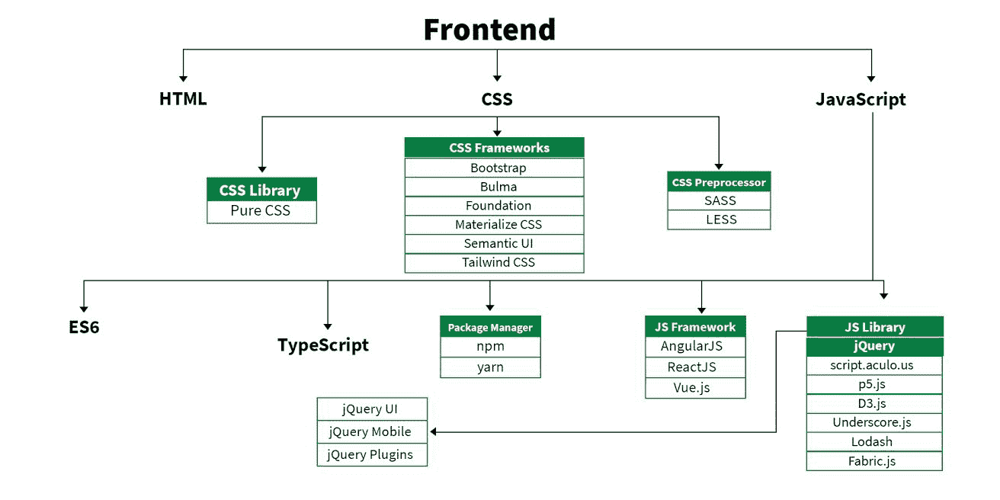
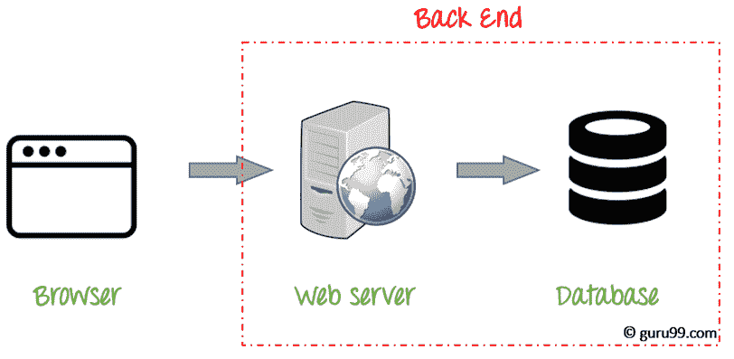

# 2022 年的全栈开发:它是什么，它的好处和用途

> 原文：<https://javascript.plainenglish.io/full-stack-development-in-2022-what-it-is-its-benefits-uses-e85a62cfe73c?source=collection_archive---------4----------------------->

## 了解什么是全栈开发，使用它的好处，以及它在 2022 年最受欢迎的一些用途。

source: [https://dzone.com/articles/the-rise-of-full-stack-developers-amp-benefits-of](https://dzone.com/articles/the-rise-of-full-stack-developers-amp-benefits-of)

在不断发展和变化的技术世界中，全栈开发正成为一项越来越重要的技能。

全栈开发人员可以从头到尾在一个网站或应用程序上工作，这意味着他们可以创建设计，构建代码，并将其投入生产。

但是什么是全栈开发呢？用最简单的术语来说，这是一个用来描述可以在应用程序或网站的前端和后端工作的开发人员的术语。

虽然这曾经是只有大公司才需要的技能，但现在小企业拥有全栈开发人员已经变得越来越普遍。

此外，根据 Gartner 的数据，全球 IT 支出预计将在 2022 年达到 4.5 万亿美元，比 2021 年增长 5.1%。

在这篇博文中，我们将讨论什么是全栈开发，使用它的好处，以及它在 2022 年最受欢迎的一些用途。

*让我们开始旅程吧！*

# 什么是全栈开发？

全栈开发是指在 web 开发的所有方面都有经验的 web 开发人员，包括设计、前端编码、后端编码以及托管和部署网站的经验。

一个全栈开发人员可以从头到尾在一个网站上工作，或者他们可能是团队的一部分，团队中的每个成员都专注于开发过程的不同方面。

以前，web 开发人员专注于一个领域的开发是比较常见的，比如前端编码或后端编码。

然而，随着 web 应用程序的增长以及对更健壮和交互式网站的需求，全栈开发已经成为一种更受欢迎的选择。

许多公司现在都在寻找全栈开发人员，因为他们可以为公司节省时间和金钱。

全栈开发可以分为两个主要部分:前端开发和后端开发。

前端开发专注于网站或应用程序的外观和感觉，而后端开发负责所有的幕后功能。

这两个组件共同构成了全栈开发人员的技能组合。

*   **前端开发**

source: [https://www.geeksforgeeks.org/web-development/](https://www.geeksforgeeks.org/web-development/)

前端开发侧重于网站或应用程序的外观和感觉。这包括从布局和设计到用户界面和用户体验的一切。

如果你想创建一个视觉上吸引人的网站或应用程序，很好地理解前端开发是至关重要的。

一些常用的前端开发工具包括 HTML、CSS 和 JavaScript。HTML 用于创建页面结构，CSS 用于设计页面样式，JavaScript 用于增加交互性。

还有一些前端框架和库可以让开发变得更容易，比如 Bootstrap 和 React。此外，你还可以[雇佣全栈开发者](https://www.valuecoders.com/hire-developers/hire-full-stack-developers?utm_source=hire_full&utm_medium=Guest_Blog&utm_campaign=medium&utm_id=NKY)来创建动态 web 应用。

*   **后端开发**

source: [https://www.guru99.com/what-is-backend-developer.html](https://www.guru99.com/what-is-backend-developer.html)

后端开发负责所有的幕后功能。这包括数据库管理、服务器管理和 API 开发。

如果你想创建一个健壮且功能强大的网站或应用程序，对后端开发有一个很好的理解是相对重要的。

一些最常见的后端开发工具包括 PHP、Ruby on Rails 和 Node.js，PHP 是开发 web 应用程序的流行语言，Ruby on Rails 是流行的框架，Node.js 是流行的 JavaScript 运行时环境。

还有很多后端框架和库可以让开发变得更容易，比如 Laravel 和 Express。

# 全栈开发的优势

1.  **性价比**

全栈开发的主要好处是节省时间和金钱。当开发人员能够同时处理 web 应用程序的前端和后端时，他们可以更快地完成项目。

这是因为他们能够自己解决问题并做出改变，而不必等待别人来为他们做。

因此，通过让一个团队负责整个系统，您可以消除对多个团队和相关费用的需要。

此外，这种类型的开发可以帮助提高效率和优化工作流程，从而节省总体成本。

全栈开发人员通常比那些只专注于一个 web 开发领域的人收取更低的时薪。不过，你也可以联系印度的任何一家全栈开发公司，获得熟练的全栈开发人员。

**2。提高效率**

全栈开发的一个重要好处是它允许企业更快更容易地创建和部署应用程序。

这种提高的效率可以节省企业的时间和金钱，也可以帮助他们在市场上更具竞争力。

全栈开发也有助于企业更加敏捷。这意味着他们可以快速适应市场的变化，并对新的机遇做出反应。

因此，使用全栈开发的企业可能能够获得超越竞争对手的竞争优势。

**3。改进的可扩展性**

使用全栈开发的另一个好处是，它可以帮助企业提高应用程序的可伸缩性。

可伸缩性非常重要，因为它允许企业处理增加的负载或流量，而不必对其应用程序进行重大更改。

通过提高应用程序的可伸缩性，企业可以确保即使在业务增长时也能满足客户的需求。

全栈开发可以通过提供一个健壮而灵活的架构来帮助提高您的可伸缩性。

有了这种类型的开发，您可以根据需要轻松地向系统添加新的特性和功能。

**4。更快的上市时间**

全栈开发的另一个重要好处是，它可以帮助企业更快地推出产品。

这对于处于竞争市场中的企业来说是有益的，因为这允许它们在竞争对手之前将产品推向市场。

此外，全栈开发还可以帮助企业减少他们在开发项目上花费的时间。这可以释放时间和资源，使企业可以专注于其他领域的业务。

**5。改善客户体验**

全栈开发可以帮助企业创建更加用户友好和满足客户需求的应用程序。

这样，采用全栈开发的企业将在客户体验方面具有显著的优势。

全栈开发人员能够跨所有渠道和设备创建无缝体验，这对于提供一致的客户体验至关重要。

此外，通过让一个团队负责整个软件开发过程，企业可以确保功能得到适当的实现和优化。

这导致更有效和用户友好的产品或服务。此外，通过**在 Indi** a 雇佣全栈开发者，你也可以构建高效的网络应用。

# 总结一下！

全栈开发对企业有很多好处，包括提高效率、改善可伸缩性、加快上市时间和改善客户体验。

通过使用全栈开发人员，您可以确保快速高效地开发您的应用程序，满足客户的需求。

所以，如果你是一个企业主或企业家，想把你公司的网络战略提升到一个新的水平，考虑**雇佣一个软件开发人员:**

 [## 雇佣印度最好的软件工程师|在线软件编码员- @ValueCoders

### 雇用专门的软件工程师和编码在印度为您的定制软件开发项目每小时/…

www.valuecoders.com](https://www.valuecoders.com/hire-developers/hire-software-developers-india?utm_source=hire_sw_dev&utm_medium=Guest_Blog&utm_campaign=medium&utm_id=NKY) 

由于他们能够在你的网站的前端和后端工作，他们可以比只专注于一个领域的人更快地完成项目。

现在还有什么可想的？请立即联系任何一家全栈开发公司，享受这些优势。

*更多内容请看*[***plain English . io***](https://plainenglish.io/)*。报名参加我们的* [***免费周报***](http://newsletter.plainenglish.io/) *。关注我们关于*[***Twitter***](https://twitter.com/inPlainEngHQ)*和*[***LinkedIn***](https://www.linkedin.com/company/inplainenglish/)*。加入我们的* [***社区不和谐***](https://discord.gg/GtDtUAvyhW) *。*