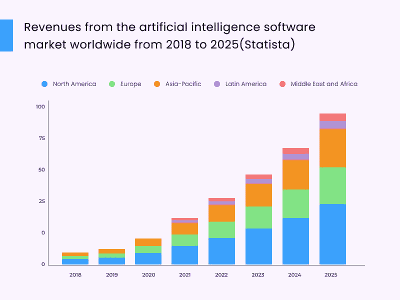
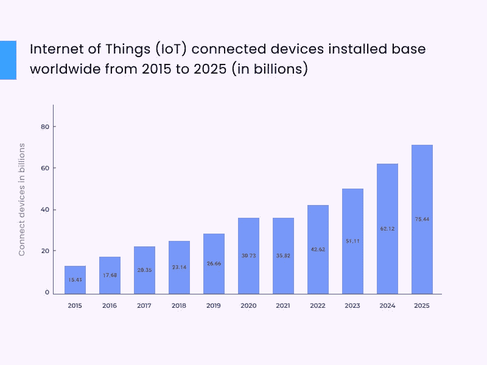

# 全栈开发趋势:2022–23 年的主要趋势

> 原文：<https://javascript.plainenglish.io/full-stack-development-trends-the-major-trends-to-follow-in-2022-23-c69ed631ad27?source=collection_archive---------5----------------------->

全栈开发趋势在过去几年中经历了显著的增长，看起来这种情况不会很快改变。

预计到 2022 年，全栈开发人员将成为最受欢迎的软件开发专家。我们已经看到他们出现在福布斯全球收入最高的专业人士名单上。

那么，是什么让全栈开发如此受欢迎，要取得成功需要遵循哪些主要趋势呢？

我们将仔细研究这些问题，并讨论一些流行的全栈开发趋势，帮助您做出正确的业务决策！

# 什么是全栈开发？

全栈开发是一个术语，用来描述开发一个完整的软件应用程序的过程。全栈开发人员负责应用的前端和后端开发。

全栈开发人员必须对软件开发的所有方面有深刻的理解，包括数据库、用户体验和部署。

相关博客:[全栈发展的主要趋势| 2022](https://www.valuecoders.com/blog/technology-and-apps/key-trends-in-full-stack-development-in-2019/)

# 7 个最受欢迎的全栈开发趋势

## 1.人工智能

如果我说全栈开发，它的一大趋势就是人工智能。这是一个新兴领域，致力于让计算机像人类一样思考和行动。

它还包括开发能够学习、适应和解决问题的智能机器。人工智能已经存在很长时间了，但直到最近，由于机器学习、大数据分析和高性能计算的进步，它才开始取得重大进展。

事实上，人工智能已经在许多行业发挥作用，例如医疗保健和营销。而且随着时间的推移只会越来越大。因此，如果你打算[**雇佣全栈开发人员**](https://www.valuecoders.com/hire-developers/hire-full-stack-developers?utm_source=hire_full_stack&utm_medium=Guest_Blog&utm_campaign=Medium&utm_id=NKY_plainenglish) ，考虑一下他们对人工智能的了解。

另请阅读:[最好使用的全栈 Web 开发工具](https://www.valuecoders.com/blog/technology-and-apps/top-full-stack-web-development-tools/)

## 2.区块链

另一个全栈发展趋势是区块链。它是一个分布式数据库，以安全和防篡改的方式存储数据。它通常用于加密货币，但它还有许多其他潜在用途，如智能合同、身份管理和供应链管理。

区块链的好处是安全、透明和去中心化。然而，它仍处于早期阶段，有局限性，如可伸缩性。尽管如此，如果您打算开发全栈应用，这是一项值得关注的技术。

## 3.低代码开发

有了低代码平台，所有用户现在都可以使用点击式工具成为开发人员。这种趋势正迅速成为试图通过快速将产品和服务推向市场来实现规模增长的公司的主要趋势，而无需担心开发代码或雇佣全栈开发人员。

流行的 web 开发语言，如。NET 正在采用低代码/无代码平台，让非技术用户只需点击一下鼠标就能创建专业的网站和应用程序。

低代码开发是更受欢迎的全栈开发趋势，尤其是在大型组织中。它指的是使用可视化编程工具，用较少的代码开发应用程序。

低代码开发的好处是开发应用程序更快更容易。它还使非技术人员无需编码技能就可以构建应用程序。

然而，低代码开发也有一些缺点，比如——应用程序的功能有限，缺乏对代码的控制。尽管如此，如果您打算构建全栈应用程序，您应该意识到这一趋势。

## 4.混合现实

今天，我们生活在一个技术时代，虚拟现实(VR)和增强现实(AR)变得非常重要。虽然虚拟现实仍处于萌芽阶段，但它已经证明了有巨大的增长空间，它将通过新时代的概念彻底改变企业。

在全栈开发中，您需要意识到这种趋势，以便将它们应用到您的项目中。MR 的好处在于，它提供了比 VR 或 AR 更具沉浸感的体验。

它还有许多潜在的应用，如教育、培训、医疗保健和游戏。MR 面临的主要挑战是它仍处于早期阶段，支持它的设备并不多。

## 5.物联网

物联网(IoT)是另一个你需要了解的全栈发展趋势。它指向物理设备和传感器与互联网的互联。

未来几年，我们将看到物联网解决方案在全栈开发中的普及程度大幅提升。这是因为它们使我们的日常生活更容易和更舒适。尽管有这些好处，但在构建物联网系统时，安全必须放在第一位。

物联网有潜力改变许多行业，如医疗保健、制造和运输。它使组织能够实时收集和分析数据，从而做出更好的决策。也可以 [**聘请对物联网很了解的开发者**](https://www.valuecoders.com/hire-developers?utm_source=hire_dev&utm_medium=Guest_Blog&utm_campaign=Medium&utm_id=NKY_plainenglish)；这将帮助您形成领先的应用程序。

另请阅读:[全栈开发者与平均栈开发者:你的下一个项目应该雇佣谁——(信息图)](https://www.valuecoders.com/blog/technology-and-apps/full-stack-developer-vs-mean-stack-developer/)

## 6.渐进式网络应用

作为 web 应用程序构建的网站变得越来越受欢迎，这意味着开发人员专注于构建渐进式 web 应用程序(pwa)非常重要。PWA 将传统 web 应用程序、移动应用程序和桌面应用程序的功能合二为一。

渐进式 Web 应用程序将在未来几年继续流行，因为用户将在五个关键因素上看到显著的改进:安装、参与、转换、性能和使用数据分析。

通过使用渐进式 Web 应用程序(PWA)简化用户体验，公司可以通过提高转换率和客户保持率轻松增加利润。

## 7.趋势编程语言

全栈开发趋势不仅仅是关于新的框架或技术。了解最新的编程语言也很重要。最流行的全栈开发语言是 JavaScript、Python 和 PHP。

JavaScript 是最受欢迎的全栈开发语言，因为它简单易学，应用广泛。它也用于许多流行的框架，如 React 和 Angular。

Python 是另一种流行的全栈开发语言，因为它易于读写，所以越来越受欢迎。它也用于许多流行的全栈开发框架，如 Django 和 Flask。

PHP 也是已经存在很久的最好的全栈开发语言。它不像 JavaScript 或 Python 那么容易学，但在很多流行的全栈开发框架中仍然使用，比如 Laravel 和 Symfony。

另请阅读:[全栈 vs 均值 vs MERN:你应该选择哪个开发栈？](https://www.valuecoders.com/blog/web-full-stack/full-stack-vs-mean-vs-mern-which-development-stack-should-you-choose/)

# 结论

全栈开发趋势一直在变化，因此跟上最新趋势非常重要。在这篇博文中，我们讨论了 2022 年至 2023 年你应该了解的一些主要全栈发展趋势。这些趋势将帮助你建立更好的应用程序和网站。

如果你正专注于全栈开发来开发一个成熟的应用，**从最可靠的 [**软件产品开发公司**](https://www.valuecoders.com/outsource-software-product-development-services?utm_source=out_soft_pro_deve&utm_medium=Guest_Blog&utm_campaign=Medium&utm_id=NKY_plainenglish) 之一雇佣全栈开发人员**。他们将深入了解所有这些全栈开发趋势，并帮助您构建成功的应用。

*更多内容看* [***说白了就是 io***](https://plainenglish.io/) *。报名参加我们的* [***免费周报***](http://newsletter.plainenglish.io/) *。关注我们关于*[***Twitter***](https://twitter.com/inPlainEngHQ)*和*[***LinkedIn***](https://www.linkedin.com/company/inplainenglish/)*。查看我们的* [***社区不和谐***](https://discord.gg/GtDtUAvyhW) *加入我们的* [***人才集体***](https://inplainenglish.pallet.com/talent/welcome) *。*