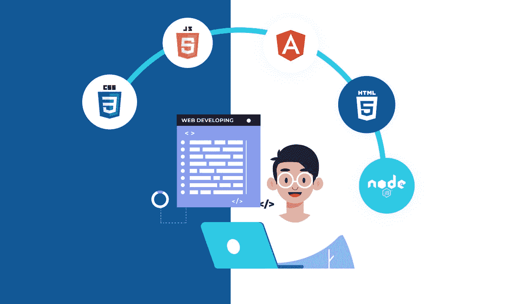
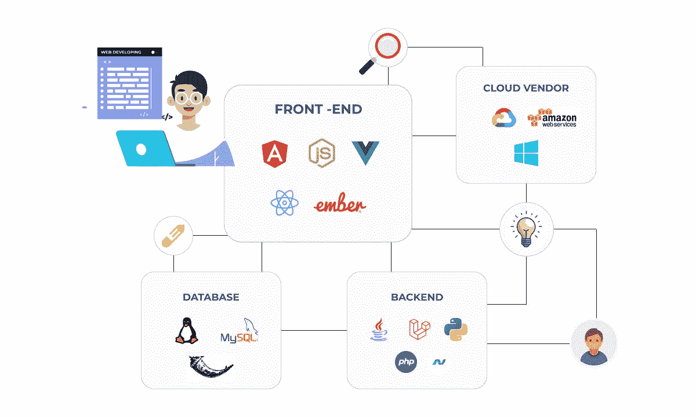

# 全栈开发:为什么它仍然是一条可行的道路

> 原文：<https://javascript.plainenglish.io/full-stack-development-why-its-still-a-viable-path-2674534531a5?source=collection_archive---------12----------------------->

说到 web 开发，有几种不同的方法可以用来开发一个站点，包括前端开发、后端开发或全栈 web 开发。但如果我说最可行的一个，那就是为那些希望进入科技行业的人提供全栈式网络开发。

尽管前端和后端框架兴起，但全栈开发人员仍然需求量很大。在这篇博客文章中，我们将讨论为什么全栈 web 开发仍然是一个理想的技能组合的一些原因。继续阅读，了解更多！

*相关博客:* [*全栈开发者，神话还是现实？*](/full-stack-developers-a-myth-or-reality-b976296687c1)

# 什么是全栈开发？

全栈开发是从开始到结束开发一个网站或应用的过程。它包含了从初始设计到最终部署的所有内容。全栈开发人员是指拥有处理网站或应用程序所有方面的技能和知识的人。

此外，全栈开发团队确保前端是有吸引力的，后端是无 bug 的，并且数据库得到了适当的集成和管理。他们提供一体化的开发服务。

# 全栈 web 开发包括:

*   应用程序后端编程
*   与全栈开发团队协调
*   构建应用程序的前端
*   开发问题疑难解答
*   测试和推出产品
*   管理 web 开发生命周期

# 为什么全栈开发仍然有需求？

有几个原因可以解释为什么全栈 web 开发仍然有很高的需求；其中一些如下:

*必读:* [*全栈发展趋势:2022–23 年跟随的主要趋势*](/full-stack-development-trends-the-major-trends-to-follow-in-2022-23-c69ed631ad27)

# 多种技术专业知识

全栈开发仍然有需求的主要原因之一是因为它需要多种技术的专业知识。全栈开发人员必须精通前端和后端开发，并了解数据库、服务器管理和用户体验。

虽然框架可以帮助完成其中的一些任务，但是从头到尾知道如何做每一件事仍然是有价值的。对于小型企业或初创公司来说尤其如此，它们可能没有预算来雇佣多个具有不同专长的开发人员。

# 端到端责任

全栈 web 开发仍然有很高需求的另一个原因是它提供了端到端的责任。一个全栈开发者从头到尾对整个网站或应用负责。这意味着，如果出现问题，全栈开发人员是需要修复它的人。

这可能是件好事，也可能是件坏事，取决于你如何看待它。一方面，有一个人可以照顾一切，并在确保项目成功方面有既得利益，这很好。另一方面，独自负责整个项目可能会有很大的压力。

# 更快的开发过程

全栈 web 开发的另一个优势是它往往是一个更快的开发过程。因为整个项目只有一个开发人员在工作，所以不需要在不同专业的多个开发人员之间进行协调。

它可以节省大量的时间，这对于试图将产品快速推向市场的企业来说是很有价值的。如果你想更早的开发一个 web 应用， [**从一家可靠的**全栈开发公司**雇佣全栈开发人员**](https://www.valuecoders.com/hire-developers/hire-full-stack-developers?utm_source=hire_full_stack_dev&utm_medium=Guest_Blog&utm_campaign=medium&utm_id=NKY) 。

# 全面发展

全栈开发流行的主要原因之一是它的集成方法。全栈开发者不仅能更快地完成项目，还能提供全方位的服务。

他们负责网站或应用程序开发的每个阶段，从概念化到完成。它节省了企业在项目的不同阶段与不同机构或开发商协调的麻烦和时间。

# 多种技术专业知识

全栈开发需要多种技术的专业知识。开发人员需要充分了解前端和后端开发框架、数据库、服务器管理和用户体验。

虽然各种工具可以帮助完成其中的一些任务，但知道如何从头到尾做每件事仍然是有价值的。这对那些可能没有预算雇佣不同专业的开发人员的小企业或初创公司来说尤其有利。

# 端到端责任

全栈开发流行的另一个原因是它提供了端到端的责任。全栈开发人员从头到尾处理整个网站或应用程序。这意味着如果出了问题，开发人员是需要修复它的人。

这可能是件好事，也可能是件坏事，取决于你如何看待它。一方面，有一个人可以照顾一切，并在确保项目成功方面有既得利益，这很好。另一方面，独自负责整个项目可能会有很大的压力。

# 全栈 Web 开发的缺点

虽然全栈 web 开发有很多优点，但是也要考虑一些缺点。

其中一个主要的不利因素是，寻找具有必要技能的开发人员是一项挑战。因为全栈开发需要多种技术的专业知识，所以很难找到精通所有这些技术的开发人员。

另一个缺点是，全栈开发人员可能比其他人更昂贵，因为他们拥有更广泛的技能。

尽管有这些缺点，全栈 web 开发对于希望快速有效地将产品推向市场的企业来说仍然是一条可行的道路。

在决定这种类型的开发是否适合您的项目之前，权衡利弊是非常重要的。如果你选择走这条路，雇佣一个有经验的全栈开发者。

*你可能会觉得这个很有意思:* [*全栈 vs 均值 vs MERN:你应该选择哪个开发栈？*](https://www.valuecoders.com/blog/web-full-stack/full-stack-vs-mean-vs-mern-which-development-stack-should-you-choose/)

# 结论

对于那些希望进入科技行业的人来说，全栈式 web 开发仍然是一条可行的道路。全栈开发人员可以利用多种技术专业知识和端到端责任，帮助企业更快地完成开发过程。

集成开发人员可以了解所有技术如何协同工作，从而带来更好的客户结果。

*更多内容看* [***说白了就是 io***](https://plainenglish.io/) *。报名参加我们的* [***免费周报***](http://newsletter.plainenglish.io/) *。关注我们关于* [***推特***](https://twitter.com/inPlainEngHQ) ， [***领英***](https://www.linkedin.com/company/inplainenglish/) *和* [***不和***](https://discord.gg/GtDtUAvyhW) ***。***