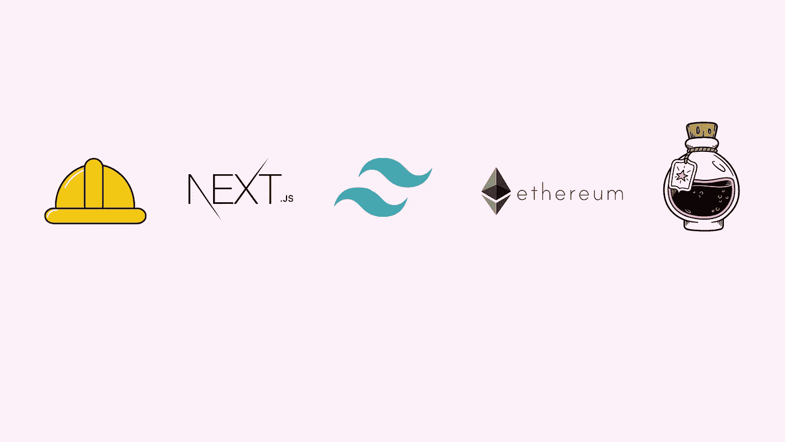
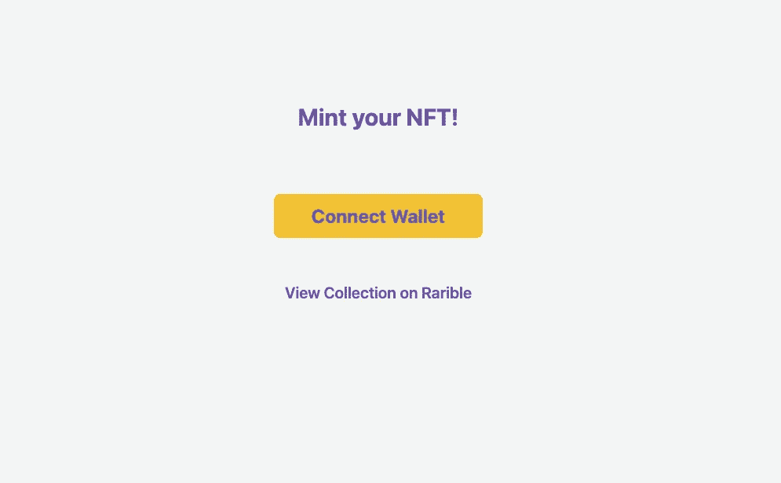
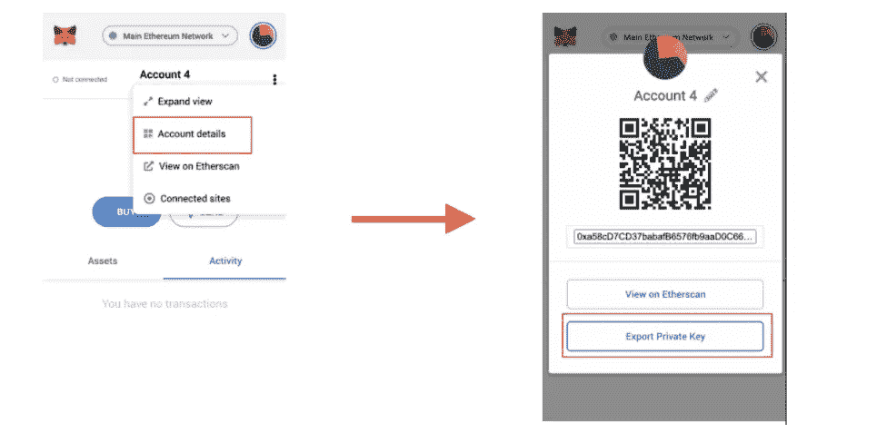

# 使用 Next.js、Hardhat、Ethers.js、Alchemy、MetaMask 和 TailwindCSS 的 Fullstack NFT Minting Dapp

> 原文：<https://javascript.plainenglish.io/fullstack-nft-minting-dapp-using-next-js-hardhat-ethers-js-alchemy-metamask-and-tailwindcss-145e0ef41d26?source=collection_archive---------0----------------------->

## 使用 Next.js、Hardhat、Ethers.js、Alchemy、MetaMask 和 TailwindCSS 构建 NFT Minting Dapp。



# 先决条件

请确保您了解以下内容:

*   [Node.js](https://nodejs.org/en/) 安装在你的机器上。
*   [**Metamask**](https://metamask.io/) 钱包扩展安装完毕。
*   关于 [**ETH 区块链**](https://ethereum.org/en/) 如何工作的知识。

# 资源

*   [坚固性概述](https://docs.soliditylang.org/en/v0.8.11/)
*   关注我的 [Youtube 频道](https://www.youtube.com/channel/UCV-_hzlbVSlobkekurpLOZw)了解即将推出的初学者稳健课程。

# 项目概述

在本文中，我们将首先编写我们自己基于 Solidity 的智能合约，在区块链联邦理工学院部署该智能合约，然后构建一个允许我们铸造 NFT 的 Web 应用程序。



*   要查看有关该项目的详细视频:

*   要查看该项目的完整源代码，这里是[库](https://github.com/Kavit900/minting-nft-dapp)。

# 后端项目设置

要开始，我们需要创建一个安全帽项目。为此，请打开您的终端。创建或更改到一个新的空目录，并运行以下命令:

```
npm install ethers hardhat @nomiclabs/hardhat-waffle \
ethereum-waffle chai @nomiclabs/hardhat-ethers \
@openzeppelin/contracts dotenv
```

接下来，让我们初始化一个新的开发环境，为此，我们将使用 hardhat 命令:

```
npx hardhat
```

运行此命令后，我们将得到一堆设置问题，只需选择`Create a basic sample project`选项，其他选项按`yes`。

现在，您应该可以在根目录中看到为您创建的以下文件和文件夹:

**hardhat.config.js** —您的整个 hardhat 设置(即您的配置、插件和自定义任务)都包含在这个文件中。

**脚本** —包含名为 sample-script.js 的脚本的文件夹，该脚本将在执行时部署您的智能合约。

**test —** 一个包含测试脚本示例的文件夹。

**合同** —保存示例 Solidity 智能合同的文件夹。

## 使用炼金术获取以太坊 API 密钥

Alchemy 是一个区块链开发者平台，致力于简化区块链开发。他们构建了一套开发人员工具、增强的 API 和卓越的节点基础设施，以无缝地构建和运行区块链应用程序。

要创建 API，请遵循以下步骤:-

1.  在[炼金术](https://www.alchemy.com/)报名。

2.转到[仪表板](https://dashboard.alchemyapi.io/)。

3.选择网络作为 rinkeby。

4.在这之后，在 alchemy 上创建 app 之后复制 HTTP key。

完成上述步骤后，在项目根目录下创建一个`.env`文件，并将这个 HTTP 密钥存储为:

```
ALCHEMY_RINKEBY_URL = "ALCHEMY_HTTP_API_KEY"
```

## 从元掩码获取您的帐户私钥

这个私有帐户密钥是我们的智能合同部署脚本所需要的，以便执行它并从我们的钱包中取出煤气费。

1.  点击图标
2.  选择您想要导出的帐户
3.  在账户页面上，点击右上角的菜单(三个点):


4.点击“账户详情”按钮

5.单击“导出私钥”:



6.输入您的密码并点击“确认”

7.你的私钥泄露了。单击以复制它，并将其保存在安全的地方。

8.点击“完成”关闭屏幕:


现在，一旦你有了你的私有密匙，把它复制并粘贴到你的`.env`文件中。

```
ACCOUNT_KEY = "YOUR_ACCOUNT_PRIVATE_KEY
```

**重要提示**:不要将`.env`文件推送到 GitHub，因为它包含你的私人数据。

# 更新 hardhat.config.js

此后，用以下内容更新 **hardhat.config.js** 中的配置:

```
require("[@nomiclabs/hardhat-waffle](http://twitter.com/nomiclabs/hardhat-waffle)");
require('dotenv').config()module.exports = {
  solidity: "0.8.4",
  networks: {
    rinkeby: {
      url: process.env.ALCHEMY_RINKEBY_URL,
      accounts: [process.env.ACCOUNT_PRIVATE_KEY],
    }
  }
};
```

# 创建智能合同逻辑

接下来，我们将创建我们的智能合约！我们将为创建 NFT 资产创建一个 NFT 合同。在 contracts 目录中创建一个名为`knft.sol`的新文件。在这里，添加以下代码:

我不会详细介绍如何在`solidity`中编码，但很快我会在`solidity`上制作视频教程。敬请期待！

在这个契约中，我们继承了由 [OpenZeppelin](https://openzeppelin.com/contracts/) 实现的[ERC 721 ERC 721 uri storage . sol](https://github.com/OpenZeppelin/openzeppelin-contracts/blob/master/contracts/token/ERC721/extensions/ERC721URIStorage.sol)和 [Counters.sol](https://github.com/OpenZeppelin/openzeppelin-contracts/blob/master/contracts/utils/Counters.sol)

对于由契约继承的 **Base64 库**，在契约文件夹中创建一个`libraries`文件夹。在 libraries 文件夹内创建一个`Base64.sol`文件，添加以下代码:

# 测试智能合约

现在智能合约代码已经完成，我们可以尝试使用`unit tests`进行测试。

要创建一个`unit test`，打开`test/sample-test.js`并用以下代码更新它:

现在我们可以使用以下命令运行`unit test`

```
npx hardhat test
```

# 在 Rinkeby 网络上部署智能合约

现在，我们已经创建了我们的智能合同，并且已经过单元测试，我们有信心将其部署到我们的区块链联邦理工学院。

要部署合同，在`scripts`文件夹中创建一个名为`deploy.js`的`file`，并添加以下内容:-

```
const main = async() => {
  const nftContractFactory = await ethers.getContractFactory('knft')
  const nftContract = await nftContractFactory.deploy()
  await nftContract.deployed()console.log("Contract deployed to: ", nftContract.address)
}const runMain = async() => {
  try {
    await main()
    process.exit(0)
  } catch(error) {
    console.log(error)
    process.exit(1)
  }
}runMain()
```

当我们运行下面的脚本时，它将使用`ethers.js`包获取`knft`合同，然后我们将使用`deploy()`内置方法部署它。

要运行该脚本，请使用以下命令:-

```
npx hardhat run scripts/deploy.js --network rinkeby
```

现在，我们脚本中的`console`命令将显示我们的契约被部署的`address`。

```
console.log("Contract deployed to: ", nftContract.address)
```

将那个`contract address`复制并粘贴到一个安全的地方，因为我们将在我们的前端文件中使用它。

# 前端设置

现在，我们需要为 dapp 的前端创建一个新的 Next.js 项目。为此，请在终端中运行以下命令:

```
npx create-next-app -e with-tailwindcss client
```

这将在文件夹`client`中使用 **tailwindcss** 创建一个新的下一个项目。

在此之后，在`client`文件夹中安装前端的依赖项。为此，请在终端中运行以下命令:

```
cd clientnpm install axios ethers
```

# 构建前端

现在**智能契约**正在工作，我们可以开始构建 UI 了。

首先，我们需要在**前端**和**智能合同**之间建立一个连接，这样它就可以利用合同中的功能与来自区块链的数据进行交互。

现在，为了让前端知道基于用户交互调用什么函数，我们需要从文件夹`artifacts/contracts/knft.sol`中导入一个`knft.json`文件，并将该文件放在`client`文件夹中的一个新的`utils`文件夹中。

接下来，在`client`文件夹的根目录下创建一个`config.js`文件，并将`contract`部署地址粘贴为:-

```
export const nftContractAddress = "DEPLOYED_CONTRACT_ADDRES"
```

接下来，要设置前端，转到`client/pages/index.js`并用以下代码更新它:

该代码包含以下功能:

*   `checkIfWalletIsConnected`:顾名思义，此功能检查钱包是否连接到应用程序。
*   `connectWallet`:功能用于连接钱包和 dapp。
*   `checkCorrectNetwork`:该功能检查钱包是否连接到`rinkeby`网络。
*   `mintCharacter`:当用户点击`Mint Character`按钮时，函数创建交易以铸造新的 NFT。
*   `getMintedNFT`:该函数获取新铸造的 NFT 的数据并显示给用户。

要在浏览器中测试 dapp，请在终端中运行以下命令:

```
cd clientnpm run dev
```

# 结论

恭喜你！向区块链联邦理工学院部署您的第一份 Smart 合同，并创建一个 Dapp 来创建 NFT。

与我联系:-

推特👦🏻:-[https://twitter.com/kmmtmm92](https://twitter.com/kmmtmm92)

油管（国外视频网站）📹:-[https://www . YouTube . com/channel/UCV-_ hzlbVSlobkekurpLOZw/关于](https://www.youtube.com/channel/UCV-_hzlbVSlobkekurpLOZw/about)

开源代码库💭:-[https://github.com/Kavit900](https://github.com/Kavit900)

照片墙📸:-[https://www.instagram.com/code_with_kavit/](https://www.instagram.com/code_with_kavit/)

*更多内容请看* [***说白了。报名参加我们的***](http://plainenglish.io/) **[***免费周报***](http://newsletter.plainenglish.io/) *。在我们的* [***社区不和谐***](https://discord.gg/GtDtUAvyhW) *获得独家获取写作机会和建议。***