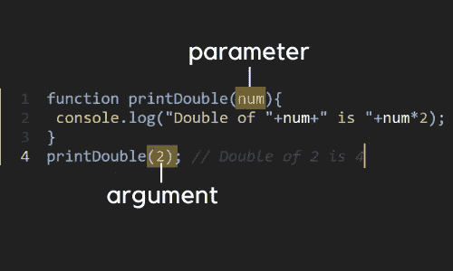

# JavaScript 函数入门

> 原文：<https://javascript.plainenglish.io/function-in-javascript-the-basic-65ac9b93f81?source=collection_archive---------16----------------------->

## JavaScript 编程的基础。


Photo by [Will Porada](https://unsplash.com/@will0629?utm_source=unsplash&utm_medium=referral&utm_content=creditCopyText) on [Unsplash](https://unsplash.com/?utm_source=unsplash&utm_medium=referral&utm_content=creditCopyText)

如果你从事编程已经有一段时间了，你可能会知道函数是任何典型编程语言的重要概念。

如果你熟悉函数式编程语言，比如 JavaScript，那么很难否认 ***函数是函数式编程语言的面包和黄油*** 。

如果您是编程世界的新手，那么通读这篇文章，最后，您可能会了解一些关于函数的有趣的事情以及它为什么重要。

函数的概念相当简单:

***把大问题分解成小块，用一个值包装起来，减少重复。***

听起来很书生气？

我来简化一下。

比方说，你在寻找一些数字的平方时遇到了问题。

典型的方法是:

```
let num;num = 10;
console.log("Square of "+num+" is "+num*num);num = 11;
console.log("Square of "+num+" is "+num*num);num = 12;
console.log("Square of "+num+" is "+num*num);num = 13;
console.log("Square of "+num+" is "+num*num);num = 14;
console.log("Square of "+num+" is "+num*num);num = 15;
console.log("Square of "+num+" is "+num*num);num = 16;
console.log("Square of "+num+" is "+num*num);num = 17;
console.log("Square of "+num+" is "+num*num);
```

不觉得很奇怪吗？重复？

让我们看看函数如何减少这种重复。

```
function findSquare(num) {
 console.log("Square of "+num+" is "+num*num);
}findSquare(10); //Square of 10 is 100
findSquare(11); //Square of 11 is 121
findSquare(12); //Square of 12 is 144
findSquare(13); //Square of 13 is 169
findSquare(14); //Square of 14 is 196
findSquare(15); //Square of 15 is 225
findSquare(16); //Square of 16 is 256
findSquare(17); //Square of 17 is 286
findSquare(18); //Square of 18 is 324
```

怎么样！

这只是一个简单的例子来展示函数的强大，但这还不够。事实上这些天我们已经用**函数式编程方法**到解决了一个问题。我们将在以后的文章中讨论更多的函数式编程。

现在让我们从一些基础开始，帮助你学习基本概念。

## 函数的结构:

要使用函数:

*   首先，您需要定义一个函数
*   然后，调用该函数

**在上面的例子中:**

定义一个函数:

```
function findSquare(num) {
 console.log("Square of "+num+" is "+num*num);
}
```

调用函数:

```
findSquare(10);
```

## 功能的组成部分:

通常，一个函数有三个组成部分:

1.  函数名
2.  因素
3.  返回值

函数名是强制性，而有些函数有参数，有些函数没有。返回值也一样，有些函数返回值，有些函数不返回值。

```
**// Without parameter, Without return value**
function sayHello(){
 console.log("I said hello");
}
sayHello(); *// I said hello***//Without parameter, With return value**
function greeting(){
 return "Hello";
}
console.log(greeting()+ " World!"); *// Hello world***//With parameter, Without return**
function printDouble(num){
 console.log("Double of "+num+" is "+num*2);
}
printDouble(2); *// Double of 2 is 4***//with parameter, with return**
function giveSquare(num) {
 return num*num;
}
console.log(giveSquare(5)); *// 25*
```

在函数内部创建的每个变量只在该函数内部有效。它被称为**局部范围。**

让我展示给你看:

```
function printFive() {
 const num = 5;
 console.log(num); //5
}
console.log(num); //ReferenceError: num is not defined
```

我写过一篇关于 JavaScript 范围的详细文章。在这里结帐👇

[](https://withinbracket.com/posts/variables-in-javascript-scope-and-hoisting/) [## JavaScript 中的变量、范围和提升

### 编程的核心概念，一个都不能跳过。变量是任何事物最基本也是最重要的部分…

withinbracket.com](https://withinbracket.com/posts/variables-in-javascript-scope-and-hoisting/) 

在我继续之前，让我提醒您注意**参数**和**参数**。

有时候人们会混淆参数和自变量，把它们当作一回事。但是要成为一个更好的开发者，你需要知道它们之间的一条细线。

看看下面的图片:



当我们在*调用*函数的同时传递值时，该值被称为**参数**，而当我们接受函数*定义*中的值时，该值被称为**参数。**

这些都是你需要知道的关于函数的基础知识。

但是对于 JavaScript，你可以用不同于其他函数式编程语言的方式来操作函数。

让我展示给你看:

所有函数式编程语言都可以做到这一点:

```
function makeTwice(n) {
 return 2*n;
}
console.log(makeTwice(5));
```

但并不是所有的函数式编程都不能做到这一点:

```
const makeTwice = function(n) {
 return 2*n;
}let giveMeTwice = makeTwice; *//passing makeTwice to giveMeTwice*
console.log(giveMeTwice(5));
```

在 JavaScript 中，我们甚至可以将函数像典型值一样传递给变量。这个特性在 JavaScript 函数式编程中有几个好处，我们将在以后的文章中讨论。

在我结束之前，有些话题需要讨论。

## 可选参数:

让我先给你看一个例子:

```
function makeSquare(n) {
   return n* n; 
}
console.log(makeSquare(5, "hello", false)); //25
```

我们可以传递 3 个参数 *(5，“hello”，false)* ，但是我们的函数 **makeSquare** 只能接受 1 个参数。

所以你猜对了，无论是 ***【你好】*** 还是 ***假*** 都是可选参数。

可选参数看似无用，但事实并非如此。

让我展示给你看:

假设你有一个传递 2 个参数的问题。如果函数接受两个参数，它给出它们的差的结果，但是如果函数只接受一个参数，那么它给出这个数的-ve。

```
function minus(x, y) {
  if (y === undefined)
    return -x;
  else 
   return x - y;
}
console.log(minus(10)); // → -10
console.log(minus(10, 5)); // → 5
```

您甚至可以设置可选参数的默认值。

```
function multiply(x, y=1) {
  return x*y; //here y is 1 by default
}
console.log(multiply(10)); // → 10
console.log(multiply(10, 5)); // 50
```

## 参数数组

就像我之前告诉你的，JavaScript 中的函数比其他任何函数都要高级。它的一个很酷的特性是**参数**数组。

arguments 数组是 JavaScript 中一个函数的默认属性，它包含以**数组形式传递给该函数的所有参数。**

让我展示给你看:

```
function demo(a,b,c) {
 console.log(a); // 10
 console.log(b); // 20
 console.log(c); // 30
 console.log(arguments.length); // 3 
 console.log(arguments[0]); // 10
 console.log(arguments[1]); // 20
 console.log(arguments[2]); // 30
}demo(10,20,30);
```

即使您没有在函数参数中传递任何东西，arguments 数组仍然有效。

听起来很奇怪？

看看这个:

```
**// removing a,b,c from parameter**
function demo() {
 console.log(arguments.length); // 3 
 console.log(arguments[0]); // 10
 console.log(arguments[1]); // 20
 console.log(arguments[2]); // 30
}demo(10,20,30);
```

# 结论:

也就是说，到目前为止，我们已经涵盖了您需要了解的关于 JavaScript 函数的所有基础知识。现在你可以自己去和他们玩了。

因为这是你能学得更好的唯一方法。

但这根本不是。关于函数和它们的一些很酷的特性，我们还有很多要讨论的。

更多后续文章。在那之前继续学习。

*本文正式发表于* [***括号内***](https://withinbracket.com/posts/function-in-javascript/) ***。***

*更多内容请看*[***plain English . io***](https://plainenglish.io/)*。报名参加我们的* [***免费周报***](http://newsletter.plainenglish.io/) *。关注我们关于*[***Twitter***](https://twitter.com/inPlainEngHQ)*和*[***LinkedIn***](https://www.linkedin.com/company/inplainenglish/)*。加入我们的* [***社区不和谐***](https://discord.gg/GtDtUAvyhW) *。*