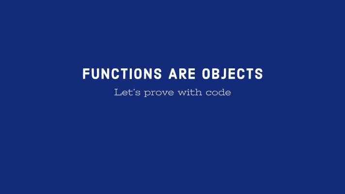

# 函数是 JavaScript 中的对象，我们来证明一下

> 原文：<https://javascript.plainenglish.io/functions-are-objects-in-javascript-lets-prove-it-a5129c81b76d?source=collection_archive---------13----------------------->

## 通过 5 个要点，我们可以看到函数在 JavaScript 内部只是对象。



函数是 JavaScript 中的对象。我们可以像传递对象一样传递它们，比如包含数据。除了作为函数执行操作之外，它们还作为数据存储在内部。

JavaScript 中的函数是一个对象，因为，

1.  函数包含像对象一样的属性
2.  我们可以添加新的属性或读取属性
3.  我们可以将一个函数连同它的属性和数据一起传递给另一个函数
4.  我们可以返回一个函数及其属性和数据
5.  它属于 JavaScript 原型链

> 空谈是廉价的，给我看看你的代码

让我们看看这些声明的实际应用，

# 函数包含属性

我们可以得到一个函数名，就像对象属性一样，

```
function getBestRockBandInBd() {
  return 'Warfaze'; 
}console.log(getBestRockBandInBd.name); // getBestRockBandInBd
```

这里我们看到，当我们创建一个函数时，它有属性`name`，可以像对象属性一样打印出来。

当我们创建一个函数时，它在内部创建一个具有以下属性的对象，

*   代码(我们可以使用`functionName()`调用它们)
*   名称(存储的功能名称，不适用于箭头功能)

# 我们可以添加新的属性或读取属性

我们可以使用函数来存储属性并在以后检索它，

```
function bestPsychedelicRockBandInBd() {
  return 'Sonar Bangla Circus';
}bestPsychedelicRockBand.foo = 'bar';console.log(bestPsychedelicRockBand.foo); // bar
```

这里我们为函数`bestPsychedelicRockBand`设置了一个属性`foo`，稍后在控制台中打印它。

# 我们可以将一个函数连同它的属性和数据一起传递给另一个函数

让我们将一个函数传递给另一个函数并执行它，

```
function nemesis(whoIsVocal) {
  console.log(whoIsVocal()); // `whoIsVocal` function comes as parameter
}// We will pass this function to `nemesis` function as parameter
function showVocalName() {
  console.log('Zohad');
}nemesis(showVocalName);
```

# 我们可以返回一个函数及其属性和数据

现在像一个对象一样，我们将从另一个函数返回一个函数，

```
function anotherRockBand() {
  // We are returning function named `aurthohin`
  return function aurthohin() {
    console.log('This is Aurthohin');
  }
}const returnedFunction = anotherRockBand();returnedFunction();
```

这个特性增强了 JavaScript 的`closure`特性。

# 它属于 JavaScript 原型链

我们知道基本对象`Object`有一个叫做`prototype`的属性，

```
console.log(Object.hasOwnProperty('prototype')); // true
```

如果我们创建一个函数，我们可以看到，这个函数也有属性`prototype`，

```
function crypticFate() {}console.log(crypticFate.hasOwnProperty('prototype')); // true
```

我们可以使用`call`、`bind`和`apply`调用一个函数。有趣的是，这些不是函数自身的属性，我们可以验证这一点，

```
function crypticFate() {}console.log(crypticFate.hasOwnProperty('call'));  // false
console.log(crypticFate.hasOwnProperty('bind'));  // false
console.log(crypticFate.hasOwnProperty('apply'));  // false
```

实际上，这些属性是从原型链继承的，并且是基对象的固有属性。为了验证，

```
function crypticFate() {}console.log(crypticFate.__proto__.hasOwnProperty('call'));  // true
console.log(crypticFate.__proto__.hasOwnProperty('bind'));  // true
console.log(crypticFate.__proto__.hasOwnProperty('apply'));  // true
```

# 最后的想法

正如我们看到的这 5 点，如上所述，函数只是 JavaScript 世界中的对象。让我知道你对此的想法。

*更多内容请看*[***plain English . io***](https://plainenglish.io/)*。报名参加我们的* [***免费周报***](http://newsletter.plainenglish.io/) *。关注我们关于*[***Twitter***](https://twitter.com/inPlainEngHQ)[***LinkedIn***](https://www.linkedin.com/company/inplainenglish/)*[***YouTube***](https://www.youtube.com/channel/UCtipWUghju290NWcn8jhyAw)*[***不和***](https://discord.gg/GtDtUAvyhW) *。对增长黑客感兴趣？检查* [***电路***](https://circuit.ooo/) *。***