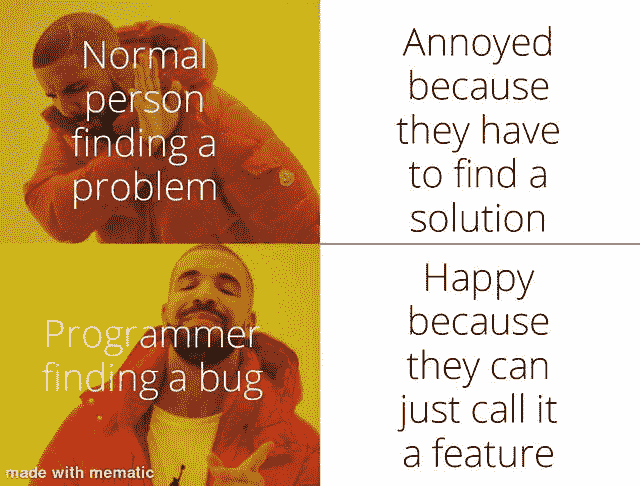
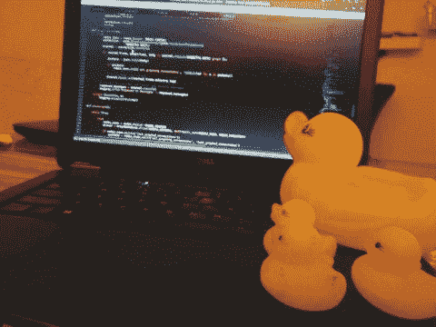
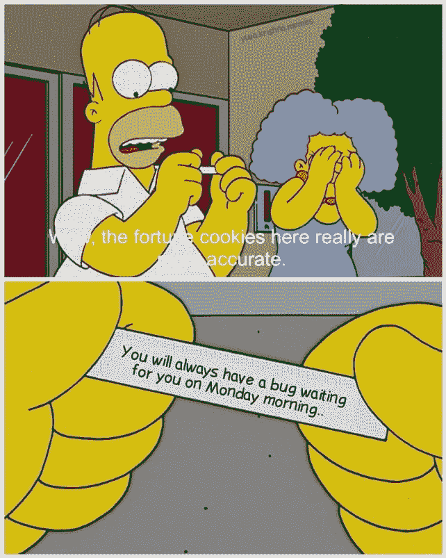
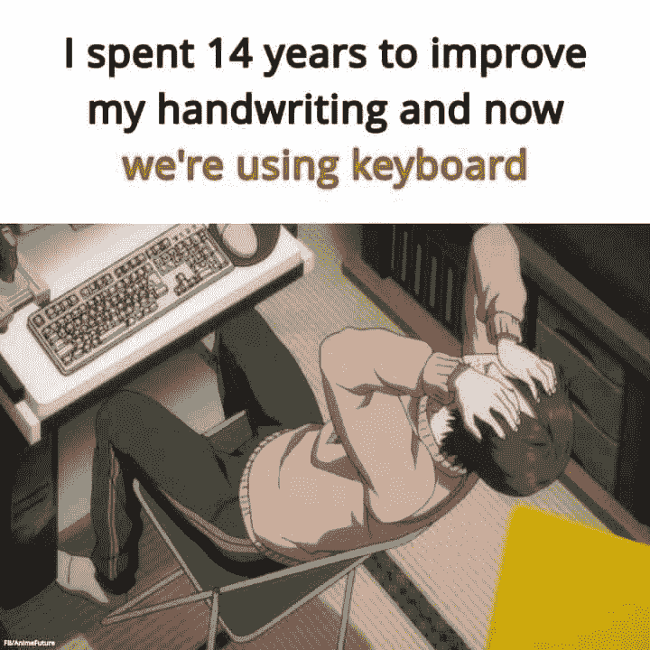

# 有趣的比较:程序员与普通人(第 2 部分)

> 原文：<https://javascript.plainenglish.io/funny-comparisons-programmers-vs-normal-people-part-2-93a68a97ffb7?source=collection_archive---------0----------------------->

## 是什么让程序员与众不同？

[https://www.reddit.com/r/ProgrammingAndTech](https://www.reddit.com/r/ProgrammingAndTech)

程序员和正常人不一样。你相信这种说法吗？让我们来看看一些不同之处，以帮助您得出结论。

*(这是一篇幽默的文章，无意伤害任何社区。)*

# 让我们与众不同的一些常见术语…

Picture Credit:[https://www.reddit.com/r/memes/comments/r4th0i/normal_people_vs_programmer/](https://www.reddit.com/r/memes/comments/r4th0i/normal_people_vs_programmer/)

# 你睡觉的时候带着笔记本电脑吗？

Picture Credit: [https://www.pinterest.c](https://www.pinterest.ca/)om

# 当我的朋友抱怨他们的工作时，我希望他们来编程，这样我们就可以分享同样的痛苦

Picture Credit: https://www.pinterest.com

# 当我的经理要求我们进行结对编程，以便我们能够快速完成任务时，他的期望与现实相比…

Picture Credit:[https://www.reddit.com/r/memes/](https://www.reddit.com/r/memes/comments/r4th0i/normal_people_vs_programmer/)

# 对我们来说，问题是功能…

Picture Credit:[https://www.reddit.com/r/memes/](https://www.reddit.com/r/memes/comments/r4th0i/normal_people_vs_programmer/)

# 你向你的朋友解释这些吗？

Picture Credit:[https://www.freelancinggig.com/](https://www.freelancinggig.com/)

# 如此相关…

Picture Credit: [https://www.pinterest.com](https://www.pinterest.com)

# 你按了多少次 ctrl+s？

Picture Credit:[https://www.reddit.com/](https://www.reddit.com/r/memes/comments/r4th0i/normal_people_vs_programmer/)

# 当我们需要给每个图标添加工具提示时…

Picture Credit: [https://www.pinterest.com](https://www.pinterest.com)

# 为什么要使用额外的内存？

Picture Credit:[https://www.freelancinggig.com/](https://www.freelancinggig.com/)

# 程序员 vs 数学家…

Picture Credit: [https://www.reddit.com/r/ProgrammerHumor/](https://www.reddit.com/r/ProgrammerHumor/)

# 当他们问 Jason 而不是 JSON 时

# 对其他人来说，它可能是一个台球玩具，但对它来说，它是压力的伙伴…

# 一些有趣的比较…

Picture Credit:[https://www.reddit.com/r/memes/](https://www.reddit.com/r/memes/comments/r4th0i/normal_people_vs_programmer/)

# 世界林业人员协会(Woodmen of the World)..事实上，我并不认为这有什么大不了的，但拿着它也没什么坏处。英雄联盟

Picture Credit:[https://www.reddit.com](https://www.reddit.com/r/memes/comments/r4th0i/normal_people_vs_programmer/)

# 没有外交回答..说话直是我们的美德哈哈..

Picture Credit:[https://www.reddit.com](https://www.reddit.com/r/memes/comments/r4th0i/normal_people_vs_programmer/)

# 当有人开始谈论 NNN 时…我们确实有很多其他的…

Picture Credit: [https://www.reddit.com/r/ProgrammerHumor/](https://www.reddit.com/r/ProgrammerHumor/)

喜欢 vs LGTMs

Picture Credit: [https://www.reddit.com/r/ProgrammerHumor/](https://www.reddit.com/r/ProgrammerHumor/)

# (第 1 部分，如果您错过了)

# 正常人设置闹钟是为了记住起床时间…而程序员…

[https://www.reddit.com/r/ProgrammerHumor](https://www.reddit.com/r/ProgrammerHumor)

# 我们在这个区域处于什么位置？

[https://www.reddit.com/r/ProgrammerHumor](https://www.reddit.com/r/ProgrammerHumor)

# 一些常见问题…

[https://knowyourmeme.com/](https://knowyourmeme.com/)

# 在 COVID 时间内…

[https://aprogrammerlife.com/](https://aprogrammerlife.com/)

# 你如何定义树根？

[https://www.semicolonworld.com/humor](https://www.semicolonworld.com/humor)

# 调试…

[https://twitter.com/webclipse/status/665260017600196608](https://twitter.com/webclipse/status/665260017600196608)

# 程序员如何睡觉…

[https://www.reddit.com/](https://www.reddit.com/)

# 你怎么看字母表？

# 就寝时间…

# 笔记本电脑…

[https://aprogrammerlife.com/](https://aprogrammerlife.com/)

> **如果你喜欢这篇文章，请用这个链接加入 Medium，它帮助我得到一点钱。**

> [“从此链接加入](https://sheetalpatel93.medium.com/membership)”

# 你在想什么？

[https://www.pinterest.ca/](https://www.pinterest.ca/)

# 你喝咖啡还是茶？

# 是的，我们确实经常跑步…

[https://onsizzle.com/t/normal-people](https://onsizzle.com/t/normal-people)

# 数据库管理员如何看待关系…

[https://me.me/](https://me.me/)

# 正常人是怎么犯的？等等，程序员呢？

[https://memesuite.org/programming/110335/](https://memesuite.org/programming/110335/)

> 额外内容

# 你喜欢幸运饼干吗？如果你收到这个，作为一个开发者你的反应是什么？

[https://www.facebook.com/yuva.krishna.memes](https://www.facebook.com/yuva.krishna.memes)

# 我也有同样的感觉…当我很少用纸和笔写字的时候…

[https://www.facebook.com/yuva.krishna.memes](https://www.facebook.com/yuva.krishna.memes)

# 我不在乎，我知道这是一种不好的态度，但让我享受这种感觉…

[https://www.facebook.com/yuva.krishna.memes](https://www.facebook.com/yuva.krishna.memes)

# 一切皆有可能..不管怎样，你都可以得到结果。

[https://www.facebook.com/yuva.krishna.memes](https://www.facebook.com/yuva.krishna.memes)

# 让我们来看看 Div 的虚拟世界…在我改变位置进行适当调整后，他们看起来是怎样的…

[https://www.facebook.com/yuva.krishna.memes](https://www.facebook.com/yuva.krishna.memes)

# 当我在代码中发现一个问题时，最常见的事情发生了…

[https://www.monkeyuser.com/](https://www.monkeyuser.com/)

# 下次我会试着写正确的代码…让我们今天就发出请求吧…

[https://www.monkeyuser.com/](https://www.monkeyuser.com/)

# 我的分支在做什么？

[https://www.facebook.com/ProgrammersCreateLife](https://www.facebook.com/ProgrammersCreateLife)

# 当我们每年收到太多的框架时..这很正常…

[https://www.facebook.com/programminggeeks.in](https://www.facebook.com/programminggeeks.in)

# 你喜欢什么？我正在学习一门新的语言…

[https://www.facebook.com/techindustan/](https://www.facebook.com/techindustan/)

# 为帮助我们脱帽致敬…

[https://www.facebook.com/programminggeeks.in](https://www.facebook.com/programminggeeks.in)

# 让我们做一些课程

# 后来意识到…

[https://www.facebook.com/javascriptJS/photos/a.1387402908063976/2193489080788684/](https://www.facebook.com/javascriptJS/photos/a.1387402908063976/2193489080788684/)

# 我们很安全…

[https://www.facebook.com/ProgrammersCreateLife/photos/3513764435339076](https://www.facebook.com/ProgrammersCreateLife/photos/3513764435339076)

# 将 bug 转化为功能…

# 当我找到根本原因时…

[https://www.quora.com/What-are-the-best-programming-comic-strips](https://www.quora.com/What-are-the-best-programming-comic-strips)

# 当我试图修复一个小错误时…

[https://www.quora.com/What-are-the-best-programming-comic-strips](https://www.quora.com/What-are-the-best-programming-comic-strips)

# 如何衡量代码质量？

[https://www.osnews.com/comics/page/4/](https://www.osnews.com/comics/page/4/)

 [## 25 个以上的 StackOverflow 编程迷因，所有开发人员都可以涉及到

### 编程幽默可以通过刷新你的情绪来减轻你的压力

javascript.plainenglish.io](/25-more-stackoverflow-programming-jokes-that-all-devs-can-relate-to-ebc2f9c11ca3) 

# IT 人如何看待彼此…

[https://www.facebook.com/ProgrammersCreateLife/photos/3355993314449523](https://www.facebook.com/ProgrammersCreateLife/photos/3355993314449523)

# StackOverflow 的真正英雄…

[https://www.quora.com/What-are-some-of-the-best-programmer-jokes-and-memes-out-there](https://www.quora.com/What-are-some-of-the-best-programmer-jokes-and-memes-out-there)

# 单元测试与集成测试

[https://iq.opengenus.org/best-programming-memes-of-2019/](https://iq.opengenus.org/best-programming-memes-of-2019/)

# 很好的幽默…

[https://www.facebook.com/ProgrammersCreateLife/photos/3136101556438701](https://www.facebook.com/ProgrammersCreateLife/photos/3136101556438701)

*更多内容请看*[***plain English . io***](https://plainenglish.io/)*。报名参加我们的* [***免费周报***](http://newsletter.plainenglish.io/) *。关注我们关于*[***Twitter***](https://twitter.com/inPlainEngHQ)[***LinkedIn***](https://www.linkedin.com/company/inplainenglish/)*[***YouTube***](https://www.youtube.com/channel/UCtipWUghju290NWcn8jhyAw)*[***不和***](https://discord.gg/GtDtUAvyhW) *。对增长黑客感兴趣？检查* [***电路***](https://circuit.ooo/) *。***