# 只有程序员才能理解的有趣的迷因

> 原文：<https://javascript.plainenglish.io/funny-memes-that-only-programmers-can-understand-af7c553e5cdb?source=collection_archive---------0----------------------->

## 2022 年最佳编程笑话汇编。


Photo by [Sithamshu Manoj](https://unsplash.com/@shidzuu?utm_source=medium&utm_medium=referral) on [Unsplash](https://unsplash.com?utm_source=medium&utm_medium=referral)

人生无常，有时觉得开心，有时觉得难过。但是我们无法控制事情。你唯一能做的就是接受现状，无论如何都要努力保持快乐。

我们(开发者)也是一样，有时候能解决或完成任务就很开心，有时候需要保持清醒直到完成某件事。

但是这一切和文章有什么关系呢？关系是享受生活的每一刻，不管你周围的事情如何。

今天，我收集了一些与编程相关的最佳迷因，它们肯定能帮助你提升幸福感。

# 当有人更改 UI 中的 ID 时…

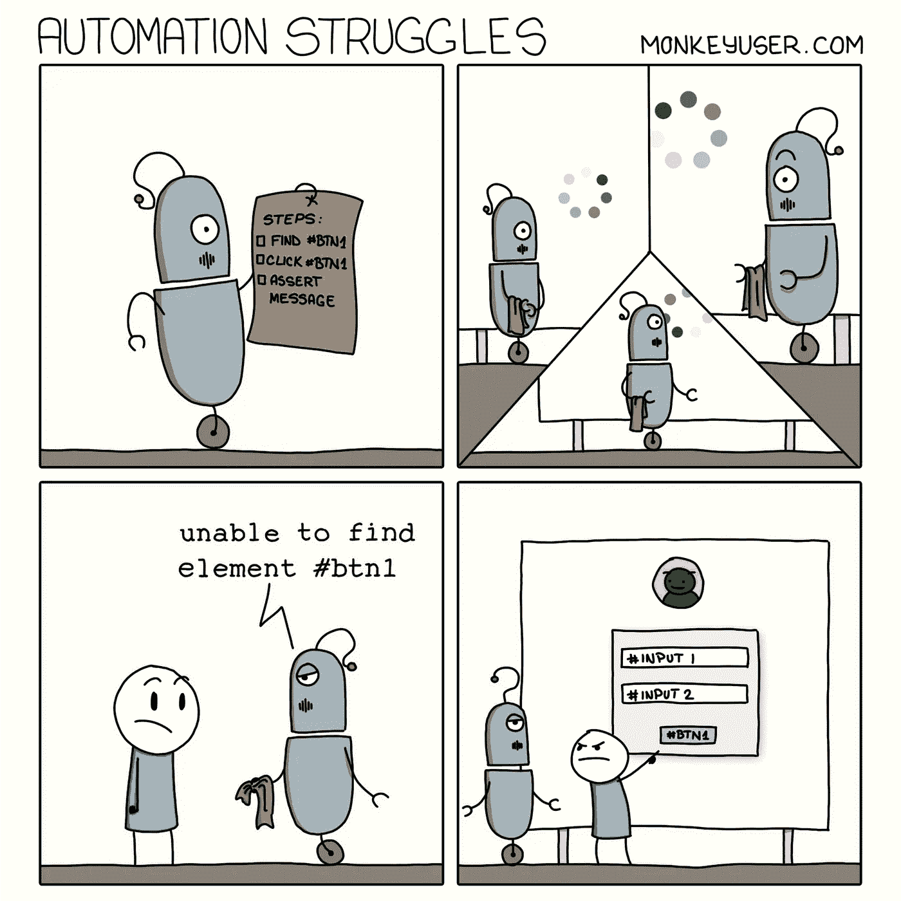

Picture Credit:[https://www.monkeyuser.com/](https://www.monkeyuser.com/)

# 软件开发中的假设…

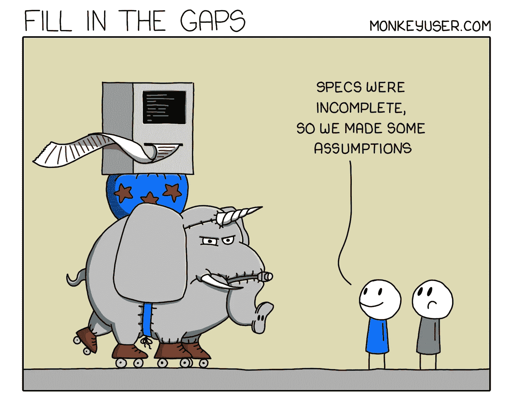

Picture Credit:[https://www.monkeyuser.com/](https://www.monkeyuser.com/)

# 有人能理解吗？

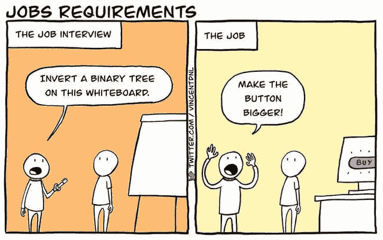

[https://www.reddit.com/r/ProgrammerHumor/](https://www.reddit.com/r/ProgrammerHumor/)

# 我在哪里？

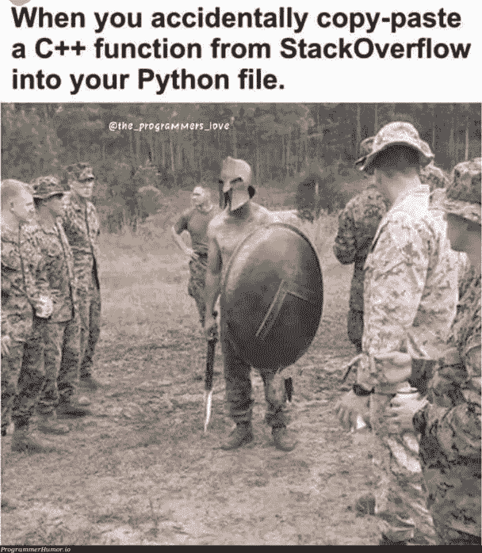

Picture Credit:[https://programmerhumor.io/](https://programmerhumor.io/)

# 我警告过他们，但他们想这样…

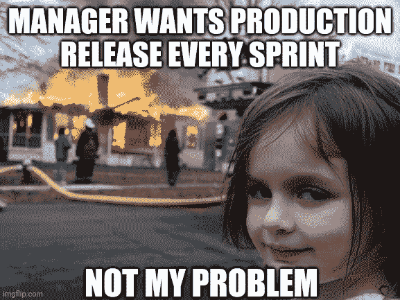

Picture Credit: [https://www.reddit.com/r/ProgrammerHumor/](https://www.reddit.com/r/ProgrammerHumor/)

# 自从我买下这把钥匙的那天起，它就没有沾过灰尘…


Picture Credit:[https://programmerhumor.io/](https://programmerhumor.io/)

# 当你找到一个好的副业项目并把它添加到你的 git 中时…

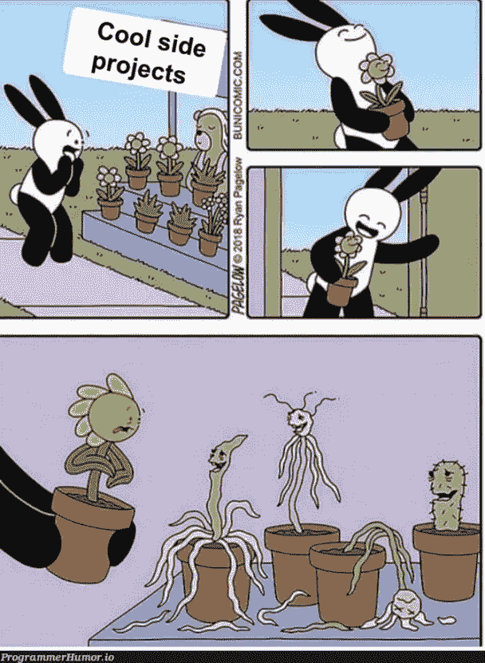

Picture Credit:[https://programmerhumor.io/](https://programmerhumor.io/)

# 等等，不用写了，有库可用…


Picture Credit:[https://programmerhumor.io/](https://programmerhumor.io/)

# 当高级开发人员参加客户会议时…


Picture Credit:[https://www.facebook.com/yuva.krishna.memes](https://www.facebook.com/yuva.krishna.memes)

# 有人有机会阅读所有内容吗？

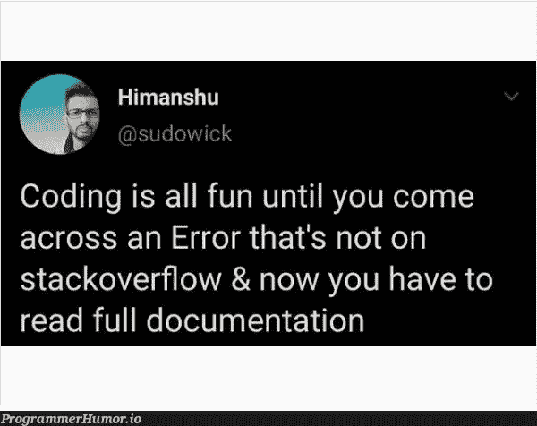

Picture Credit:[https://programmerhumor.io/](https://programmerhumor.io/)

# 这个冲刺不会有腐坏…

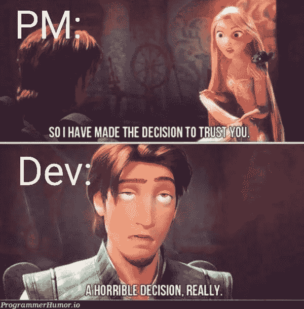

Picture Credit:[https://programmerhumor.io/](https://programmerhumor.io/)

# 猜猜他们用的是哪种方法？敏捷还是瀑布？


Picture Credit:[https://programmerhumor.io/](https://programmerhumor.io/)

# 当你在 IT 公司贴上这个标签…

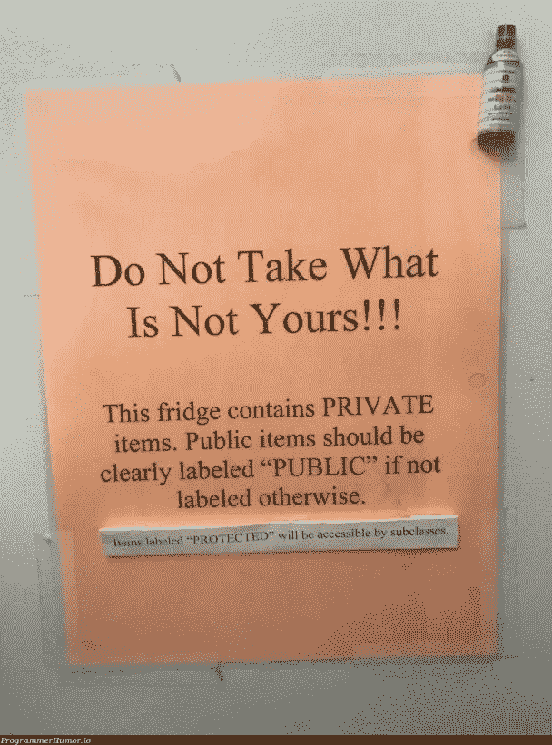

Picture Credit:[https://programmerhumor.io/](https://programmerhumor.io/)

# 改编某物的艺术。


Picture Credit:[https://programmerhumor.io/](https://programmerhumor.io/)

# 在家工作日记…


Picture Credit:[https://programmerhumor.io/](https://programmerhumor.io/)

# 额外内容

```
***A boy looks inside a girls shirt in a class.******Girl : Its bad manners***
***Boy : No. Its not***
***Girl : Y?***
***Boy : Members of the same class can access private data***
```

```
3 Database Admins walked into a NoSQL bar. A little while later they walked out because they couldn't find a table.
```

```
There is a C level. Everything above that is High level, eveything below that is Low level.
```

**来源:**

[https://www . Reddit . com/r/AskReddit/comments/1kv hmz/whats _ the _ best _ programming _ joke _ that _ you _ know/](https://www.reddit.com/r/AskReddit/comments/1kvhmz/whats_the_best_programming_joke_that_you_know/)

# 如何避免线头问题？用任何… LOL

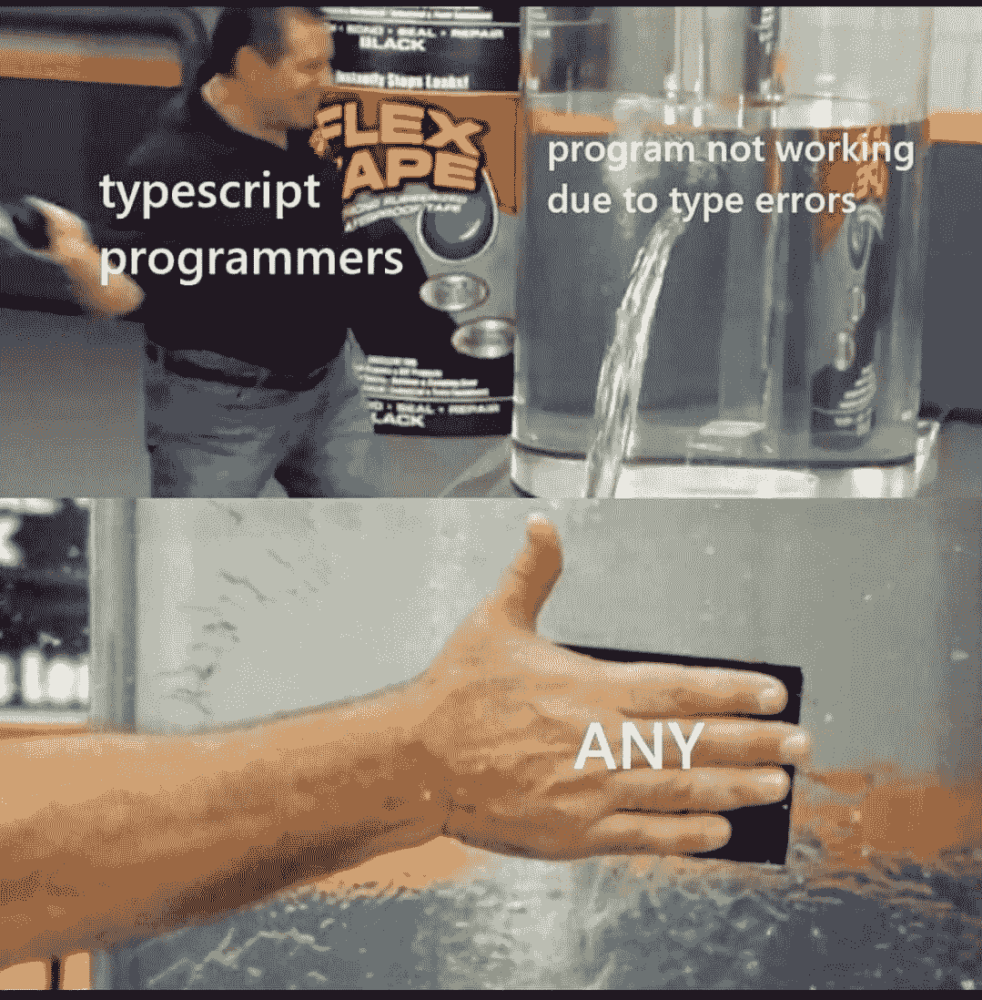

[https://www.facebook.com/photo/?fbid=507053803737120&set=gm.2892947247639492](https://www.facebook.com/photo/?fbid=507053803737120&set=gm.2892947247639492)

# 让我们与模拟响应并行工作，稍后我们将集成它…

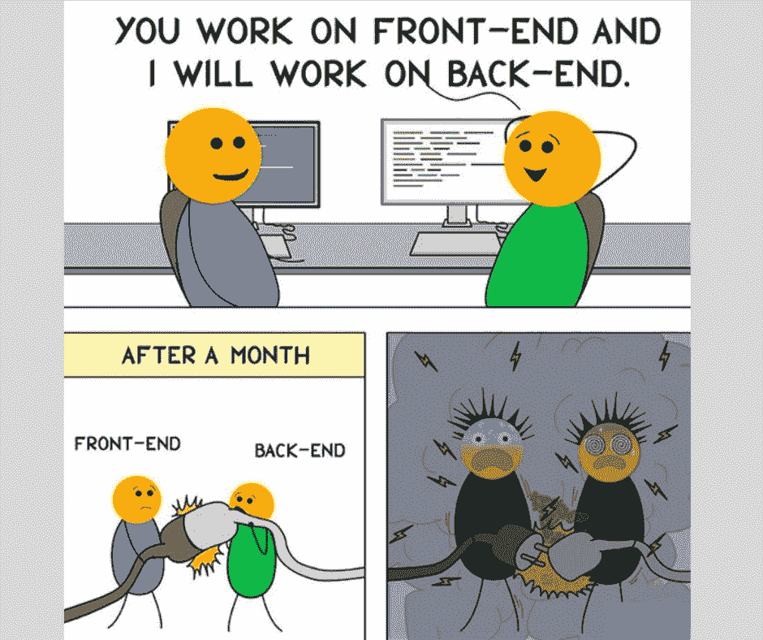

[https://www.facebook.com/101406868766057/photos/a.111476934425717/152664723640271/](https://www.facebook.com/101406868766057/photos/a.111476934425717/152664723640271/)

# 字面上的我，现在…

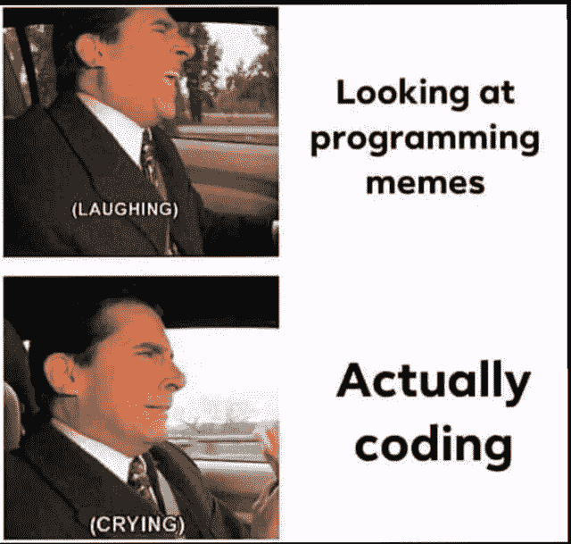

[https://www.facebook.com/101406868766057/photos/a.111476934425717/152664863640257/](https://www.facebook.com/101406868766057/photos/a.111476934425717/152664863640257/)

# 文档是什么？我知道，斯达克弗洛。


[https://www.facebook.com/photo?fbid=3878936845549373&set=gm.944860159405928](https://www.facebook.com/photo?fbid=3878936845549373&set=gm.944860159405928)

# 为什么它不工作…嗯…哦…这就是为什么…

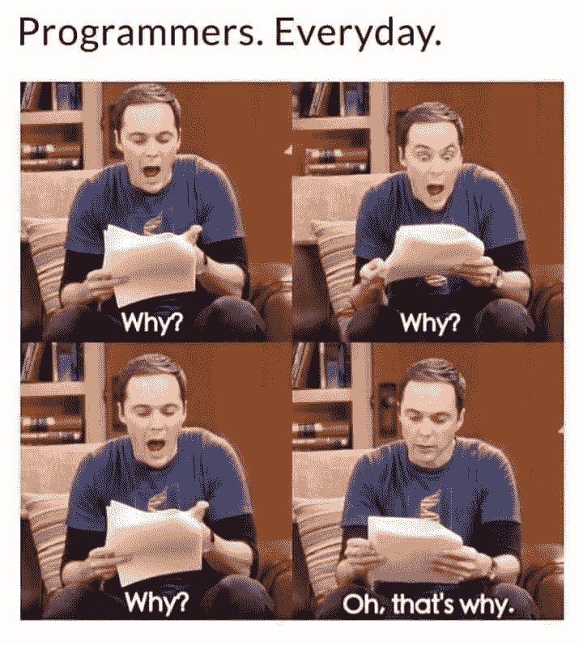

[https://www.facebook.com/CodersPhilippines/photos/a.103712541841220/150585230487284/](https://www.facebook.com/CodersPhilippines/photos/a.103712541841220/150585230487284/)

# 不能找到相同的结果，但是的，这是完美的定义

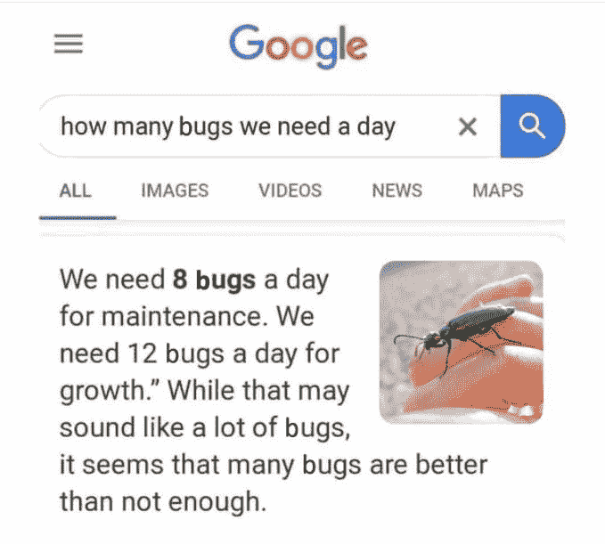

[https://www.facebook.com/photo/?fbid=4637136529652355&set=gm.6513183998707329](https://www.facebook.com/photo/?fbid=4637136529652355&set=gm.6513183998707329)

# 行内注释就像…


[https://www.reddit.com/r/ProgrammerHumor/comments/oxpi0x/inline_comments_be_like/](https://www.reddit.com/r/ProgrammerHumor/comments/oxpi0x/inline_comments_be_like/)

# 当你需要向你的经理解释某事时…

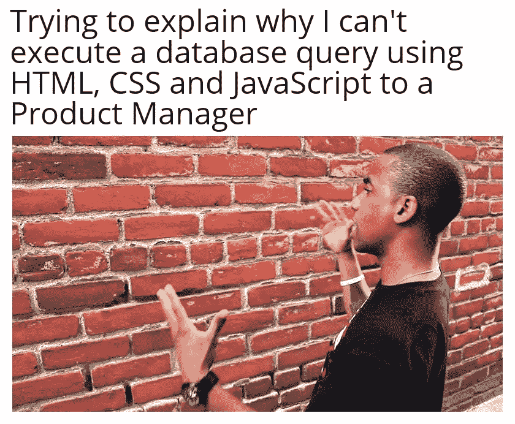

[https://www.reddit.com/r/ProgrammerHumor/comments/oxr93p/how_why/](https://www.reddit.com/r/ProgrammerHumor/comments/oxr93p/how_why/)

# 任何人都不应该碰一个功能…即使它没有用…


[https://www.reddit.com/r/ProgrammerHumor/comments/ox51s7/tf_does_it_even_do/](https://www.reddit.com/r/ProgrammerHumor/comments/ox51s7/tf_does_it_even_do/)

# 自动化脚本正在运行，但没有人更新它们…

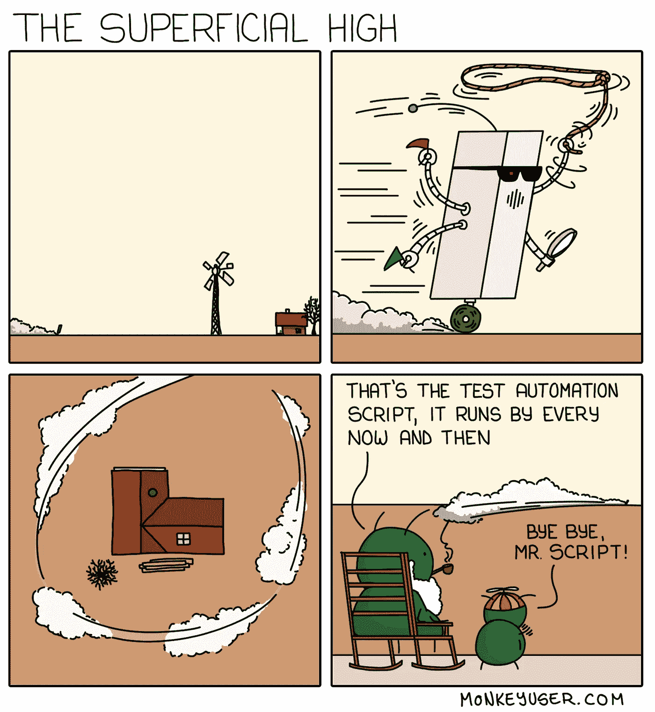

[https://www.monkeyuser.com/2019/the-superficial-high/?sc=true&dir=random](https://www.monkeyuser.com/2019/the-superficial-high/?sc=true&dir=random)

# 希望你笑得很开心！

*更多内容请看*[***plain English . io***](https://plainenglish.io/)*。报名参加我们的* [***免费周报***](http://newsletter.plainenglish.io/) *。关注我们关于*[***Twitter***](https://twitter.com/inPlainEngHQ)[***LinkedIn***](https://www.linkedin.com/company/inplainenglish/)*[***YouTube***](https://www.youtube.com/channel/UCtipWUghju290NWcn8jhyAw)*[***不和***](https://discord.gg/GtDtUAvyhW) *。***