# 有趣的编程幽默

> 原文：<https://javascript.plainenglish.io/funny-programming-humor-16a1ee00bf55?source=collection_archive---------0----------------------->

## 编程幽默的笑声炸弹

Photo by [Toms Rīts](https://unsplash.com/@piecdesmit?utm_source=medium&utm_medium=referral) on [Unsplash](https://unsplash.com?utm_source=medium&utm_medium=referral)

你可能已经听过很多次了，喝更好的咖啡可以让你一整天都很美好。但是，如果某件事给你带来了笑容，你当然可以说… **我已经感觉到了…或者我很喜欢这个…**

今天，我试着整理一些在互联网和脸书上发现的**笑话/迷因**，它们让我开心了一天…

> 开始了…准备好改变你的心情…

# 谁花更多的时间在这里寻找答案？

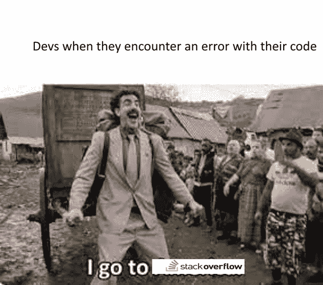

Picture Credit:[https://www.reddit.com/r/ProgrammerHumor/](https://www.reddit.com/r/ProgrammerHumor/)

# 故障排除指南 101

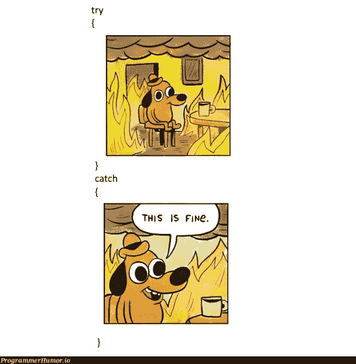

Picture Credit:[https://programmerhumor.io/](https://programmerhumor.io/)

# 当压力水平增加时…

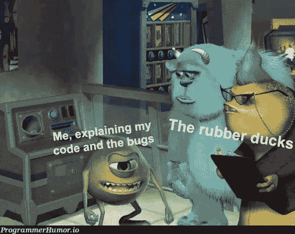

Picture Credit:[https://programmerhumor.io/](https://programmerhumor.io/)

# Java 开发人员可以与此相关…

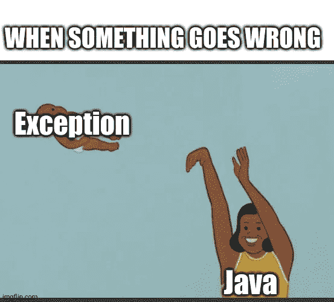

Picture Credit:[https://www.reddit.com/r/ProgrammerHumor/](https://www.reddit.com/r/ProgrammerHumor/)

# 谁想成为 QA 工程师？

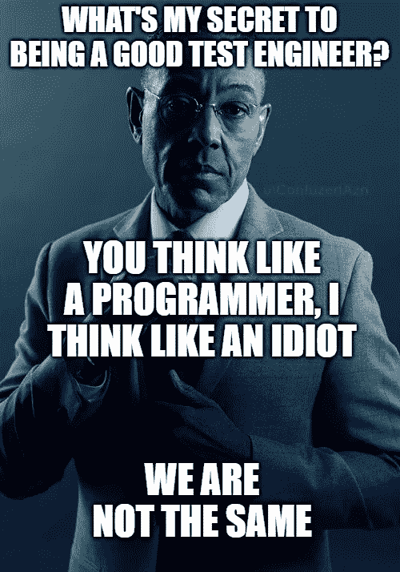

Picture Credit:[https://www.reddit.com/r/ProgrammerHumor/](https://www.reddit.com/r/ProgrammerHumor/)

# 有人在敏捷中工作吗？你花多少时间在编程上？

Picture Credit:[https://www.monkeyuser.com/](https://www.monkeyuser.com/)

# 当你朋友要求你学习一个框架时

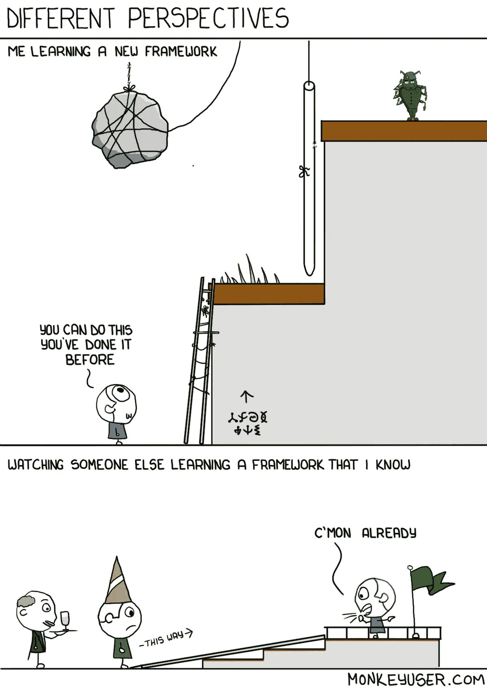

Picture Credit:[https://www.monkeyuser.com/](https://www.monkeyuser.com/)

# 我们可以联系到这个通知…

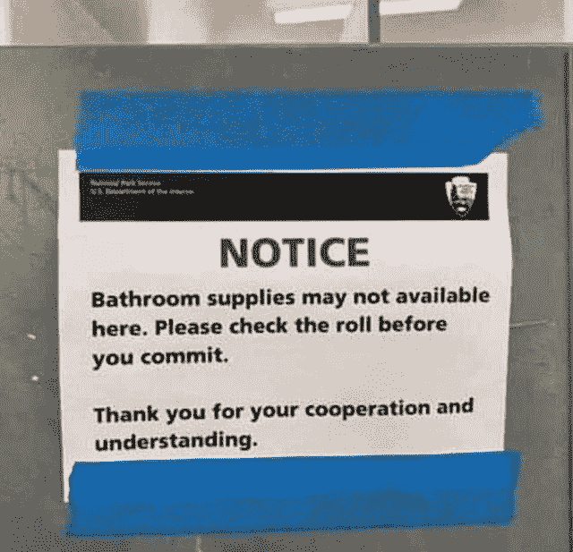

Picture Credit:[https://www.reddit.com/r/ProgrammerHumor/](https://www.reddit.com/r/ProgrammerHumor/)

# 当你的榜样是 Stackoverflow…

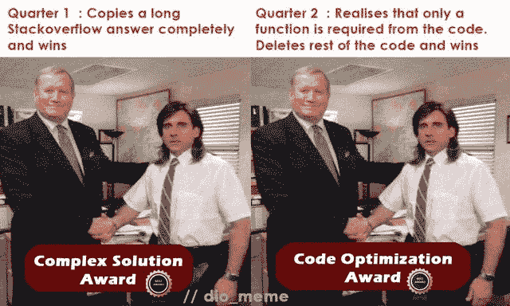

Picture Credit: [https://www.reddit.com/r/ProgrammerHumor/](https://www.reddit.com/r/ProgrammerHumor/)

# 当你在 UX 看到虚假的“欧莱雅”值并询问设计师时…

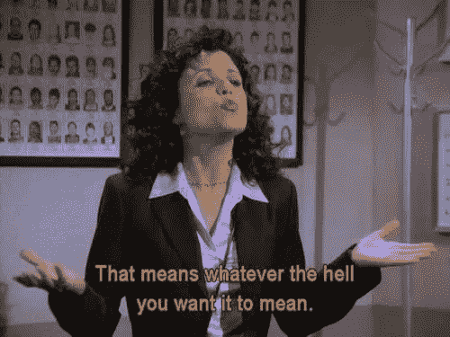

Picture Credit: [https://www.reddit.com/r/ProgrammerHumor/](https://www.reddit.com/r/ProgrammerHumor/)

# 完成这个功能需要多长时间？

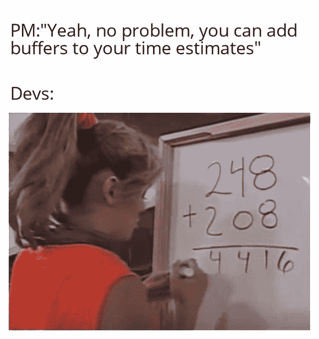

Picture Credit: [https://www.reddit.com/r/ProgrammerHumor/](https://www.reddit.com/r/ProgrammerHumor/)

# 额外内容

# 我还没想到土豆的这种深层次的激励信息…

[https://www.facebook.com/javascriptJS/photos/a.1387402908063976/2154381918032734/](https://www.facebook.com/javascriptJS/photos/a.1387402908063976/2154381918032734/)

# 乍一看，对我来说是一样的..然后发现括号是如何处理的…太旧了，可能是因为我们现在已经格式化了…

[https://www.facebook.com/groups/programming.jokes](https://www.facebook.com/groups/programming.jokes)

# 当我的学长要求编写单元测试时…我相信我的程序也是这样做的…

[https://www.monkeyuser.com/](https://www.monkeyuser.com/)

# 语法错误，我们这里不这样做… python

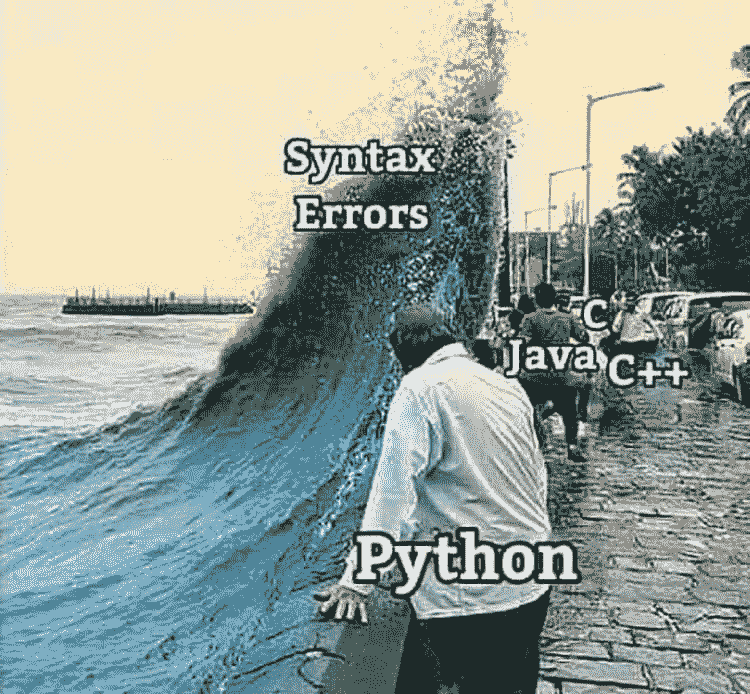

Source:[https://www.facebook.com/programminggeeks.in](https://www.facebook.com/programminggeeks.in)

# 当你想象编程术语在我脑海中的样子…

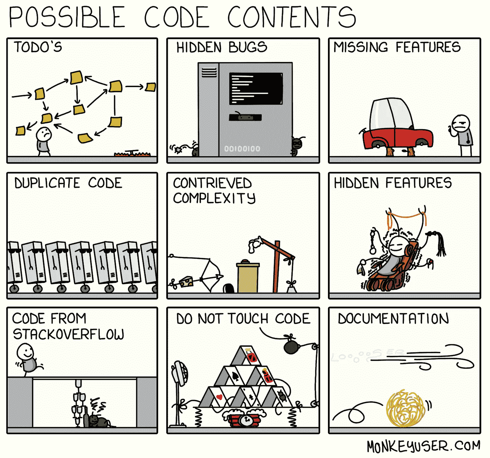

[https://www.monkeyuser.com/](https://www.monkeyuser.com/)

# 可能需要两者的同等比例来平衡行业…

[https://www.facebook.com/techindustan/](https://www.facebook.com/techindustan/)

# 电影(三个白痴)中关于工资的一段很好的对话，非常适合软件行业…

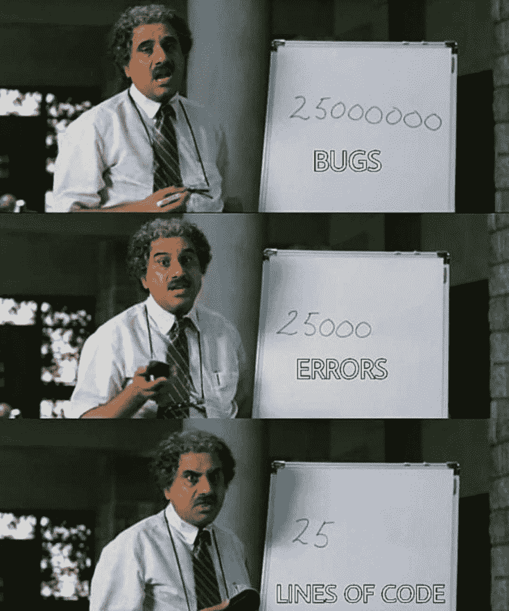

[https://www.thecoderpedia.com/blog/programming-memes](https://www.thecoderpedia.com/blog/programming-memes)

# 谁能定义什么是最好的开发者？对我来说，大概是这样的…

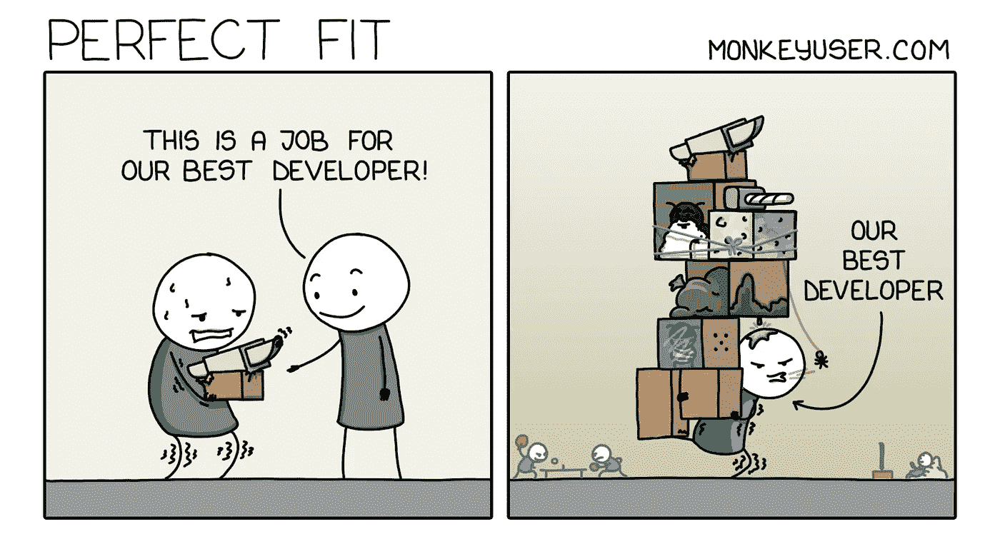

[https://www.monkeyuser.com/](https://www.monkeyuser.com/)

# 当你和很多人打交道时…一切都是公平的…甚至谎言也是…哈哈

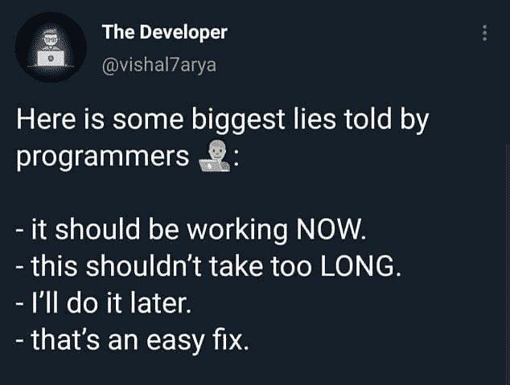

[https://www.facebook.com/javascriptJS/photos/a.1387402908063976/2150614578409468/](https://www.facebook.com/javascriptJS/photos/a.1387402908063976/2150614578409468/)

# 最糟糕的时刻是当你的学长要求一起审查我的代码，因为他什么也不懂…

[https://www.facebook.com/ProgrammersCreateLife](https://www.facebook.com/ProgrammersCreateLife)

# 奖励时间:

# 我不需要你…让我放下你，伙计…

[https://www.reddit.com/r/ProgrammerHumor/comments/oo16aa/im_sorry_dear_data/](https://www.reddit.com/r/ProgrammerHumor/comments/oo16aa/im_sorry_dear_data/)

# 不要教我写了什么…哈哈

[https://www.reddit.com/r/ProgrammerHumor/comments/oo4ttu/perplexed_obama/](https://www.reddit.com/r/ProgrammerHumor/comments/oo4ttu/perplexed_obama/)

# 需要经历几个阶段？

[https://www.monkeyuser.com/2017/code-review-stages/?sc=true&dir=random](https://www.monkeyuser.com/2017/code-review-stages/?sc=true&dir=random)

# 希望我的周期到达那里…但是如何？

[https://www.monkeyuser.com/2017/testing-vs-prod-env/?sc=true&dir=random](https://www.monkeyuser.com/2017/testing-vs-prod-env/?sc=true&dir=random)

# 我靠编程挣钱…

[https://www.facebook.com/photo/?fbid=349251050087280&set=gm.1262598024177843](https://www.facebook.com/photo/?fbid=349251050087280&set=gm.1262598024177843)

# 一切皆有可能…

[https://www.facebook.com/techwithcodex/photos/a.137007467972178/331986501807606/](https://www.facebook.com/techwithcodex/photos/a.137007467972178/331986501807606/)

# 不要和我有眼神接触..我是最棒的…哈哈

[https://twitter.com/MayaShavin/status/1414659230833971205/photo/1](https://twitter.com/MayaShavin/status/1414659230833971205/photo/1)

# 没有布尔怎么有主见？

[https://twitter.com/realColinMac/status/1375360353442295811/photo/1](https://twitter.com/realColinMac/status/1375360353442295811/photo/1)

# 同辈压力？他会让我们的周末变得很糟糕…

[https://imgur.com/t/funny/Mk5F6E1](https://imgur.com/t/funny/Mk5F6E1)

# 不要试图问愚蠢的问题…这里的完美答案…

[https://programmerhumor.io/programming-memes/actual-photo-of-the-stackoverflow-hiring-process/](https://programmerhumor.io/programming-memes/actual-photo-of-the-stackoverflow-hiring-process/)

# 哇！新定义…满栈表示我已经满了… LOL

[https://programmerhumor.io/programming-memes/i-love-me-a-good-full-stack-of-pancakes-%f0%9f%a5%9e/](https://programmerhumor.io/programming-memes/i-love-me-a-good-full-stack-of-pancakes-%f0%9f%a5%9e/)

# 我们不知道我们到底想要什么…但我们希望尽快——客户

[https://programmerhumor.io/programming-memes/yes-now/](https://programmerhumor.io/programming-memes/yes-now/)

*更多内容请看*[***plain English . io***](https://plainenglish.io/)*。报名参加我们的* [***免费周报***](http://newsletter.plainenglish.io/) *。关注我们关于*[***Twitter***](https://twitter.com/inPlainEngHQ)[***LinkedIn***](https://www.linkedin.com/company/inplainenglish/)*[***YouTube***](https://www.youtube.com/channel/UCtipWUghju290NWcn8jhyAw)*[***不和***](https://discord.gg/GtDtUAvyhW) *。对增长黑客感兴趣？检查* [***电路***](https://circuit.ooo/) *。***