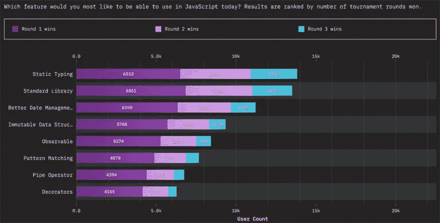

# 类型可能最终会出现在 JavaScript 中

> 原文：<https://javascript.plainenglish.io/future-javascript-types-may-finally-be-coming-to-javascript-4d4411668dcf?source=collection_archive---------7----------------------->

## 详细了解将要发生的变化以及它们将如何影响 JavaScript。


随着[类型注释](https://github.com/tc39/proposal-type-annotations)提升到提案级别 1 阶段，JavaScript 离成为更强类型的语言又近了一步。让我们深入探讨一下这些变化对 JavaScript 意味着什么。

# JavaScript 中的类型

JavaScript 是动态类型的。这意味着它通过某样东西出现的地方来判断它的类型。例如:

```
let x = 1; // typeof "number"
let y = "1"; // typeof "string"
```

在复杂的应用程序和系统中，这是一个巨大的弱点。应用程序可能会因为最小的事情而出错——比如您的 API 返回“false”而不是 false。

这意味着我们有时不得不通过做这样的傻事来保护我们的代码，尤其是在我们无法控制软件发回不可靠类型的情况下:

```
if(x === true || x === "true") {
    // this is true
}
```

对于彻头彻尾的软件工程师来说，这是一个巨大的烦恼，但对于初学者来说，JavaScript 是一个礼物。JavaScript 使得用简单的方式编写相当复杂的东西变得如此容易。如果您的代码是错误的，JavaScript 通常会找到一种方法让它工作。大多数 JavaScript 开发人员发现，随着他们越来越精通这门语言，他们开始时喜欢的灵活性很快就变得令人痛苦。

由于这些原因，从来没有一股强大的力量推动 JavaScript 成为一种带有硬性规则的类型化语言。JavaScript 的可访问性是其最大的特点之一，添加类型不仅会使初学者更加困难，还可能破坏许多基于非类型化 JavaScript 的现有 web 技术。

因此，开发了可选的软件包——TypeScript 和 Flow 是其中两个最著名的。这些将 JavaScript 转化成一种具有强声明类型的语言。

# 输入:JavaScript 类型

新的类型注释提案试图找到一个中间地带，这样 JavaScript 可以保持可访问性，但允许更容易地使用类型等高级特性。

在某些方面，这是不可避免的。强类型始终是开发人员最需要的 JavaScript 特性:



# 类型注释的工作方式

**需要澄清的是**，类型注释不会使 JavaScript 成为强类型语言。相反，他们让 JavaScript 处理类型。这意味着，一旦这个规范达到实现阶段，如果您向 JavaScript 添加类型，它们将被简单地忽略。但是，如果用 TypeScript 编译它，类型将正常工作。

如果您以前使用过 TypeScript，那么您将会熟悉类型注释的外观。例如，定义变量的类型如下所示:

```
let x:string = "String";
let x:number = 5;
```

# 类型注释之后 JavaScript 如何工作

假设您编写了一段如下所示的代码:

```
let x = "String";
console.log(x);
```

稍后，您决定要添加类型。我们可以简单地将类型添加到 JavaScript 文件中，而不必使用类型脚本和类型注释来编译它:

```
let x:string = "String";
console.log(x);
```

在这种情况下，`:string`完全被 JavaScript 忽略——这意味着它仍然与非类型化的 JavaScript 和类型包(如 TypeScript)兼容。这意味着您可以用 TypeScript 构建它，但也可以将它作为普通的`.js`文件运行。普通 JavaScript 文件中的类型最终是注释。

# 类型批注中的其他类型示例

您所期望的一般类型列表可以在类型注释中找到。比如说-

## 接口:

```
interface Name {
    firstName: string,
    lastName: string
}
```

## 工会类型:

```
function test(x: string | number) {
    console.log(x);
}
```

## 通用类型:

```
type Test<T> = T[];
let x:Test<number> = [ 1, 2, 3, 4 ];
```

# 类型注释背后的基本原理

主要理由是，随着浏览器开发变得更加简化，Deno 和 Node.js 等后端 JavaScript 生态系统变得更加流行，JavaScript 有机会进入越来越少的构建步骤。TypeScript 带来了巨大的变化，在运行 TypeScript 文件的地方，我们需要将它构建回 JavaScript。对于开发人员来说，这显然是一个耗时的、有时是繁重的步骤，并且肯定会限制效率。

在 TypeScript 中使用类型注释的一个主要好处是它移除了另一个构建步骤。本机 TypeScript 可以在浏览器中运行，而无需将其转换回 JavaScript，这极大地优化了开发人员的体验。

同样，这种类型的注释行为为 JavaScript 中的类型定义提供了一个标准基础。通过标准化 JavaScript 中最一致的类型部分，它确保了所有类型编译器的一致性，使开发人员更加容易。

# 结论

总之，类型正在走向 JavaScript，但可能不是以人们预想的方式。JavaScript 仍将是一种动态类型语言，但它本身将接受类型声明。该规范仍处于第一阶段，因此可能会有很多变化——但这是 JavaScript 向更强类型化的世界迈出第一步的激动人心的时刻。

感谢您的阅读。

*更多内容请看*[***plain English . io***](https://plainenglish.io/)*。报名参加我们的* [***免费周报***](http://newsletter.plainenglish.io/) *。关注我们关于*[***Twitter***](https://twitter.com/inPlainEngHQ)*和*[***LinkedIn***](https://www.linkedin.com/company/inplainenglish/)*。加入我们的* [***社区不和谐***](https://discord.gg/GtDtUAvyhW) *。*