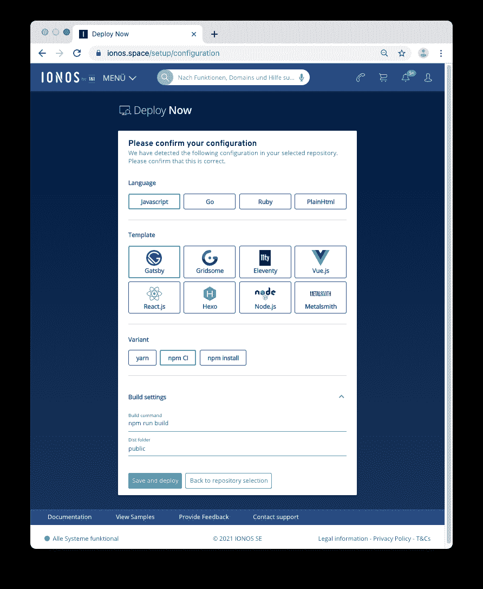
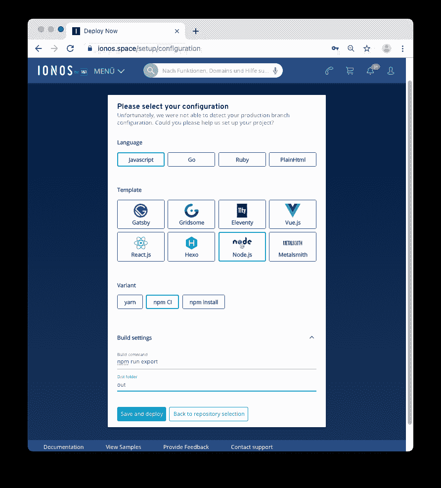

# Gatsby vs. React Static vs. Next.js:最好的基于 React 的静态站点生成器是什么？

> 原文：<https://javascript.plainenglish.io/gatsby-vs-react-static-vs-next-js-what-is-the-best-react-based-static-site-generator-1a96bbf1f685?source=collection_archive---------11----------------------->

*了解使用 IONOS 部署三种不同的基于 React 的静态站点生成器现在部署*


# 介绍

我会认为你已经找到了写这篇博文的方法，因为你了解 Jamstack 并认识到了它的优点和缺点。很有效。更快的加载时间*和*无服务器架构的诱惑力很强，全世界的 web 开发者现在都在使用 Jamstack。那么，如何利用最新的框架在竞争中获得优势，而又不至于倾家荡产呢？好吧，请继续阅读，我们将比较三个最流行的基于 React 的框架，它们现在都与 Ionos Deploy 兼容:Gatsby、Next.js 和 React-Static；它们的用例、优点和缺点。

# 盖茨比（姓）

Gatsby 是比较知名的 React 框架之一，因为它非常通用，并且有一个强大的开发团队推动它的增长。将 Gatsby 定义为流行框架的另一个原因是他们网站上的文档。没有组织良好的文档，我们作为开发人员已经处于非常不利的地位。抛开我对文档的热爱，我在下面列出了盖茨比的优点和缺点，以及一些有助于激发你的创造精神的用例。

# 赞成的意见

*   速度——当没有服务器提供站点资源时，加载时间将会减少。正如我们之前所讨论的，从长远来看，这有可能增加您企业的收入。
*   安全性—由于没有可攻击的服务器，您公司的前向资产将更加安全。
*   配置——至少可以说，配置 web 服务器及其伴随的技术是很有压力的。有了无服务器架构，您再也不用担心配置 web 服务器了。
*   可扩展性— Gatsby 可以轻松扩展，这使它成为大中型企业的绝佳选择。
*   重新水合——尽管 Gatsby 的主要用途是静态站点，但它可以重新水合为一个全功能的 react 应用程序。
*   插件——Gatsby 自带丰富的插件库，说实话，谁不喜欢插件呢？
*   GraphQL 支持—用于简化从外部和内部来源获取数据的过程。

# 骗局

*   没有 GUI——Gatsby 没有提供与他们的框架交互的图形界面。对一些人来说，这不是问题，对另一些人来说，这可能是进入的障碍。
*   学习曲线——无论这是您第一次使用 CMS，还是您正在从另一个平台迁移，您都必须学习如何使用 Gatsby 及其相关功能。
*   不支持动态内容——可以用 Gatsby 提供动态内容，但不推荐，而且很难有效完成。

如您所见，Gatsby 是一个非常强大的 React 框架。不过，重要的是要记住，Gatsby 只对某些类型的网站和应用程序有用。我在下面列举了几个不同的例子…

# 使用案例/示例

Gatsby 非常适合拥有大量页面的网站，比如博客、新闻网站、文档门户以及类似的网站。无论是一页纸还是一万页纸，盖茨比让它们的创作变得前所未有的简单。这里有几个值得注意的使用盖茨比建立的网站:

*   [www.figma.com](http://www.figma.com)
*   【www.reactjs.com 号
*   developer.paypal.com
*   【www.affirm.com 

# 使用 Ionos 部署立即部署

1.  通过在终端中输入以下命令创建一个新站点:

```
npx gatsby-cli@latest new gatsby-site
cd gatsby-site
npm run develop
```

2.通过将本地主机地址从 CLI 标准输出复制到浏览器栏，在本地访问您的站点。

3.现在，在 GitHub 上创建一个新的 Git 存储库，并将 repo 的 URI 复制到您的剪贴板上。

4.使用以下命令初始化 git 并将您的项目推送到创建的 GitHub 存储库:

```
git init
git add .
git commit -m “initial commit”
git branch -M main
git remote add origin git@github.com:username/reponame.git# replace the above repo with the URI of your repo
git push -u origin main
```

5.通过登录“立即部署”帐户并单击“新建项目”来设置部署接下来，选择要部署的源。将请求的权限授予 IONOS，并继续选择以下配置:



6.现在，休息一会儿，直到您的项目构建被部署。“立即部署”将始终显示项目的当前构建和部署状态。完成后,“立即部署”将为您提供一个指向您的项目的直接 URL。您还可以在存储库中找到一个名为的新工作流文件。github/workflow/deploy-now . YAML

# 静电反应

React Static 是一个开源的*渐进式站点生成器*，由 Tanner Linsley 编写，于 2017 年末发布。渐进式站点生成器在功能上类似于静态站点生成器，但有几个关键区别。在渐进式站点生成器的核心中有一个静态站点，一旦用户请求，它就开始将自己重新水合为一个全功能的 react 应用程序，因为页面的资产已经呈现，所以无论何时单击链接都允许极快的加载时间。将 React Static 概念化的一个简单方法是，一旦一个站点被请求，它就逐渐转变成 React 应用程序，而不管入口点是什么。这个聪明的特性加上静态站点生成器的所有已有优点，使得 React Static 成为希望部署静态站点的开发人员的一个有吸引力的选择。

# 赞成的意见

*   速度——由于该站点被重新整合为一个全功能的 react 应用程序，因此当用户与该站点交互时，不需要重新加载任何资源。这导致接近瞬时的响应时间。
*   安全性——就像使用静态站点生成器构建的常规站点一样，不涉及服务器，这将自动产生一个更安全的站点。
*   可伸缩性——React Static 在从单页面网站到拥有数千页面的大型网站的所有方面都表现良好。
*   react Static 的定义是将静态站点转变为全功能 React 应用程序的能力。
*   数据处理——React Static 在数据来源方面非常灵活。最重要的是，React Static 还允许实时显示/更新数据。
*   搜索引擎友好

# 骗局

*   没有 GUI——不幸的是，React Static 没有可以交互的 GUI，这让一些人学习起来有点困难。
*   学习曲线——利用 React Static 需要大量的学习，但是，嘿，很多最强大的框架和工具都需要时间和精力来掌握。
*   用例——React Static 虽然非常有用，但并不能满足您所有的 web 开发需求。它的效用仅限于网站的某个子集。
*   文档——为 React Static 发布的文档数量非常有限。

# 使用案例/示例

下面是几个用 React Static 制作的页面示例:

*   交通信号灯. io
*   矢量开发
*   turbotax.intuit.com

react-static 之所以成为一个有趣的框架，是因为它将您的静态站点重新合并成一个功能齐全的 react 应用程序。因此，如果以极快的速度提供静态页面是你或你的公司未来需要做的事情，那么 react-static 是值得记住的。同时，你需要记住，react-static 因需要快速显示静态页面而蓬勃发展，所以如果你正在使用一个塞满了充满独特风格的动态页面的站点模型，那么 react-static 可能不适合你……目前还不适合！

# 创建一个静态网站

1.通过在终端中输入以下命令创建一个新站点:

```
npm i -g react-static
 or
 yarn global add react-static
```

2.通过在终端中输入以下命令启动一个新项目:

```
react-static create
```

3.按照终端中的提示配置项目。为了这个例子，我们将使用基本模板。

4.现在，在 GitHub 上创建一个新的 Git 存储库，并将 repo 的 URI 复制到您的剪贴板上。之后，初始化 git，并通过以下命令将您的项目推送到创建的 GitHub 存储库:

```
git init
git add .
git commit -m “initial commit” 
git branch -M main
git remote add origin git@github.com:username/reponame.git 
// replace the above URL with your GitHub repo that you created
git push -u origin main
```

5.接下来，通过登录到“立即部署”帐户并单击“新建项目”来设置部署选择要部署的来源。将请求的权限授予 IONOS，并继续选择以下配置:JavaScript，然后是 Node.js 和 public。祝贺您的站点正在部署！

# Next.js

js 是一个混合静态站点生成器。这实质上意味着 Next.js 可以完成我们之前讨论的几乎所有内容，甚至更多。然而最重要的是，Next.js 已经可以投入生产，并且对 SEO 优化有很好的支持。但是，有一点需要注意:对于所有精彩的特性，如预渲染、代码分割、SEO 优化等，您需要将 Next.js 与 Node.js 一起运行，这最终超出了本文的范围，但是，静态生成/预生成与 Deploy now 一起工作，但是 Node.js 只能在构建时使用，而不能在运行时使用。尽管本文围绕的是现在部署，但我们认为 Next.js 是一个非常好的框架，值得一提。

# 赞成的意见

*   速度——next . js 是一个非常快的框架，没有 React Static 快，但也很快。
*   生产就绪— Next.js 开箱即可投入生产。
*   文档——next . js 有很好的文档，保存得很好，并经常更新。
*   代码示例——next . js 的一个独特之处是他们在自己的网站和 Github 上托管了大量代码示例。这些代码示例中的每一个都可以在您的应用程序中免费使用，无需注明出处。
*   代码拆分— Next.js 支持代码拆分。
*   Typescript — Next.js 支持 Typescript。

# 骗局

*   Node.js 依赖性— Next.js 要求 node.js 在大多数情况下运行。
*   安全性——考虑到 next.js 有大量的依赖项，它比我们提到的任何框架都有更大的攻击面。

# 示例/使用案例:

一些利用 Next.js 的网站包括:

*   tiktok.com
*   twitch.com
*   att.com
*   [更](https://nextjs.org/showcase)

如果你的公司需要一个生产就绪的网站，能够处理中小型企业和相关网站的负载，那么 Next.js 绝对值得一试。正如你所看到的，世界上一些最大的公司使用 Next.js 是因为它的易用性和可扩展性。如果你有兴趣了解更多关于 Next.js 的信息，请务必查看:【https://nextjs.org/.】T2

# 使用 IONOS 部署立即部署

1.通过在终端中输入以下命令创建一个新站点:

```
npx create-next-app@latest next-site
cd next-site
npx next@latest dev
```

2.通过将本地主机地址从 CLI stdout 复制到您最喜欢的浏览器，在本地访问您的站点。

3.启用静态 HTML 导出。

4.注意:目前，Deploy Now 不支持 Next.js >=中可用的映像优化，因此您必须编辑 index.js 文件来删除此功能:

5.从 pages/index.js 中删除以下导入:

从“下一张/图像”导入图像

6.接下来，找到以下图像标记:

```
<image src=”/vercel.svg” alt=”Vercel Logo” width={72} height={16}/>
```

7.用标准的 HTML img 标签替换它:

```

```

8.接下来，编辑 package.json 文件并添加导出选项，将所有页面预呈现为 HTML:

```
“scripts”: {
 …
 “export”: “next build && next export”
},
```

9.最后，改编. eslintrc.json 以克服 Next.js eslint 规则限制:

```
{
 “extends”: [“next”, “next/core-web-vitals”],
 “rules”: {
 “@next/next/no-img-element”: “off” }
})
```

10.现在，在 GitHub 上创建一个新的 Git 存储库，并将 repo 的 URI 复制到您的剪贴板上。然后初始化 git，并通过以下命令将您的项目推送到创建的 GitHub 存储库:

```
git init
git add .
git commit -m “initial commit” 
git branch -M main
git remote add origin git@github.com:username/reponame.git 
# replace the above URL with your GitHub repo that you created
git push -u origin main
```

11.通过登录到“立即部署”帐户并单击“新建项目”来设置部署接下来，选择要部署的源。将请求的权限授予 IONOS，并继续选择以下配置:

