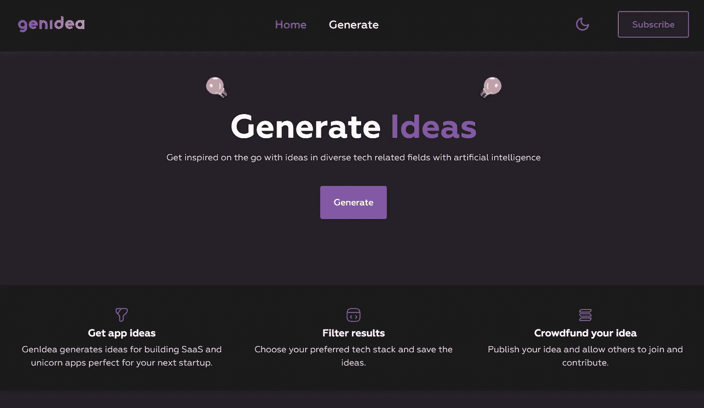
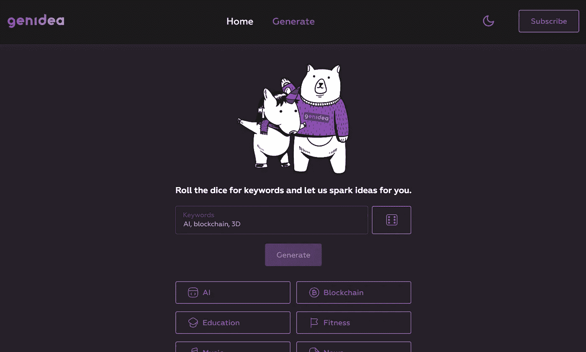
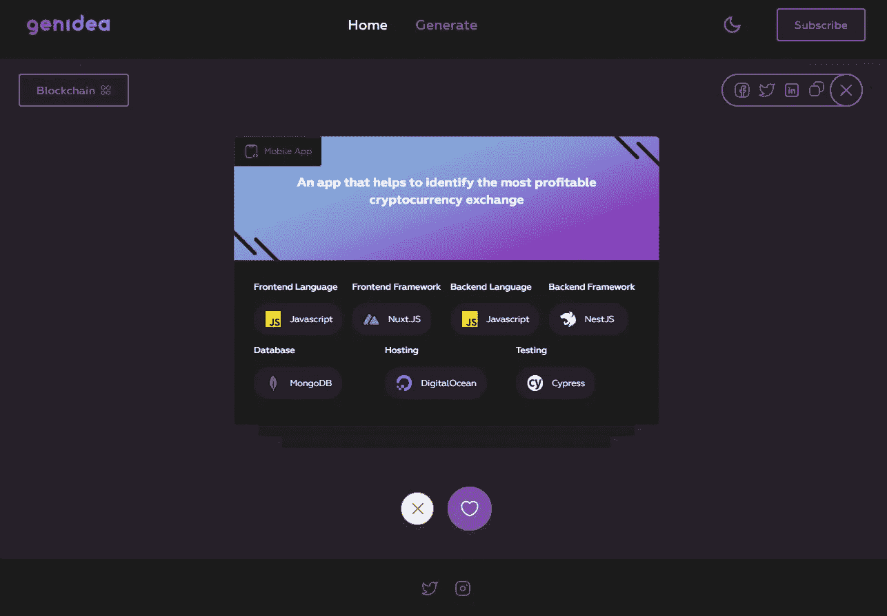
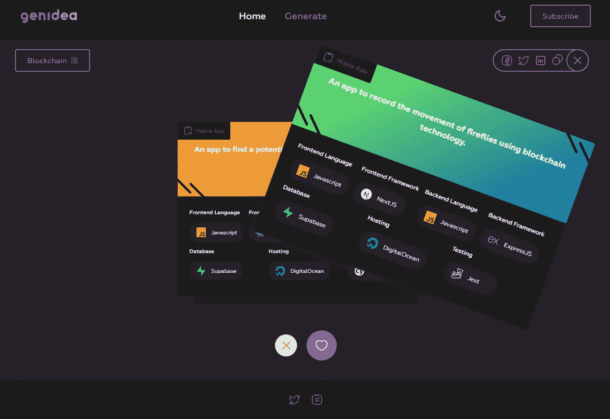

# 利用 OpenAI 的 GPT-3 产生应用创意

> 原文：<https://javascript.plainenglish.io/generate-app-ideas-with-openais-gpt-3-8afb053b5f3e?source=collection_archive---------11----------------------->

## [**GenIdea**](https://www.producthunt.com/posts/genidea) ，一个 [OpenAI](https://openai.com/) GPT-3 驱动的网络应用程序，它将把每个人的灵感和创造力提升到一个新的水平。

# 产品的初期阶段

每一种产品，无论是 SaaS、PaaS、DaaS(即将推出的甜甜圈即服务应用)，还是实体产品，都处于初创阶段，是建筑商和创新者手中的一个天真的想法。

SaaS Nowadays

我的愿望是建立一些帮助他人建立的东西，而许多人面临着可怕的缺乏想法，所以我研究了一些工具来减少头脑风暴到简单的点击和敲击，没有一个是真正了不起的。

我开发了 GenIdea，这是一个基于 GPT-3 的网络应用程序，很快会将每个人的灵感和创造力提升到一个新的水平(我希望如此)。还在[产品搜索](https://www.producthunt.com/posts/genidea)上发布了它，请随时提供反馈。

目前，我们正在演示阶段推出它，以收集注册信息，并将很快发布许多即将推出的功能的路线图(真实想法生成、项目构建和许多其他功能)。

# 产品演示

查看全新主页，开始产生想法，就像儿科上的百万美元独角兽一样。

GenIdea | Landing Page

您的偏好对我们来说至关重要，因此只需轻轻一按，即可在亮暗模式之间自由切换。

不管你是喜欢自由还是喜欢偶尔碰碰运气，掷骰子决定一个类别或者自己选择一个。

GenIdea | Choose Category

作为一个额外的接触，我们还建议一个技术列表，让你马上开始使用你的应用程序。我们有点偏向于 JavaScript 框架，但很快会包括更多的技术。

GenIdea | Ideas

但是你怎样才能得到你可能会问的下一个想法呢？无论你喜欢与否，只需左右滑动，很快就会链接喜欢/不喜欢的想法，这样你就可以保留所有创意的图书馆。

GenIdea | Swipe Ideas

不要忘记在手机上查看网站，以获得最佳体验。

# 即将发布的更新

我计划在 3 月 1 日**发布**，这将开放免费和付费等级的账户创建。一旦你有了一个账户，你将有机会根据你的计划产生前所未见的想法。

## 帐户创建

认证将通过[谷歌](https://developers.google.com/identity/protocols/oauth2) & [GitHub OAuth](https://docs.github.com/en/developers/apps/building-oauth-apps/authorizing-oauth-apps) 完成，之后你将自动获得免费的 10 级想法/月。

这些想法将从已经产生的想法池中提取，而不是由付费用户提出。

## 计划选择

如果你真的想体验人工智能的最佳状态，选择标准或高级订阅计划，每月提供 100 / 500 个想法，这应该可以满足你所有的头脑风暴需求。

[Stripe](https://stripe.com/) 将作为支付处理器使用，实现流畅的集成和支付体验。

## 搜索想法

发现他人产生的想法，甚至加入/支持他们来构建他们发表的想法。只有付费用户产生的想法才能发布给其他人查看和支持。

使用过滤器，如首选技术堆栈、关键字等。

目前就这样，但我希望在推出 **SaaS** 时，能带来更多的功能和更深入的指南，不要忘记鼓掌并关注更多软件相关内容🚀。

*更多内容看* [***说白了。报名参加我们的***](http://plainenglish.io/) **[***免费周报***](http://newsletter.plainenglish.io/) *。在我们的* [***社区不和谐***](https://discord.gg/GtDtUAvyhW) *获得独家获取写作机会和建议。***