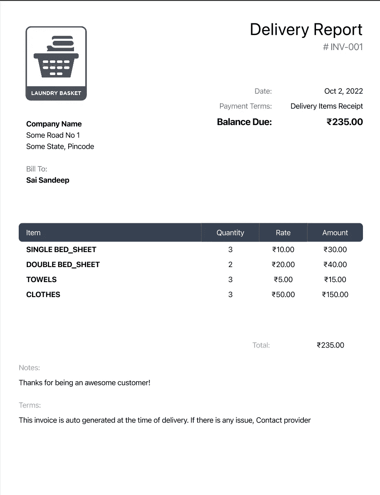

# 使用 Node.js 随时生成您自己的发票

> 原文：<https://javascript.plainenglish.io/generate-your-own-invoice-at-any-time-using-nodejs-434d90f95cb9?source=collection_archive---------3----------------------->

## 用动态数据呈现为 PDF 的 HTML 模板页面

Invoice

大家好，我是来自印度的**桑德普**，我基本上每天都要写很多代码，和普通程序员一样，我的生活非常无聊。刚刚开始在媒体分享我的一些想法，项目和我在生活中学到的教训。希望对其他人有帮助:)顺便说一句，这是我写的第一篇文章，如果有任何错误，我道歉:')
让我们开始吧！！

因此，在我的电子商务项目中，我遇到了一种情况，我必须为客户设计我们自己的品牌发票。我查了一下谷歌，看看我是否能找到任何可以使用模板的服务。但遗憾的是我找不到。我想为什么我们不自己做呢？我就是这样开始的

我用普通的 HTML 开始工作，对于 css，我使用了 Tailwind，将处理输出放入一个. css 文件中。模板非常简单。

Template for invoice

然后，我通过创建一个特定的 JSON 数据并在 JS 文件中使用它将数据放在 html 文本中，使静态 HTML 变得更加动态。在我准备好 HTML 的东西后，我在 node 中搜索可以将 HTML 文件转换成 PDF 的包。并且，我找到了[这个包](https://www.npmjs.com/package/convert-html-to-pdf)，它使用木偶师来渲染 HTML 并保存为 PDF 格式。这是它看起来的样子。

然后，我用 express.js 创建了一些基本路线。
* GET /sample =该路径给出了发票所需数据的确切形式。
* POST /getInvoice =该路径给出将内容类型设置为`application/pdf`的 pdf

[这是我们从 API](https://github.com/SandeepDev1/InvoiceGenerator/blob/main/response.pdf) 获得的样本 PDF。
就是这样，我们将 API 集成到我们的网站中，按需生成发票。
我知道我没有涉及太多技术方面的东西，但我假设你们中的许多人都知道如何在 Nodejs 中使用 HTML 和基本路由。我试图解释我是如何实现这一目标的逻辑部分。当然有很多方法可以实现这一点。

我有一个回购这整个发票生成器[https://github.com/SandeepDev1/InvoiceGenerator](https://github.com/SandeepDev1/InvoiceGenerator)

如果有人想为这个项目做贡献，我会很高兴接受拉请求，如果它甚至只有一个用例。我会为它的 HTML 制作一些模板:)

感谢你读到这里，❤️.
可以联系我:-
邮箱—saisandeep1811@gmail.com
insta gram—[https://www.instagram.com/sandeep_dev1/](https://www.instagram.com/sandeep_dev1/)推特—[https://twitter.com/sandeep_dev1](https://twitter.com/sandeep_dev1)

*更多内容看* [***说白了。报名参加我们的***](https://plainenglish.io/) **[***免费周报***](http://newsletter.plainenglish.io/) *。关注我们关于* [***推特***](https://twitter.com/inPlainEngHQ) ，[***LinkedIn***](https://www.linkedin.com/company/inplainenglish/)*，*[***YouTube***](https://www.youtube.com/channel/UCtipWUghju290NWcn8jhyAw)*，以及* [***不和***](https://discord.gg/GtDtUAvyhW) *。对增长黑客感兴趣？检查* [***电路***](https://circuit.ooo/) *。***