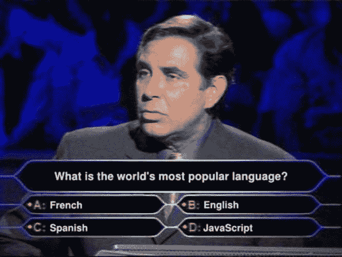

# 发电机功能:您需要知道的一切

> 原文：<https://javascript.plainenglish.io/generator-functions-all-you-need-to-know-3d5a2cb9ca2e?source=collection_archive---------2----------------------->

## 什么是生成器函数，它们与常规方法有什么不同，什么时候应该使用它们？

您可能听说过生成器方法，但可能对它们与常规方法有何不同以及何时应该使用它们感到困惑。希望这篇文章能对这些方面有所启发。


[link](https://miro.medium.com/max/640/1*RJXe3ij2rR4RNKFox-qgvw.jpeg)

> **语法**

```
function* generator(i) {
  yield i;
  yield i + 1;
}const gen = generator(10);console.log(gen.next().value);
// expected output: 10console.log(gen.next().value);
// expected output: 11
```

你会看到一个生成器方法用*表示，这就是你如何快速判断这个方法是一个生成器函数还是一个常规函数。

> **什么是生成器方法**

生成器是可以退出并稍后重新进入的函数，不像常规函数只能进入一次。它们的上下文(变量绑定)将在重入时被保存。

调用生成器函数不会立即执行它的整个主体。相反，它返回一个迭代器对象，然后您可以调用 next 方法继续顺序执行。当迭代器的`next()`方法被调用时，生成器函数的主体被执行，直到第一个`[yield](https://developer.mozilla.org/en-US/docs/Web/JavaScript/Reference/Operators/yield)`表达式。`next()`方法返回一个对象，其`value`属性包含生成的值，其`done`布尔属性指示生成器是否生成了它的最后一个值。

```
function* mygenerator(i) {
  yield i;
  yield i + 1;
}const gen = mygenerator(10);console.log(gen.next().value);
// expected output: 10console.log(gen.next().value);
// expected output: 11
```

生成器中的`return`语句在执行时，将使生成器结束(即由它返回的对象的`done`属性将被设置为`true`)。如果返回一个值，它将被设置为生成器返回的对象的`value`属性。同样，如果出现异常，done 属性也将被设置为 true。

您也可以用`yield*`替换`[yield](https://developer.mozilla.org/en-US/docs/Web/JavaScript/Reference/Operators/yield)`来从一个生成器中调用另一个生成器

```
function* myGenerator2(i) {
  yield i + 1;
  yield i + 2;
  yield i + 3;
}

function* myGenerator1(i) {
  yield i;
  yield* myGenerator2(i);
  yield i + 10;
}

const gen = myGenerator1(10);

console.log(gen.next().value); // 10
console.log(gen.next().value); // 11
console.log(gen.next().value); // 12
console.log(gen.next().value); // 13
console.log(gen.next().value); // 20
```

在方法完成且 done 属性设置为 true(通过完成整个方法的执行或通过 return 或 error 语句)后调用的任何数量的`next()`语句，将使值返回为 false，done 设置为 true。

```
function* myGenerator() {
  yield "A";
  return "B";
  yield "C";
}

const gen = myGenerator();
console.log(gen.next()); // { value: "A", done: false }
console.log(gen.next()); // { value: "B", done: true }
console.log(gen.next()); // { value: undefined, done: true }
```


> **用例——何时以及为何使用**

现在，一个价值百万美元的问题来了,“我什么时候以及为什么要使用生成器方法。

*   **惰性评估—仅在需要时运行**

假设有一个无限的数据流，我们不能用一生的时间来评估这些数据。因此，我们可以在需要时使用生成器函数进行计算。

下面是这种行为的一个非常常见的用例

> *创建连续 id。您可以轻松地运行 while(true)循环来获得一个新的亮片 id，只有当您调用 next()时，它才会计算下一个 id。*

```
function* idMaker() {
  let index = 0;
  while (true) {
    yield index++;
  }
}

const gen = idMaker();

console.log(gen.next().value); // 0
console.log(gen.next().value); // 1
console.log(gen.next().value); // 2
console.log(gen.next().value); // 3
```

*   **记忆高效**

由于它是惰性执行，因此它的内存效率更高，因为内存仅分配给数据，直到产生语句



> **结论和需要记住的事情**

*   不能在生成器方法上调用构造函数

```
function* = myGenerator() {}
const obj = new myGenerator; 
// throws "TypeError: myGenerator is not a constructor
```

*   `yield`是一条双行道:它不仅向外部返回结果，还可以通过在 next()方法内部传递一个参数来传递生成器内部的值。

```
function *myGenerator() {
        console.log('Hey ', yield)
        console.log('is your last name ',yield)
}
let gen = myGenerator()
gen.next()
gen.next('sumeet') // Hey sumeet
gen.next('bhalla') // is your last name bhalla
```

我希望这篇文章能帮助 clera 理解生成器方法的神秘本质。如果你使用 Redux Saga，你将特别需要处理它们。

如果你喜欢这篇文章，并想了解更多关于 redux Saga，请点击这里

[](/redux-thunk-vs-redux-saga-all-you-need-to-know-ecb06eb7e34e) [## Redux Thunk vs Redux Saga:你需要知道的一切

### 您需要了解的关于 Redux Thunk 和 Redux Saga 的一切，以便为您的项目选择正确的 React 中间件。

javascript.plainenglish.io](/redux-thunk-vs-redux-saga-all-you-need-to-know-ecb06eb7e34e) 

这里还有一些 Javascript 文章，你可能也会感兴趣

[](/must-know-javascript-features-in-2022-80c0655a6e98) [## 2022 年必知的 JavaScript 特性

### 使用这些功能，您可以减少代码并使其更具可读性。

javascript.plainenglish.io](/must-know-javascript-features-in-2022-80c0655a6e98) [](/all-about-importing-methods-in-javascript-d8d84fbd30d3) [## 关于在 JavaScript 中导入方法的所有内容

### 知道在什么情况下使用什么语法。

javascript.plainenglish.io](/all-about-importing-methods-in-javascript-d8d84fbd30d3) [](/type-coercion-in-javascript-ef5e390d2318) [## JavaScript 中的类型强制

### 虽然 JavaScript 被认为是对初学者来说最简单的编程语言之一，但它也可能变得令人沮丧…

javascript.plainenglish.io](/type-coercion-in-javascript-ef5e390d2318) 

*更多内容请看*[***plain English . io***](https://plainenglish.io/)*。报名参加我们的* [***免费周报***](http://newsletter.plainenglish.io/) *。关注我们关于*[***Twitter***](https://twitter.com/inPlainEngHQ)[***LinkedIn***](https://www.linkedin.com/company/inplainenglish/)*[***YouTube***](https://www.youtube.com/channel/UCtipWUghju290NWcn8jhyAw)*[***不和***](https://discord.gg/GtDtUAvyhW) *。对增长黑客感兴趣？检查* [***电路***](https://circuit.ooo/) *。***