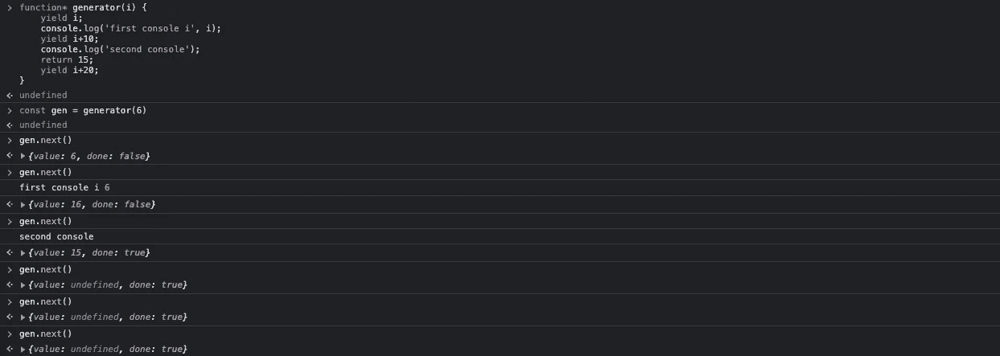

# JavaScript 中的生成器函数:简单指南

> 原文：<https://javascript.plainenglish.io/generator-functions-in-js-4f39052b1ab8?source=collection_archive---------11----------------------->


Photo by [Pankaj Patel](https://unsplash.com/@pankajpatel?utm_source=medium&utm_medium=referral) on [Unsplash](https://unsplash.com?utm_source=medium&utm_medium=referral)

一般的 JavaScript 函数在函数执行的中途是不能中断的，也就是说，从函数被调用的时候到函数执行完成都是没有中断的。当我们想要执行可以被中断的函数或者可以在执行开始后的一段时间后执行的函数时，我们可以使用一种新型的函数，称为*生成器函数*，它是在 ES6 中出现的。

**有趣的事实:**异步等待构建在生成器函数之上

声明生成器函数:

```
function* generate() {}
```

ES6 中引入的`yield`关键字用于停止生成器函数内部的执行。它只能在生成器函数中使用，而不能在一般的 JavaScript 函数中使用。

生成器函数总是返回迭代器对象，当迭代器调用一个`next()`方法时，函数开始执行，直到第一个`yield`语句。`next()`返回一个具有两个属性的对象:

1.value (any):函数直到第一个`yield`语句返回的值。

2.Done(布尔值):返回布尔值 true 或 false，该值定义函数执行是否完成。

每当我们在生成器函数中间使用`return`语句时，它表示函数已经执行完毕。每当我们调用`next()`方法时，它就执行生成器函数，直到第一个`yield`语句，之后它为每个`next()`方法调用执行下一个`yield`，并继续执行，直到所有的`yield`语句都被执行。

样本:



*原载于*[*https://www.shauryakalia.com*](https://www.shauryakalia.com/blogs/til-generator-functions)/博客*。*

*更多内容请看*[***plain English . io***](https://plainenglish.io/)*。报名参加我们的* [***免费周报***](http://newsletter.plainenglish.io/) *。关注我们关于*[***Twitter***](https://twitter.com/inPlainEngHQ)[***LinkedIn***](https://www.linkedin.com/company/inplainenglish/)*[***YouTube***](https://www.youtube.com/channel/UCtipWUghju290NWcn8jhyAw)*[***不和***](https://discord.gg/GtDtUAvyhW) *。***