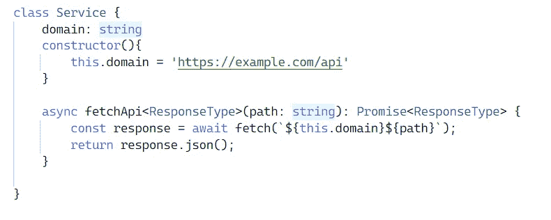
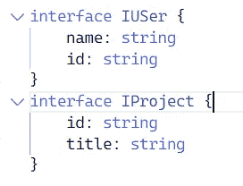
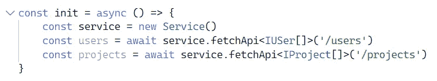

# TypeScript 中的泛型类型

> 原文：<https://javascript.plainenglish.io/generic-type-in-typescript-4870c8a449d5?source=collection_archive---------2----------------------->

## 泛型类型赋予组件将类型强加给用户的能力和控制权。


Photo by [Olga Filonenko](https://unsplash.com/@olfiika?utm_source=medium&utm_medium=referral) on [Unsplash](https://unsplash.com?utm_source=medium&utm_medium=referral)

# Typescript 中的泛型类型

在 JavaScript 中，默认情况下不支持泛型类型，但是在 TypeScript 中，您可以创建泛型类型。泛型是任何类型化语言的基本概念，您可以将自定义类型作为参数传递，并根据该参数构造实例。泛型类型赋予组件将类型强加给用户的能力和控制权。

TypeScript 也是一种类型化语言，它使我们能够创建泛型类型，并在稍后的代码执行中使用它，开发人员可以确定在工作时将传递什么输入。

## 泛型类型的语法

在 Typescript 中创建泛型类型类似于数学中的函数定义，即<t>，其中 T 是传入的类型。t 的工作方式类似于我们传递参数的常规函数调用。我们还可以包含一个类似于<t r="" a="">的参数列表，每个人都将被视为一个单独的类型</t></t>

> 在 general 中，泛型类型总是被写成单字符大写字母(T ),这不是规则而是惯例。您可以为泛型类型使用任何名称

## 泛型类型的示例

```
function functionName<T>(value: T): T { return value;}
```

下面是用泛型类型声明任何函数的语法，其中 T 可以是传递的任何类型

让我们看一个真实世界的例子来更好地理解这个想法。在任何项目中，我们都需要创建一个服务单例类，它将在 API 请求上给出一些参数并返回数据。假设我们有两个端点

*   /用户
*   /项目

我们将创建一个服务类，它将有一个方法来帮助我们从任何给定的端点获取细节



Service Class

现在我们已经有了一个服务类，让我们创建一些类型，我们将使用服务类调用这些类型



interfaces for users and projects

为了使用服务和接口，我们将创建一个驱动程序代码来运行这些方法



Driver code

现在，用户和项目变量将保存分配给它们的接口

## 常规操作

泛型的另一个用例是在任何对象的上下文中编写任何方法。例如，假设您想要创建一个方法，为每个字段返回一个布尔值，那么我们可以使用一个通用接口来完成这个任务

```
type BooleanFields<T> = {
  [K in keyof T]: boolean;
};type IUser = {
  id: string;
  name: string;
}type BooleanUserConverted = BooleanFields<User>;
```

## 结论

泛型类型不受限制，可以随心所欲地使用。有一篇关于[如何在 TypeScript](https://www.digitalocean.com/community/tutorials/how-to-use-generics-in-typescript) 中使用泛型的非常好的文章。我会推荐你阅读这篇文章和它的例子。

我希望你能从这个短杯子中学到一些新东西。快乐编码

*更多内容请看*[***plain English . io***](https://plainenglish.io/)*。报名参加我们的* [***免费周报***](http://newsletter.plainenglish.io/) *。关注我们关于*[***Twitter***](https://twitter.com/inPlainEngHQ)[***LinkedIn***](https://www.linkedin.com/company/inplainenglish/)*[***YouTube***](https://www.youtube.com/channel/UCtipWUghju290NWcn8jhyAw)*[***不和***](https://discord.gg/GtDtUAvyhW) *。对增长黑客感兴趣？检查* [***电路***](https://circuit.ooo/) *。***