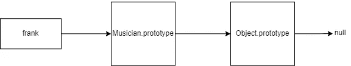
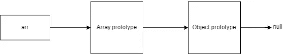

# 通过学习继承和原型链，更好地理解 JavaScript

> 原文：<https://javascript.plainenglish.io/get-a-better-understanding-of-javascript-by-learning-about-inheritance-and-the-prototype-chain-170ef2cdc23e?source=collection_archive---------9----------------------->

## 详细了解 JavaScript 中的继承和原型链。

Photo by [Oskar Yildiz](https://unsplash.com/@oskaryil?utm_source=medium&utm_medium=referral) on [Unsplash](https://unsplash.com?utm_source=medium&utm_medium=referral)

面向对象编程中的一个重要概念是继承。大多数编程语言使用经典(基于类)继承，但是 JavaScript 使用原型(基于原型)继承。虽然 ES6 确实在 JavaScript 中引入了类，但实际上，这只是语法上的好处。事实上，JavaScript 根本没有类，类语法只是一个创建对象的特殊函数。

JavaScript 是一种围绕对象构建的语言。除了原始值，JavaScript 中的一切都是对象。JavaScript 中的对象可以使用原型从其他对象继承，原型是内置的对象，包含可以被其他对象使用(继承)的属性和方法。为了清楚起见，每个对象都是数据类型`Object`的一个实例，并从`Object.prototype`获取其所有属性。

任何被创造出来的基本物体都将是`Object.prototype`的原型。其他对象也可以相互继承属性，这被称为原型链。为了演示这一点，让我们使用类语法创建一个`Musician`对象。

虽然`Musician`是使用`class`创建的，但重要的是要注意实际创建的是`Musician`实例的对象原型。`Musician`的原型是`Object.prototype`。这意味着`Musician`将继承包含在`Object.prototype`中的所有属性。`isPrototypeOf()`方法就是这样一个继承的属性。移动到链中的下一个环节，`Musician`是`frank`的原型。`frank`使用的`greeting`属性继承自`Musician.prototype`。

继承通过沿着原型链向上移动来工作。要访问`frank` 中的一个属性，对象将首先在自身中检查，如果没有找到，将移动到`Musician.prototype`，如果没有找到，也将在`Object.prototype`中检查。请看上图，每个对象都将继承其右边对象的属性。`Object.prototype`的原型是`null`，因此是链条的末端。任何被引用但在原型链中找不到的属性都返回`undefined`。

如前所述，JavaScript 中的几乎所有东西都是对象，所以理解原型继承对于正确理解这门语言是不可或缺的。更详细地说，数组只是从`Array.prototype`继承其方法的对象实例。

数组实际上与音乐家对象示例的工作方式相同。它们只是从原型链继承属性的对象实例。

最后值得一提的是原始价值观。它们不是对象，没有属性。那么我们如何在字符串上调用方法呢？JavaScript 有一个`String`对象。当在 string 上调用一个方法时，原始 JavaScript 将值转换成一个`String`对象，该对象现在可以访问它从`String.prototype`继承的属性。原始字符串仍然是一个原语。

这被称为原语包装对象，除了`null`和`undefined`之外，所有原语都有它们。

对象是 JavaScript 的主干。这种语言的基础是建立在原型继承之上的。理解继承和原型链有助于完全掌握它的功能。

这个题目到此为止。感谢您的阅读。

*更多内容请看*[***plain English . io***](https://plainenglish.io/)*。报名参加我们的* [***免费周报***](http://newsletter.plainenglish.io/) *。关注我们关于*[***Twitter***](https://twitter.com/inPlainEngHQ)*和*[***LinkedIn***](https://www.linkedin.com/company/inplainenglish/)*。加入我们的* [***社区不和谐***](https://discord.gg/GtDtUAvyhW) *。*