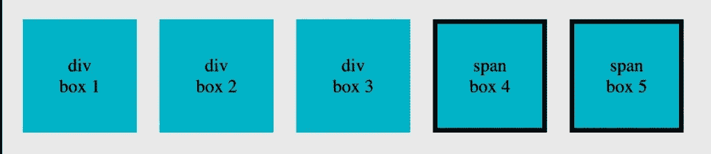
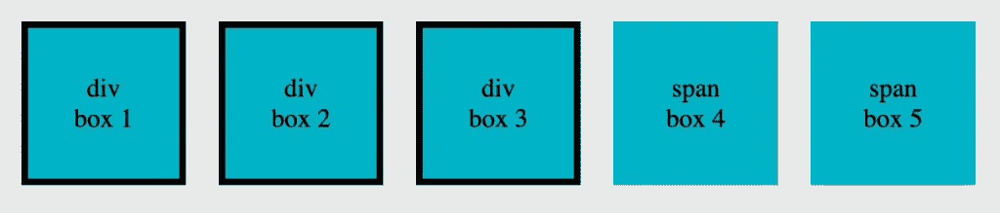
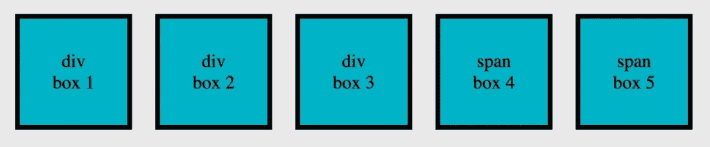

# 在 JavaScript 中通过标记名获取元素

> 原文：<https://javascript.plainenglish.io/get-element-s-by-tag-name-in-javascript-181a688b312a?source=collection_archive---------11----------------------->

了解如何使用 JavaScript 中的 **getElementsByTagName()** 和 **querySelectorAll()** 方法通过**标记名**获取**一个或多个 HTML 元素对象**。

1.  [使用**getElementsByTagName()**](https://softauthor.com/get-element-by-tag-name-in-javascript/#get-elements-by-tag-name-using-getelementsbytagname)通过标签名获取元素
2.  [使用**query selectorall()**](https://softauthor.com/get-element-by-tag-name-in-javascript/#get-elements-by-tag-name-using-queryselectorall)通过标签名称获取元素
3.  [用**多个标签名**](https://softauthor.com/get-element-by-tag-name-in-javascript/#get-elements-by-multiple-tag-names) 获取元素
4.  [从**父元素**](https://softauthor.com/get-element-by-tag-name-in-javascript/#get-elements-by-tag-name-from-parent) 中通过标签名获取元素

> 通常，您会希望通过类名而不是标签名[来获取元素，以避免指向错误的元素。](https://softauthor.com/javascript-get-elements-by-class-name/)

# 1.使用 getElementsByTagName()通过标记名获取元素

了解如何使用 **getElementsByTagName()** 方法通过标记名获取一个或多个元素。

在下面的 HTML 示例中，有三个 div 元素和两个 span 元素。

```
<div>div <br>box 1</div>
<div>div <br>box 2</div>
<div>div <br>box 3</div>
<span>span <br>box 4</span>
<span>span <br>box 5</span>
```

让我们只获取 **span** 元素。

```
const spanBoxes = document.getElementsByTagName("span");
console.log(spanBoxes); // HTMLCollection[2]
```

调用全局**文档**对象上的 **getElementsByTagName()** 。

**getElementsByTagName()** 方法接受一个参数，即**标记名**。

在这种情况下… **跨度**

它从整个文档中获取所有的 div 元素并返回一个名为 [HTMLCollection](https://softauthor.com/javascript-htmlcollection-vs-nodelist/) 的类似数组的对象。

将其分配给一个常数**框**。

**框** **HTML 集合**中有三个条目，可以使用**对其进行迭代..**回路。

```
for(spanBoxe of spanBoxes) {
   box.style.border = "4px solid";
}
```



# 2.使用 querySelectorAll()通过标记名获取元素

使用 **querySelectorAll()** 方法，您也可以**通过标签名**获得一个或多个 HTML 元素 **。**

这次让我们得到所有的 div 元素。

`const divBoxes = document.querySelectorAll("div"); console.log(divBoxes); // NodeList[3]`

在**文档**对象上调用 **querySelectorAll()** 方法。

**querySelectorAll()** 方法也接受一个参数，这个参数也是**标记名**。

在这种情况下: **div**

**querySelectorAll()** 方法返回 [NodeList](https://softauthor.com/javascript-htmlcollection-vs-nodelist/) ，这是一个包含所有元素节点列表的对象。

与 **HTMLCollection** 不同， **NodeList** 除了的**for…之外，还可以使用`forEach()`方法进行迭代。**

`divBoxes.forEach(divBox => { divBox.style.border = "1px solid"; })`



# 3.通过多个标记名获取元素

使用 **querySelectorAll()** 方法，**在一个**单个查询中通过**多个标记名**获得一个或多个元素**。**

`const boxes = document.querySelectorAll("div, span"); console.log(boxes); // NodeList[5]`

对**文档**对象调用 **querySelectorAll()** 方法。

将多个用逗号分隔的标记名作为 **querySelectorAll()** 方法的参数传递。

在这种情况下: **div，span**

*与 querySelectorAll()方法不同，当使用****getElementsByTagName()****获得相同的结果时，您必须进行两次查询。*



# 4.从父级按标记名获取元素

了解如何通过**标签名称**从**父元素**中**获取一个或多个元素**。

下面是用**部分**父元素包装的 HTML 代码。

`<section> <div>div <br>box 1</div> <div>div <br>box 2</div> <div>div <br>box 3</div> <span>span <br>box 4</span> <span>span <br>box 5</span> </section>`

现在，让我们使用 section 父元素通过**标记名**获得子元素。

`const sectionElements = document.getElementsByTagName("section"); console.log(sectionElements); //HTMLCollection const boxSectionElement = sectionElements[0]; const boxes = boxSectionElement.querySelectorAll("div, span"); for(box of boxes) { box.style.border = "4px solid black"; // Apply border to div and span tags only }`

首先，使用返回 **HTMLCollection** 的 **getElementsByTagName()** 获取所有的 section 元素。

将其分配给常量 **sectionElements** 。

使用其**索引**号获取**第一个 section 元素**，并将其存储在名为 **boxSectionElement** 的常量中。

然后，调用 **boxSectionElement** 对象上的 **querySelectorAll()** ，传递 **div** 和 **span** 标签作为参数，指向**的所有子元素**。

*或者，您也可以使用 boxSectionElement 上的 children 属性来获取所有子元素。*

最后，**使用**的**for…循环**，并将**边框**设置为**元素**。

*更多内容请看*[***plain English . io***](https://plainenglish.io/)*。*

*报名参加我们的* [***免费每周简讯***](http://newsletter.plainenglish.io/) *。关注我们关于*[***Twitter***](https://twitter.com/inPlainEngHQ)，[***LinkedIn***](https://www.linkedin.com/company/inplainenglish/)***，***[***YouTube******，*** ](https://www.youtube.com/channel/UCtipWUghju290NWcn8jhyAw)

***用*** [***电路***](https://circuit.ooo/?utm=publication-post-cta) *为你的科技创业建立认知和采用。*