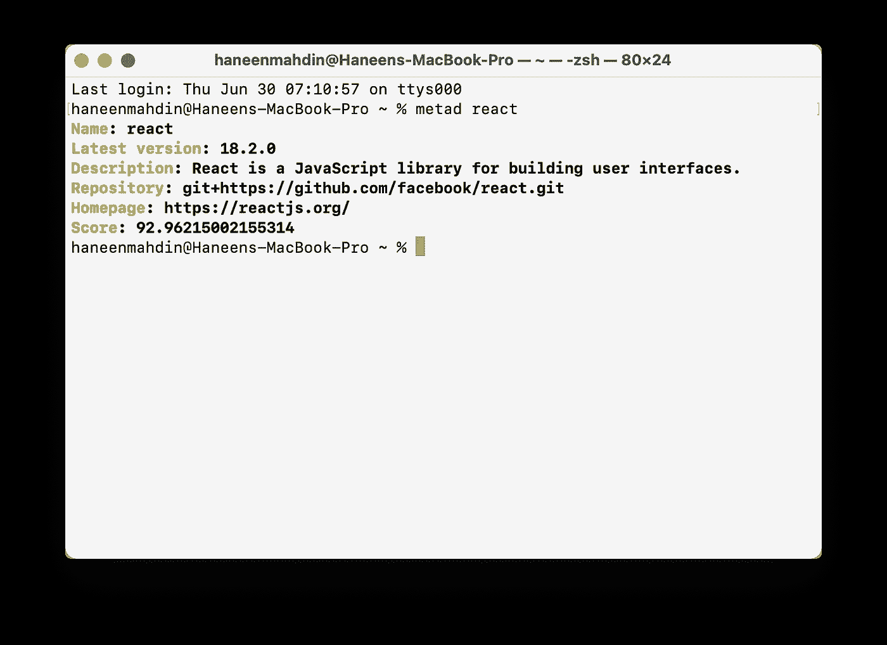

# 从您的 CLI 获取有关 NPM 软件包的信息

> 原文：<https://javascript.plainenglish.io/get-information-about-an-npm-package-from-your-cli-9aa4f22b6e6d?source=collection_archive---------15----------------------->


Photo by [Clément Hélardot](https://unsplash.com/@clemhlrdt?utm_source=medium&utm_medium=referral) on [Unsplash](https://unsplash.com?utm_source=medium&utm_medium=referral)

为了找到一些关于 npm 包的信息，或者找到它的 GitHub repo，甚至是它的文档网站，我会在 Google 上搜索它，或者尝试在他们的网站上找到它:npmjs.com。

但是，如果我们想解决这个问题，想获得关于一个 npm 包的信息——没有谷歌的东西？

因此，上周，我决定构建一个简单的 CLI 应用程序来解决这个问题。

所以，让我们继续安装这个包。

```
npm i -g metad
```

你可以使用 yarn 或者 npm，但是要确保全局安装。

要获得关于特定包的信息，您必须将包的名称传递给 metad 的 CLI。

```
metad <package-name>
```

让我们继续了解一些关于`react`包的信息。

运行此命令👇

```
metad react
```



Getting information about the react package

⬆️这是信息的样子。

在未来，我们还想增加更多的功能，所以请在 [GitHub](https://github.com/haneenmahd/metad) 上给我们一颗星。

另外，别忘了给我们投上一票 [ProductHunt](https://www.producthunt.com/posts/metad) 。

感谢阅读🤩

*更多内容看* [***说白了就是 io***](https://plainenglish.io/) *。报名参加我们的* [***免费周报***](http://newsletter.plainenglish.io/) *。关注我们关于*[***Twitter***](https://twitter.com/inPlainEngHQ)*和*[***LinkedIn***](https://www.linkedin.com/company/inplainenglish/)*。查看我们的* [***社区不和谐***](https://discord.gg/GtDtUAvyhW) *加入我们的* [***人才集体***](https://inplainenglish.pallet.com/talent/welcome) *。*