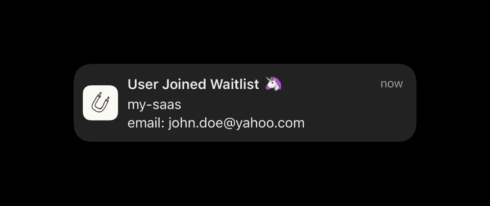
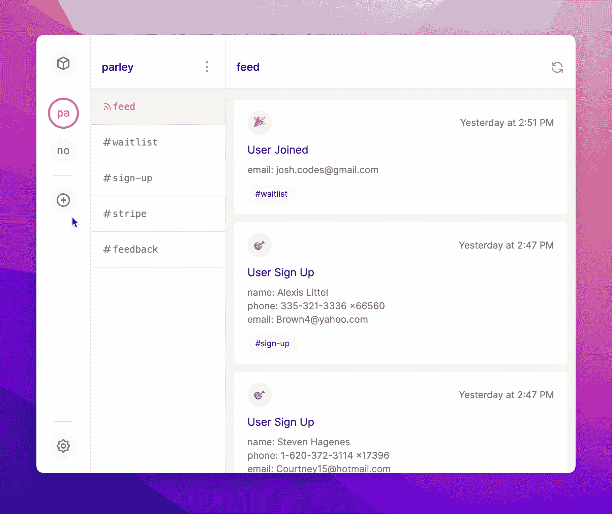
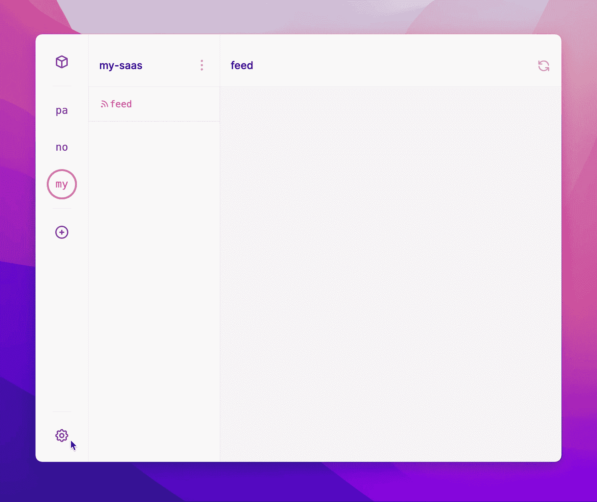
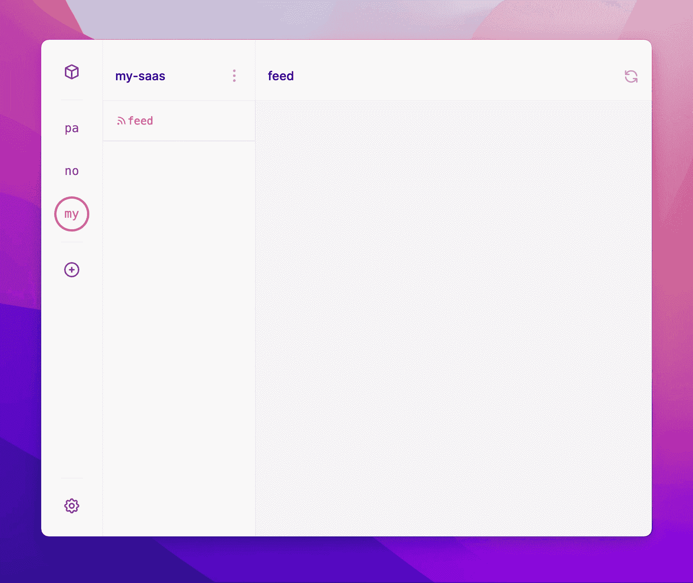

# 只需一分钟就能从 JavaScript 获得推送通知！

> 原文：<https://javascript.plainenglish.io/get-push-notifications-from-javascript-in-just-one-minute-1ae5c221f82b?source=collection_archive---------21----------------------->



作为一名开发人员，我曾多次希望得到通知并跟踪我的项目中发生的某些事件。例如，当用户加入时事通讯、创建帐户、升级到高级计划或提供反馈时。

LogSnag 让设置这些通知变得非常容易，并创建事件的 feeds，这样你就可以知道发生了什么以及什么时候发生的。

## 入门指南

首先，我将在我的 LogSnag 帐户中添加一个新项目。这个例子我们姑且称之为 ***my-saas*** 。



接下来，我们需要一个 API 令牌。前往设置，打开 API 选项卡，使用 ***+*** 按钮创建新令牌。然后，您可以使用剪贴板图标来复制令牌。



我们快完成了！让我们转向我们的代码！

## JavaScript 时间！

首先，让我们安装 [LogSnag npm 包](https://www.npmjs.com/package/logsnag)

```
npm install --save logsnag
```

然后，我们必须导入这个包，并用我们刚刚从应用程序中复制的 API 令牌初始化我们的客户机。

```
import { LogSnag } from 'logsnag';const logsnag = new LogSnag('MY_API_TOKEN')
```

最后，我们可以使用客户端发布应用程序中的任何事件。

对于此示例，我将调用我的渠道 ***等待列表*** ，因为我希望得到通知并跟踪加入我的等待列表的用户。由于这是我们第一次发布到这个频道，LogSnag 会自动为我们创建。

我将在描述中传递用户电子邮件，并使用独角兽表情符号作为图标。最重要的是，我将把 notify 设置为 true，因为我希望收到这个事件的推送通知。

```
logsnag.publish({
    project: "my-saas",
    channel: "waitlist",
    event: "User Joined Waitlist",
    description: "email: john.doe@yahoo.com",
    icon: "🦄",
    notify: true
})
```

一旦我们运行了这段代码，在 ***my-saas*** 项目下就会创建一个新的通道，并且我们会在所有安装了 [LogSnag](https://logsnag.com) 的设备上获得这个事件的推送通知！



在过去的几个月里，LogSnag 一直是一个兼职项目。它起源于使用消息平台发布和跟踪用户活动和事件的痛点。LogSnag 是专门为此目的而设计的，它提供了强大的功能，使跟踪事件和项目变得更加容易。目前，LogSnag 正处于测试阶段，你可以通过在网站上注册[等候名单来获得访问权。](https://logsnag.com)

*更多内容请看*[***plain English . io***](http://plainenglish.io/)*。报名参加我们的* [***免费周报***](http://newsletter.plainenglish.io/) *。在我们的* [***社区***](https://discord.gg/GtDtUAvyhW) *获得独家获得写作机会和建议。*