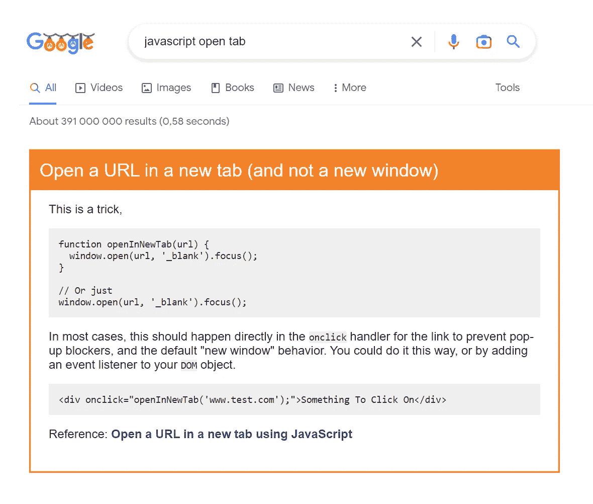
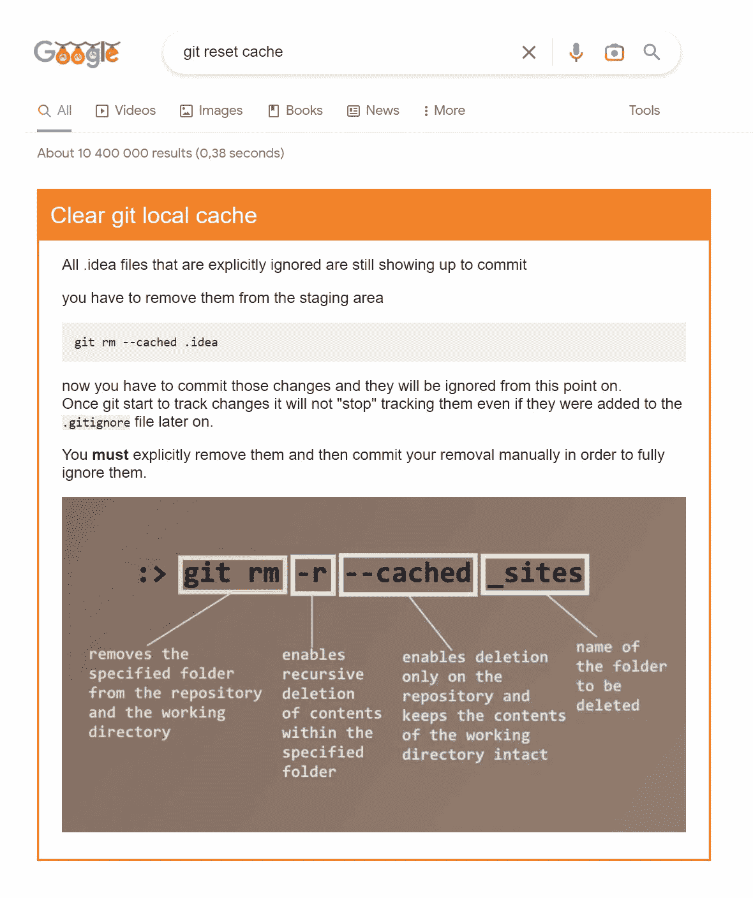
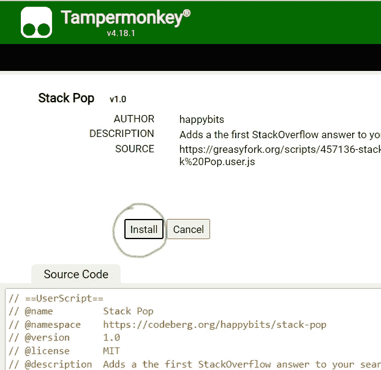
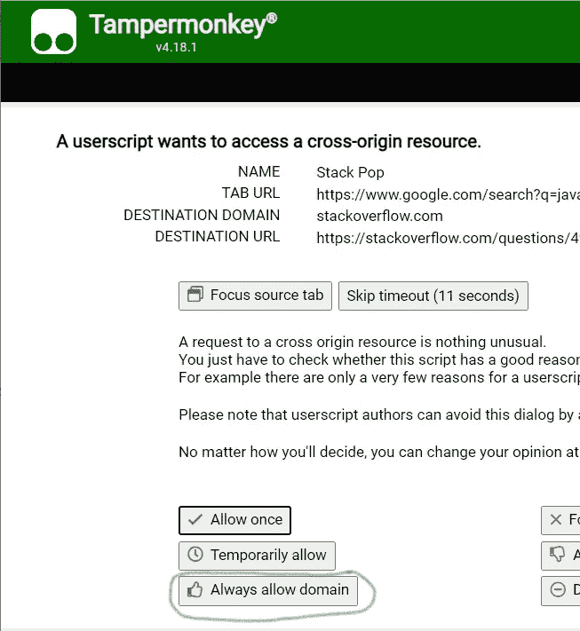
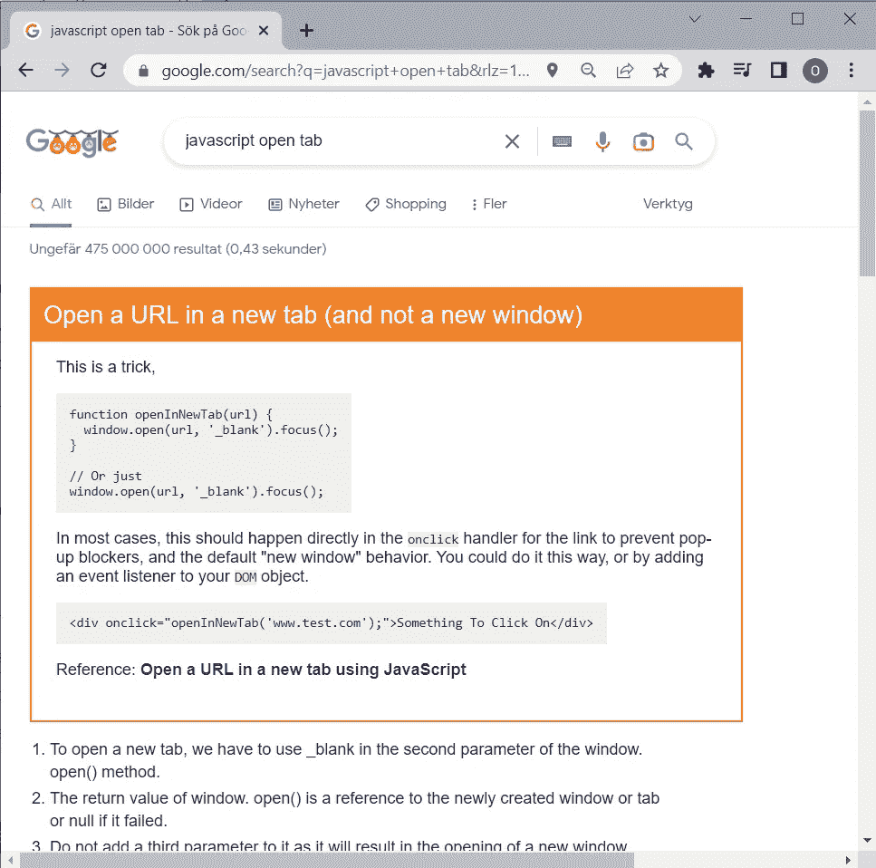

# 在您的谷歌搜索结果中获得 StackOverflow 答案

> 原文：<https://javascript.plainenglish.io/get-stackoverflow-answers-right-in-your-google-search-result-8296f8a04b3e?source=collection_archive---------10----------------------->

假设你是一名开发人员，想谷歌一些东西。

我猜你的过程看起来像这样:

1.  在谷歌中写一个查询
2.  向下滚动到第一个 StackOverflow 命中
3.  点击链接，等待页面，忽略实际问题，向下滚动到答案
4.  阅读答案

我做了一个叫做 **StackPop** 的工具，它会让你成为谷歌之神。从现在开始你只需要两步:

1.  在谷歌中写一个查询
2.  阅读答案

# 演示

好了，工具安装好了，体验如何？

假设您想知道如何用 JavaScript 打开一个新标签页。你谷歌一下:

> javascript 打开选项卡

你会得到普通的搜索结果，但是在顶部你会得到 StackOverflow 上的第一个答案！

另一个例子:您忘记了清除本地 GIT 缓存的命令。你谷歌一下:

> git 重置缓存

瞧:

不用担心，普通的搜索结果就显示在这个奇妙的橙色方框下面。

# 装置

安装这个工具需要三分钟。只要遵循这个指南。

首先安装浏览器扩展 [Tampermonkey](https://www.tampermonkey.net/)

[点击这里](https://greasyfork.org/en/scripts/457136-stack-pop)然后点击**安装这个脚本**:

接下来点击**安装**:

现在谷歌一下类似于

> javascript 打开选项卡

您将从 Tampermonkey 收到一条警告消息，询问您是否希望脚本访问其他页面。只需按下*总是允许域*。您只需要这样做一次。

搞定了。

现在您已经设置好了，您将看到这样一个页面:

# 安全吗？

你需要相信坦帕蒙基，也需要相信我的剧本。

Tampermonkey 从 2010 年就有了，有数百万开发者在使用，所以我猜它是安全的。

我的脚本不到 200 行非火箭科学的 JavaScript 代码，您可以阅读。

# 缺点？

我能想到的唯一负面影响是，如果你不喜欢来自 StackOverflow 的答案，它会在你的搜索列表中占据一些空间。

如果你看到任何缺点，请报告。我没有注意到任何速度或其他方面的问题。您通常的搜索结果将仍然存在，不会删除任何内容。

# 调整它！

这是该工具的第一个版本(2022 年 12 月 22 日)。

请帮我移植到其他搜索引擎，让我知道你是否有改进的想法😊

这个工具叫做 **StackPop** 你可以在这里找到回购:

[https://codeberg.org/happybits/StackPop/](https://codeberg.org/happybits/StackPop/)

*更多内容请看*[***plain English . io***](https://plainenglish.io/)*。报名参加我们的* [***免费周报***](http://newsletter.plainenglish.io/) *。关注我们关于*[***Twitter***](https://twitter.com/inPlainEngHQ)[***LinkedIn***](https://www.linkedin.com/company/inplainenglish/)*[***YouTube***](https://www.youtube.com/channel/UCtipWUghju290NWcn8jhyAw)*[***不和***](https://discord.gg/GtDtUAvyhW) ***。*****

*****对缩放您的软件启动感兴趣*** *？检查* [***电路***](https://circuit.ooo?utm=publication-post-cta) *。***