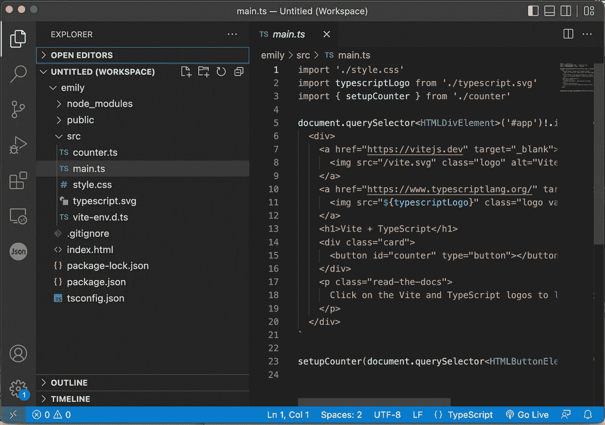

# 在 5 分钟内启动 TypeScript 并在浏览器中运行

> 原文：<https://javascript.plainenglish.io/get-typescript-up-running-in-browsers-in-5-minutes-2ce2ab5d0457?source=collection_archive---------9----------------------->

## 快速入门，喜欢它


Photo by [Dattatreya Patra](https://unsplash.com/@dattatreyapatra?utm_source=medium&utm_medium=referral) on [Unsplash](https://unsplash.com?utm_source=medium&utm_medium=referral)

你一定听过 TypeScript 很多次了，现在它的官网上有一个 [**游乐场**](https://www.typescriptlang.org/play/) ，但是作为一个认真的开发者，直到你看到它为你做了实实在在的事情，你才会服气；换句话说，作为一种 web 编程语言，您希望看到 TyepScript 在浏览器中运行。

有很多方法可以做到这一点，这也可能是它令人困惑的原因。常见的建议往往会导致 webpack，这是一个困扰许多开发人员的臭名昭著的高维护性工具。让我们避免那个。

# 安装 TypeScript:简单的方法

Vite 自我标榜为下一代前端工具。它来自设计 *Vue.js* 的同一个开发者。 *Vite* 可以用来快速搭建一个 TypeScript 项目。

在 Mac 的*终端*或 Windows 的*命令行*中输入以下命令。

```
% **npm create vite@latest** ✔ Project name: … **emily** ✔ Select a framework: › **vanilla** ✔ Select a variant: › **vanilla-ts** Scaffolding project in /Users/seanzhai/sean/myTS/emily...
Done. Now run:
 **cd emily
  npm install
  npm run dev**
```

让我们检查一下由 *Vite* 生成的文件结构。



TypeScript Project File Structure in VS Code | Screenshot by Sean Zhai

Vite 自动生成文件，并用一些合理的缺省值配置了 TypeScript，因此您可以立即开始工作。源代码在 *src* 目录下，在那里你会找到 *main.ts* 。

在最后一个命令`npm run dev`之后，它会为您创建一个开发服务器。你可以打开浏览器测试。

```
npm run dev
```


TypeScript Development Server | Screenshot by Sean Zhai

您可以使用以下代码生成 TypeScript:

```
npm run build
```

结果在您的项目主目录的`dist`目录下。

# 为什么是打字稿

如果您无法避免 JavaScript，并且它“偶尔”出现的奇怪现象让您有些困扰，那么 TypeScript 可能会提供一个不错的解决方案。它感觉像是一种设计合理的编程语言，能够处理大规模的项目。

我建议读一些关于函数和类构造的书，然后你可以开始使用 TypeScript。入门容易，边用边学。

TypeScript Creator: Anders Hejlsberg

# 尾声

你用 Vite 建立一个 TypeScript 项目花了多长时间？可能不到一分钟。

为什么我没有在标题里说一分钟？我猜你可能不相信。