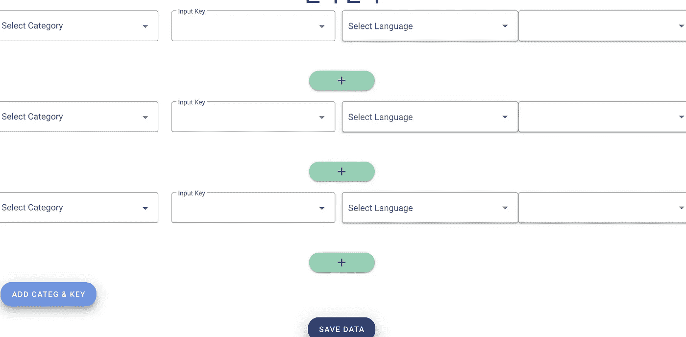
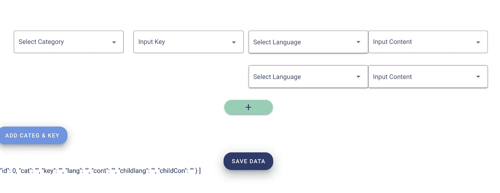

# 将子组件输入数据获取到父组件并聚集到 Vue.js 中的数组中？

> 原文：<https://javascript.plainenglish.io/getting-child-component-input-data-to-parent-gathering-into-array-in-vue-js-bcce136ecef7?source=collection_archive---------5----------------------->

## 按下一个按钮，将所有信息收集到一个数组中。


Photo by [Arnold Francisca](https://unsplash.com/@clark_fransa?utm_source=medium&utm_medium=referral) on [Unsplash](https://unsplash.com?utm_source=medium&utm_medium=referral)

例如，在这里，当我单击按钮时，我将多一个组件，这意味着它将有新的数据。所以，当我按下保存数据按钮时，我想将所有信息收集到一个数组中。我希望，这很容易理解。

```
<Child v-for="count in btnNumber" :key="count" @showData="getElements" />

<v-btn
  color="primary"
  elevation="10"
  class="space"
  large
  @click="duplicateEl"
  >Add Categ & Key</v-btn
>
<v-btn
  color="secondary"
  elevation="13"
  class="btnEl"
  dark
  large
  @click="getResult">
Save Data
</v-btn>@click="getResult">*Save* *Data*</v-btn>
```

它使用 Emit 从子组件获取数据。

```
methods:{
          getElements(emitPayload) {
          this.selectedChildCategory = emitPayload.selectedCateg;
          this.selectedChildKey = emitPayload.selectedKey;
          this.selectedChildLanguage = emitPayload.selectedLang;
          this.selectedChildContent = emitPayload.selectedCon;
        }
    }
 duplicateEl() {
  this.btnNumber++;
}
```



From Stackoverflow



## **————————回答——————**

您可以在父组件上保存数据，请看下面的代码片段:

```
Vue.component('Child', {
  template: `
  <v-form>
    <v-container>
      <v-row>
        <v-col>
          <v-select
            :items="categories"
            label="Category"
            dense
            outlined
            v-model="content.cat"
            @change="setD"
          ></v-select>
          </v-col>
          <v-col>
          <v-select
            :items="keys"
            label="Key"
            dense
            outlined
            v-model="content.key"
            @change="setD"
          ></v-select>
          </v-col>
          <v-col>
          <v-select
            :items="langs"
            label="Lang"
            dense
            outlined
            v-model="content.lang"
            @change="setD"
          ></v-select>
          </v-col>
          <v-col>
          <v-select
            :items="contents"
            label="Cont"
            dense
            outlined
            v-model="content.cont"
            @change="setD"
          ></v-select>
        </v-col>
      </v-row>
    </v-container>
  </v-form>
  `,
  props: ['conte'],
  data() {
    return {
      content: this.conte,
      categories: ['first', 'second', 'third'],
      keys: [1,2,3],
      langs: ['g', 'h', 'j'],
      contents: ['aaa', 'bbb', 'ccc']
    }
  },
  methods: {
   setD() {
      this.$emit('show', this.content);
    },
  },
})

new Vue({
  vuetify: new Vuetify(),
  el: "#app",
  data() {
    return {
      contentFields: [{id: 0, cat: '', key: '', lang: '', cont: ''}],
      showData: false
    }
  },
  methods: {
    addInput() {
      let newI = this.contentFields.length 
      this.contentFields.push({id: newI, cat: '', key: '', lang: '', cont: ''})
    },
    getElements(e){
      const newData = this.contentFields.map(obj => {
        if(obj.id === e.id) 
           return { ...obj }
        return obj
      });
    },
    getResult() {
      this.showData = !this.showData
    }
  }
})<head>
  <link href="https://fonts.googleapis.com/css?family=Roboto:100,300,400,500,700,900" rel="stylesheet">
  <link href="https://cdn.jsdelivr.net/npm/@mdi/font@6.x/css/materialdesignicons.min.css" rel="stylesheet">
  <link href="https://cdn.jsdelivr.net/npm/vuetify@2.x/dist/vuetify.min.css" rel="stylesheet">
  <meta name="viewport" content="width=device-width, initial-scale=1, maximum-scale=1, user-scalable=no, minimal-ui">
</head>
<body>
  <div id="app">
    <v-app>
      <v-main>
        <v-container>
          <v-btn
            color="primary"
            elevation="10"
            class="space"
            large
            @click="addInput"
          >Add Categ & Key</v-btn>
          <v-container v-for="(content, i) in contentFields" :key="i">
            <child :conte="content" @show="getElements" />
          </v-container>
          <v-btn
            color="secondary"
            elevation="13"
            class="btnEl"
            dark
            large
            @click="getResult"
          >Save Data</v-btn>
          <div v-if="showData">{{ contentFields }}</div>
        </v-container>
      </v-main>
    </v-app>
  </div>

  <script src="https://cdn.jsdelivr.net/npm/vue@2.x/dist/vue.js"></script>
  <script src="https://cdn.jsdelivr.net/npm/vuetify@2.x/dist/vuetify.js"></script>
```

运行代码段。

# [用道具传递数据给子组件](https://vuejs.org/v2/guide/components.html#Passing-Data-to-Child-Components-with-Props)

前面，我们提到了为博客文章创建一个组件。问题是，除非您可以向该组件传递数据，例如我们想要显示的特定帖子的标题和内容，否则该组件没有用。这就是道具的用武之地。

属性是可以在组件上注册的自定义属性。当一个值被传递给一个适当属性时，它就成为组件实例上的一个属性。要将标题传递给我们的博客文章组件，我们可以使用一个`props`选项将它包含在该组件接受的道具列表中:

```
Vue.component('blog-post', {
  props: ['title'],
  template: '<h3>{{ title }}</h3>'
})
```

一个组件可以有任意多的属性，默认情况下，任何值都可以传递给任何属性。在上面的模板中，您将看到我们可以在组件实例上访问这个值，就像使用`data`一样。

一旦注册了一个属性，就可以将数据作为自定义属性传递给它，如下所示:

```
<blog-post title="My journey with Vue"></blog-post>
<blog-post title="Blogging with Vue"></blog-post>
<blog-post title="Why Vue is so fun"></blog-post>
```

现在你知道了。感谢您的阅读。

*更多内容看* [***说白了就是 io***](http://plainenglish.io/) *。报名参加我们的* [***免费周报***](http://newsletter.plainenglish.io/) *。在我们的* [***社区获得独家访问写作机会和建议***](https://discord.gg/GtDtUAvyhW) *。*