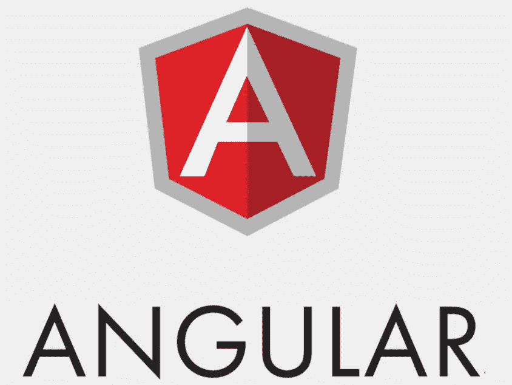

# 消除 Angular 中的 ng module(JavaScript)

> 原文：<https://javascript.plainenglish.io/getting-rid-of-ngmodule-in-angular-javascript-43fd510779bc?source=collection_archive---------3----------------------->

在 Angular 工作多年后，我发现很难创建一个项目的结构。这场斗争的主要原因在于 Angular 与组件和模块的交互方式。下面的文章解释了 NgModule 的问题，以及在可预见的未来它是否会改变。

## **内置惰性加载机制**

Angular 拥有基于模块的架构。换句话说，每个应用程序至少有一个 NgModule，它将所有组件和路由连接在一起。这是一种实用的应用程序结构方法。应用程序有一个包含所有声明的中央单元。当我们谈论小型网络应用时，这是正确的。

当处理大型单页应用程序时，性能成为一个关键的棘手问题。是时候开始考虑优化了。缩短加载时间的方法之一是在第一次加载时缩小应用程序的大小。这个目标可以通过延迟加载来实现。该技术由角度路由机制支持。

该技术允许仅在需要时加载应用程序的特定部分。这里是关于如何在 Angular 框架内实现延迟加载的[完整文档](https://angular.io/guide/lazy-loading-ngmodules)。

## 【NgModules 怎么了？

到目前为止，一切似乎都是正确的，对吗？让我们放大来看看潜在的问题是否会出现。

例如，我们将采用有角度的材质 UI。框架应该符合最佳实践，因为它是由 Angular 团队构建和维护的。查看所提供的组件，您可能会提到每个组件都有自己的 NgModule。这样做是为了允许导入单个组件，而不必抓取所有组件并使应用程序过载。

作为一名开发人员，这一切对我来说意味着什么？实际上，您需要为每个组件创建一个 NgModule。因此对每个组件创建都有双重作用。

对于新手来说，这个概念可能显得相当痛苦。老实说，以这种方式工作对我来说仍然令人沮丧。

## **VueJs 组件交互**

当我开始使用 VueJs 时，我没有感到任何不适。就在前面提到的一段时间之后，我做了比 Angular 更少的动作来实现相同的组件交互。“怎么可能？”我以为。在并排比较之后，找出 VueJs 在整个开发过程中所缺少的东西。答案是“模块”。

在 VueJs 中，一切都是基于组件的。您想创建网页吗？做一个组件。您想创建一段可重用的 UI 代码吗？制作组件！仅此而已。就这么简单。

模块不是构成了一个更连贯的结构吗？如果我错了，请纠正我，但是我还没有提到这个附加架构层的任何实际好处。

## **要变了吗？**

是的，Angular [路线图](https://angular.io/guide/roadmap#simplified-angular-mental-model-with-optional-ngmodules)给了所有 Angular 开发者一线希望。本“[【完整】RFC:独立组件、指令和管道——使 Angular 的 NgModules 可选](https://github.com/angular/angular/discussions/43784)”中解释并讨论了该提议。

然而，请注意这句话:

> *这个提议并不是试图从 Angular 中去除 NgModule 的概念——而是让它对于典型的应用程序开发任务是可选的。*
> 
> *与此同时，我们认为它为大大降低 NgModule 在典型开发场景中的作用铺平了道路——在未来的某个时候，我们有可能也有理由考虑完全删除它。*

## **总结**

摆脱模块是角度架构简化的第一步。到目前为止，我只看到这样做的好处。

谁知道将来 Angular 会不会像 React 那样采用功能组件的方法来代替类呢？

*更多内容请看*[*plain English . io*](http://plainenglish.io/)*。报名参加我们的* [*免费每周简讯*](http://newsletter.plainenglish.io/) *。在我们的* [*社区不和谐*](https://discord.gg/GtDtUAvyhW) *获取独家写作机会和建议。*