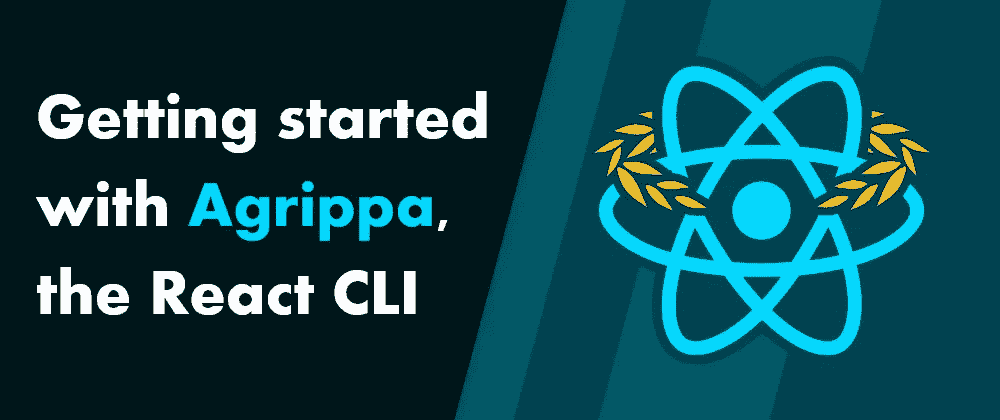
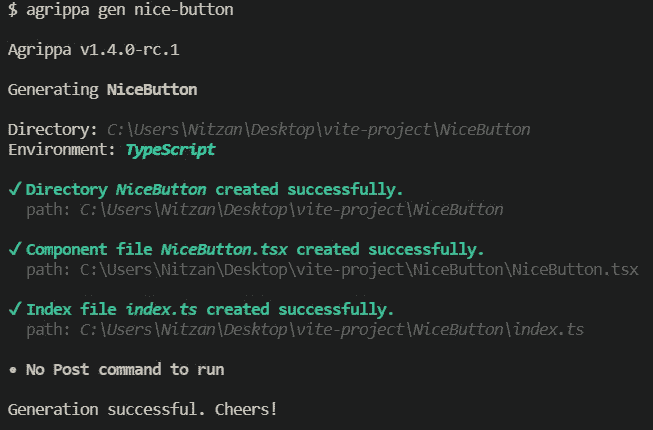
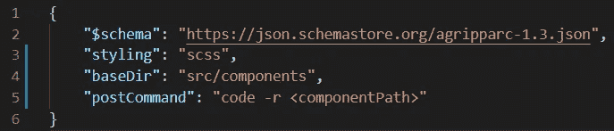

# React CLI agri PPA 入门

> 原文：<https://javascript.plainenglish.io/getting-started-with-agrippa-the-react-cli-c268c2c6bfda?source=collection_archive---------16----------------------->

**TLDR** : Agrippa 是一个轻松生成 React 组件的 CLI。通过在项目的命令行中键入三个单词，您可以生成一个全新的组件——包括专用目录、样式文件、索引文件等。在任何 React 项目中，*只需要几秒钟*就可以设置好，几分钟就可以学会，从一开始就为你节省时间和精力。

要开始，请访问 GitHub 上的 [Agrippa](https://github.com/NitzanHen/agrippa) 。如果你想知道更多，请留下来:

# 为什么是阿格里帕？

您可能想知道，与手工编写组件、从模板文件复制粘贴或使用代码片段工具(例如，在 VSCode 中)相比，Agrippa 有什么优势？简而言之，使用 Agrippa 的**效率更高**，生成的结果是**更加灵活，更加完整**。

让我们来看一下:就设置一个组件所需的时间而言，在您最喜欢的终端中键入一个简短的命令比手动编写组件或手动从模板文件(例如，在您的 PC 上)中复制和粘贴要快几个数量级。至于 snippet，使用 snippet 创建一个基本组件的时间可能不会比键入一个短命令多多少，但是当您考虑到为组件创建目录、索引文件和样式文件以及 React 代码本身时，让一个命令为您完成这一切会更快、更方便。

但是与片段相比，阿格里帕还有第二个更重要的优势——灵活性。这其实是阿格里帕背后的主要动力！如果您或您的团队有一个在您工作的所有项目中使用的最喜欢的堆栈，那么一些片段可能就足够了。但是，React 有一个多样化的生态系统，您可能很容易发现自己在许多不同的环境中使用不同的工具工作。

作为一个具体的例子，假设在你的开发生涯中，你遇到了 JS 和 TS 项目，四种不同的样式化解决方案(例如，SCSS、CSS、JSS、样式化组件)，两种不同的导出类型(名为&默认)，以及两种不同的组件声明方案(`const` & `function`)。这些的任何组合都是有效的，**因此，为了解释所有这些，你需要 4*2*2*2 = 32 个片段**。这还是在考虑 React 本地项目、不同的属性声明(JSDoc、属性类型)等之前。你最终会花更多的时间在代码片段上，而不是你的项目上！

当然，你可以通过使它们更加通用来减少代码片段的数量。但是，然后他们*失去了他们的灵活性*，并且你发现你自己“修复”了用一个片段生成的每个组件，因此它实际上适合项目的栈。

同样，将这与在命令行中编写 3-4 个单词的命令进行比较，会得到更好的结果。很有吸引力的选择，对吧？

# 建立阿格里帕

无论项目规模如何，开始使用 Agrippa 都非常简单。使用它的最低要求是简单地安装它，使用`npm i -g agrippa`。

当在一个项目中运行时，使用`agrippa gen <component-name>`，Agrippa 自动确定它需要有效运行的大部分选项——这包括项目是否使用 Typescript，是否是 React 原生项目等。

*Typical output for* `*agrippa gen*` *(v1.4.0+)*

# 使用配置

不能自动检测的选项(例如，要生成哪个样式解决方案代码)可以通过命令行传递。但是，为了避免反复输入相同的选项，建议使用 config。配置文件是一个普通的旧 JSON 文件，名为`.agripparc.json`，通常位于项目的根目录下。可以通过调用`agrippa init`生成。然后，您可以添加您的选项，无论何时运行，Agrippa 都会读取它们！

在大多数项目中，您会在配置中添加两到三个选项——您使用的`styling`解决方案，通常在其中生成组件的`baseDir`,偶尔还有一个`postCommand`,它是在 Agrippa 成功生成组件后运行的命令。

A typical `.agripparc.json` config file

关于 Agrippa 支持的选项的完整列表，请参见 [wiki](https://github.com/NitzanHen/agrippa/wiki) 上的[生成选项的完整列表](https://github.com/NitzanHen/agrippa/wiki/The-complete-list-of-generation-options)。关于`baseDir`的更多信息，参见[使用 baseDir 和 dest](https://github.com/NitzanHen/agrippa/wiki/Using-baseDir-and-dest) 。最后，关于后置命令的更多信息，这是使 Agrippa 如此灵活的主要特性之一，参见[后置命令指南🍲](https://github.com/NitzanHen/agrippa/wiki/Post-Command-cookbook-%F0%9F%8D%B2)。

# 最终注释

就是这样！阿格里帕有一个不断发展的社区，我希望你也能加入进来！要开始使用，请访问 GitHub 上的 [Agrippa](https://github.com/NitzanHen/agrippa) 。

我很乐意听到你对阿格里帕(或者特别是这篇文章)的想法和反馈。感谢您的时间，祝您愉快！

*更多内容看* [***说白了。报名参加我们的***](http://plainenglish.io/) **[***免费周报***](http://newsletter.plainenglish.io/) *。在我们的* [***社区获得独家访问写作机会和建议***](https://discord.gg/GtDtUAvyhW) *。***