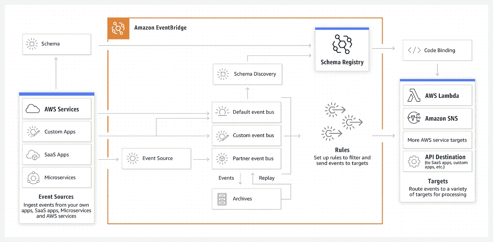

# 如何开始使用 AWS EventBridge & Node.js

> 原文：<https://javascript.plainenglish.io/getting-started-with-aws-eventbridge-nodejs-c9dc1e1ca936?source=collection_archive---------0----------------------->

## 关于从 AWS EventBridge 和 Node.js 开始的指南

你在设计一个事件驱动的架构吗？如果是这样，那么 AWS 事件桥可能是你的下一个好赌注。根据 EventBridge 的 AWS

“Amazon event bridge 是一种无服务器事件总线，通过使用从应用程序、集成软件即服务(SaaS)应用程序和 AWS 服务生成的事件，可以更轻松地大规模构建事件驱动的应用程序”

## 什么是事件驱动架构？

事件驱动架构是一种编程范例，在这种架构中，我们设计应用程序以应对“应用程序状态的重大变化”。

EventBridge 是另一个消息/事件编排服务，就像 AWS SNS 和 SQS 一样，只是功能有很大不同。由于本文更多地涉及 EventBridge 服务，因此我将展示从 node js 应用程序到 event bridge 服务的连接和使用的完整演示。

让我们从 AWS 事件桥的实现开始

# 步骤 1:设置规则

导航到 AWS 管理控制台并搜索 Amazon EventBridge。

单击“创建规则”。

initial view of event bridge page

给出名称、描述，并从下拉列表中选择事件总线。你可以选择默认开始，但也可以自定义和选择不同的事件总线。要使用不同的事件总线，您需要从上一个屏幕创建一个。

规则类型有两个参数

1.  具有事件模式的规则
2.  日程安排

第一个选项在事件与已定义的事件模式匹配时触发(我们将在下一部分中看到这一点)。第二个选项更像是自动触发事件桥的 CRON 作业。

点击“下一步”。

# **第 2 步:构建事件模式**

You can choose this setting as per your requirement. I’ll go with the default setting

对于事件模式，选择“自定义模式(JSON 编辑器)”并添加一个有效的 JSON。JSON {“source”:“node-js-test”}意味着事件桥将接受具有值为 node-js-test 的属性源的事件

点击“下一步”。

# 步骤 3:选择目标

出于演示目的，我将只使用 CloudWatch 日志来查看从节点 js 应用程序发送的事件详细信息。我在这里使用一个单一的目标，但你可以添加多个。

Target 指的是在事件桥服务捕获到有效事件后立即触发的 AWS 服务。

添加 Lambda 函数作为目标将意味着，只要事件桥捕捉到有效事件，就将执行该函数。

点击“下一步”。

# 步骤 4:添加标签

这个步骤完全是可选的，您可以选择是否添加标记。

# 第 5 步:检查配置并创建规则

在 AWS 事件桥控制台中，新添加的规则将可见，控制台如下所示:

# 步骤 6:创建 Node.js 服务器

为此，我将创建一个最低限度的 Express 服务器。在这种情况下，安装两个 npm 包 aws-sdk 和 express，用于凭据目的。

文件 1: AWS.js

要向事件桥服务发送事件，您需要做的就是使用 aws-sdk 中提供的 putEvents 函数。params 对象包含上述值的最低限度，额外的属性可以在官方文档中找到。

索引. js

一旦运行该应用程序，事件将被发送到 EventBridge 服务。该函数在成功调用时将写入 cloudwatch 日志(因为我们添加了 cloudwatch 日志组作为目标)。

console log after running file.

the cloud watch logs available as soon as the event was successfully sent.

完整代码可在此处获得:

 [## GitHub-akshay 271703/AWS-node-js-demo

### 此时您不能执行该操作。您已使用另一个标签页或窗口登录。您已在另一个选项卡中注销，或者…

github.com](https://github.com/akshay271703/aws-node-js-demo) 

不为你工作？

可能的情况—

1.  事件总线区域应该是恒定的。
2.  检查您的事件总线是否可被发现/启动。
3.  如果使用自定义总线名称，请在 params 对象中添加 EventBusName 属性。
4.  将在事件桥服务所在的同一区域创建云观察日志组。请确定您启动服务的 AWS 区域。

如果有任何问题，请随时在 GitHub 库中提出，我很乐意帮助您。

*更多内容请看*[***plain English . io***](https://plainenglish.io/)*。报名参加我们的* [***免费周报***](http://newsletter.plainenglish.io/) *。关注我们关于*[***Twitter***](https://twitter.com/inPlainEngHQ)*和**[***LinkedIn***](https://www.linkedin.com/company/inplainenglish/)*。加入我们的* [***社区***](https://discord.gg/GtDtUAvyhW) *。**