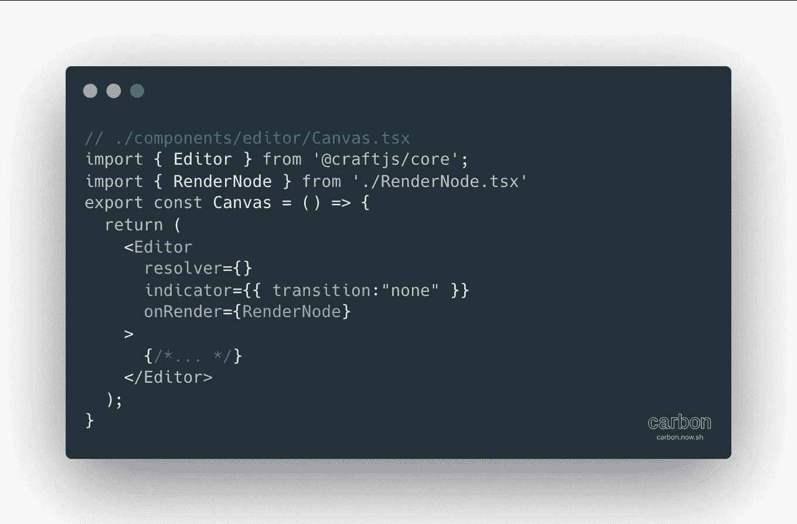
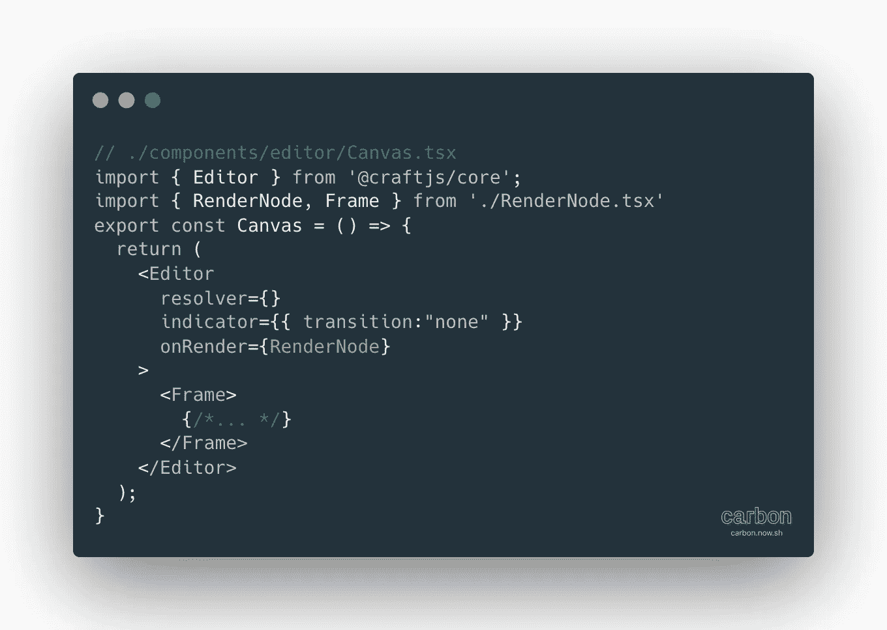
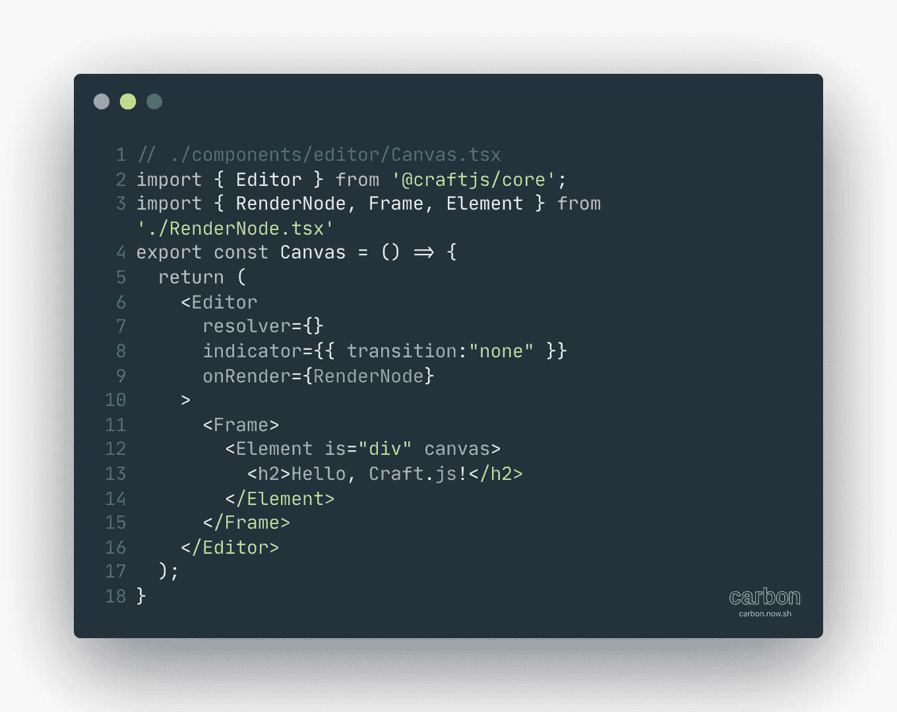

# 用 Craft.js 构建网页编辑器:入门

> 原文：<https://javascript.plainenglish.io/getting-started-with-craft-js-setup-df733d961f53?source=collection_archive---------6----------------------->

## 一个由 React 支持的拖放页面编辑器！


Photo by [Emile Perron](https://unsplash.com/@emilep?utm_source=medium&utm_medium=referral) on [Unsplash](https://unsplash.com?utm_source=medium&utm_medium=referral)

无论你是想建立自己的网站构建器，还是只是在现有的网站编辑器中添加拖放功能，Craft.js 都会支持你！仍处于早期开发阶段，在撰写本文时处于 0 . 2 . 0-β3 版本，Craft.js 使用 React 作为其选择的库，消除了您自己的页面编辑器中的繁重工作和猜测。

## 什么是 Craft.js

Craft.js ( **Craft** )是一个构建在 React 之上的拖放页面编辑器，它允许容易地被广泛采用，这使得大多数前端开发人员在寻找一个可怕任务的简单解决方案时变得容易。Craft 从其他各种解决方案中获得灵感，例如 [Grape.js](https://github.com/artf/grapesjs) 一个开源页面生成器、 [React-DnD](https://github.com/react-dnd/react-dnd) 一个用于 React 的拖放库，它不在内部使用，但被用作参考，以及一个经过修改的 [use-methods](https://github.com/pelotom/use-methods) 实现，它是一个用于简化 reducers 的钩子。

Craft 也有一个[开放集体](https://opencollective.com/craftjs)如果你愿意支持他们，如果你需要支持自己他们也有[不和](https://discord.gg/sPpF7fX)。也可以在 [GitHub](https://github.com/prevwong/craft.js) 上随意查看这个项目！

## 入门指南

对于本文，我使用我自己的模板库，它使用 TypeScript、Next 和 Yarn 3。你可以在这里[抓取它](https://github.com/TheGrimSilence/nextjs-typescript-tailwindcss-starter)，我将带你为 Craft 设置它，也使用 TailwindCSS 来简化样式。Craft 的文档使用了材料 UI 组件，但是我想创建我们自己的组件。

这个模板自带了 TailwindCSS、NextJS、TypeScript 和 Yarn 3。虽然大多数 Yarn 3 安装可能默认使用 PnP，但我强烈建议使用`node-modules`链接器来确保接下来的构建没有问题。

一旦你得到了模板，只需运行`yarn`它就会在缓存中解包，这意味着你不必等待 Yarn 来获取包。我还设置了在安装和卸载时运行的 **stage** 包，这样任何与 Yarn 相关的东西都会立即提交给 Git。

现在，安装飞船，我们可以开始了！

```
yarn add @craftjs/core
```

## 项目结构

现在我们已经有了我们需要的一切，我们将通过设置我们的项目结构来结束。

```
./components/
  ├ user/
  │ ├ Button.tsx
  │ ├ Container.tsx
  │ ├ Text.tsx
  │ └ Card.tsx
  └ editor/
    ├ Settings.tsx
    ├ Toolbox.tsx
    ├ Canvas.tsx
    ├ RenderNode.tsx
    └ Component.tsx
```

**用户**组件将是用户从**工具箱**中拖出并放入**画布**中的组件。**设置**将是我们编辑所选组件/节点的控件。**组件**不是必需的，但是对于以一种方便的方式分配名称、图标和相关元素是有用的。

这就是设置，所以让我们来看看一些基本的工艺。

## 编辑器组件

为了让我们用我们的任何组件做任何事情，Craft 需要准确地知道我们的应用程序的哪一部分属于它。这就是`[<Editor />](https://craft.js.org/docs/api/editor)`的用武之地！编辑器组件是存储状态的上下文提供者。它附带了一些重要的道具:

*   `resolver`:这是我们添加用户组件数组的地方，这样 Craft 就知道如何在编辑器中解析组件的任何实例。否则，就像试图使用 React 而不导入它一样。
*   `enabled`:布尔值，控制编辑器是否允许任何编辑。当您想要启用正在编辑的页面的预览时，请使用此选项。
*   `indicator`:如果你对红色/绿色不满意，可以在这里设置拖放指示器的颜色。虽然文档中没有说明，但您也可以设置`transition: "none"`关闭指示器的默认扭曲转换。
*   `onRender`:这就是我们的 **RenderNode** 组件的用武之地，我们用它来定义我们选择的节点周围的边界以及其他附加内容，比如选择的组件或控件的名称。



## 框架组件

在**编辑器**中，我们需要定义应用程序中可编辑的区域。因此**编辑器**保持状态，**帧**是我们正在编辑的画布。这意味着在编辑器中我们也可以有两个侧栏，**工具箱**和**设置**，因为它们属于编辑器状态。它只有一个属性，`data?`,这个属性是可选的，允许我们加载 JSON 提供的序列化节点。这方面的一个用例是在多页编辑器中加载保存到数据库的页面。



## 元素组件

最后，在树的底部，我们有**元素**组件，它将一个常规的 React 组件变成一个可编辑的 Craft 组件。在将组件拖放到编辑器中时，您不需要这样做，但是如果您希望组件的各个部分拥有自己的 dropzones，那么**元素**会在容器或卡片组件中定义这些区域。它有几个重要的道具:

*   `is`:要么是“div”这样的基本元素，要么是你的**用户**交给它的某个组件。不放“容器”，放`is={Container}`。
*   `id?`:如果组件在一个**用户**组件中，它会给组件分配一个 id，这样 Craft 就不会混淆。
*   `canvas?`:将节点设置为画布节点的布尔值。不知道这意味着什么，除了它为用户创建一个可编辑的 dropzone 来放置节点。
*   `hidden?`:隐藏节点，我不确定这是什么目的，因为我不确定它是对树还是对用户隐藏节点。`display: "none"`※后者。
*   `custom?`:设置自定义属性，同样不确定你会用它来做什么。也许对于 craft 的节点数据之上的自定义数据，比如给每个节点分配 hashnamess，类似于 Webflow 存储它们的 hashname？
*   这是一个棘手的问题。只有当`is`设置为 1 时，才会将我们的道具传递给你的**用户**组件。如果`is`是一个字符串，比如“div ”,那么它什么也不做。

你也可以在**元素**上提供常规的道具，比如`className`，但是只有当`is`是一个普通的 HTML 元素，比如 div，它才有效。



## 把所有的放在一起

最后，你有一个非常基本的编辑器。它还不能做太多，但是我们将在第二部分中扩展它。我们有一个带有单个 dropzone 的编辑器，但是没有可以拖动的**用户**组件，并且无法访问这些设置。我们将在下一部分处理所有这些问题！

*更多内容看* [***说白了。报名参加我们的***](https://plainenglish.io/) **[***免费周报***](http://newsletter.plainenglish.io/) *。关注我们关于*[***Twitter***](https://twitter.com/inPlainEngHQ)*和*[***LinkedIn***](https://www.linkedin.com/company/inplainenglish/)*。加入我们的* [***社区***](https://discord.gg/GtDtUAvyhW) *。***