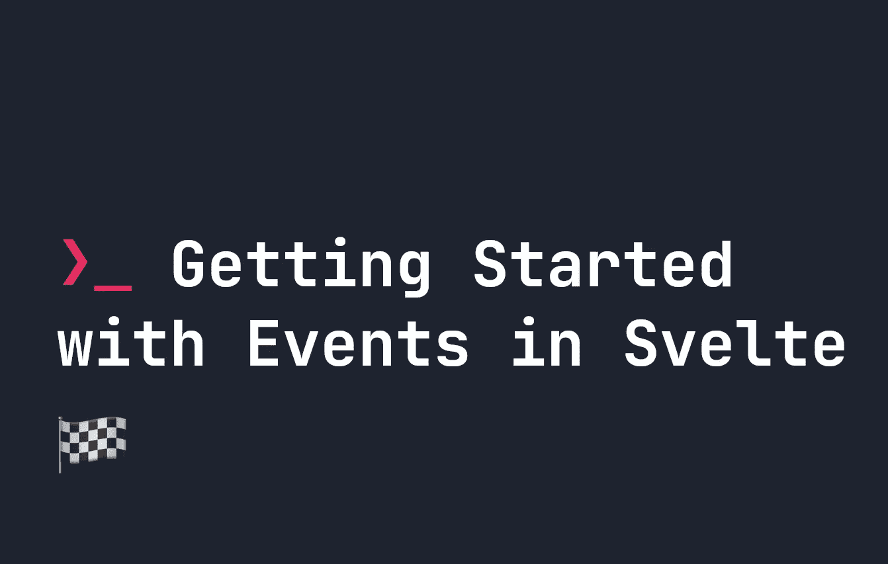

# 苗条事件入门

> 原文：<https://javascript.plainenglish.io/getting-started-with-events-in-svelte-89f0ab228c71?source=collection_archive---------15----------------------->



事件在苗条是非常直观和容易使用的。在本指南中，我们将看看如何开始苗条的事件。假设您对本指南中的 [Javascript](https://fjolt.com/series/learn-javascript) 有很好的理解。如果你是一个全新的苗条者，在开始之前阅读我的关于创建你的第一个苗条应用的指南可能是有意义的。

# 苗条事件

当我们在 Svelte 中创建新组件时，我们通常会希望它们在用户与它们交互时做某些事情——例如，悬停在它们上面，或者点击它们。Svelte 允许您通常在普通 Javascript 中找到的所有事件。[关于 Javascript 事件的更多信息，请点击此处](https://fjolt.com/article/javascript-events)。

先说一个基本的例子。下面的组件摘自我关于[创建苗条组件](https://fjolt.com/article/svelte-how-to-create-components)的文章，并创建了一个简单的计数器:

```
<script>
    // we write export let to say that this is a property
    // that means we can change it later!
    let x = 0;
    const addToCounter = function() {
        ++x;
    }
</script><button id="counter">{x}</button>
```

每当用户点击按钮时，我们希望`addToCounter`触发，这将使`x`增加 1，并显示在按钮本身内。为此，我们添加了一个事件。下面是当用户点击按钮时我们需要添加的事件:

```
<button id="counter" on:click={addToCounter}>{x}</button>
```

我们用 Svelte 中的`{}`来表示这个属性的值是 Javascript。任何**有效的** Javascript 事件都可以用来代替`click`。例如，每当鼠标移动到`button`上时，下面的代码将增加计数器:

```
<button id="counter" on:mouseover={addToCounter}>{x}</button>
```

同样，您可以使用其他 Javascript 事件，如`click`、`scroll`、`hover`、`mouseup`、`pointerup`、`pointerdown`、`mousedown`等。这些只是例子——但是您想要使用的任何 Javascript 事件都可以使用。

# 在您的苗条事件中访问事件数据

有时，当用户与我们的组件交互时，我们希望访问`e`或`event`数据。`event`对象携带了许多关于被触发事件的有用信息。要做到这一点，我们只需将我们的处理程序改为一个函数。

例如，让我们检索按钮的点击位置，并向用户显示这一次。

```
<script>
    // we write export let to say that this is a property
    // that means we can change it later!
    let x = 0;
    let click = [0, 0] const addToCounter = function(e) {
        click[0] = e.clientX;
        click[1] = e.clientY;
        ++x;
    }
</script><button id="counter" on:click={(e) => { addToCounter(e) }}>
    Clicked {x} times, last at {click[0]}, {click[1]}
</button>
```

这里，我们将`e.clientX`和`e.clientY`存储在一个变量中，并在用户点击按钮时显示出来。对于那些不知道的人来说，`e.clientX`和`e.clientY`都是指事件被触发时光标位置的一个方面。Svelte 天生就是[反应型](https://fjolt.com/article/svelte-handling-reactivity)，所以无论何时点击，按钮都会自动更新最新数据。

# 苗条事件转发

事件转发是指每当用户触发子组件上的事件时，我们希望在父组件中处理该事件。本质上是说这个组件可以有一个特定的事件，但是这里不处理。看一下前面的例子，我们可以通过设置可以在子组件上转发的事件来设置事件转发。假设我们在一个名为`Comp.svelte`的文件中创建了一个组件，如下图所示。**一个按钮**可点击，另一个不可点击。

```
<button on:click>
    Click me, I am a button
</button>
<button>
    I am unclickable. Ignore me.
</button>
```

这里我们说第一个按钮有一个有效的`on:click`事件。这很有用，因为它允许我们用可以向上转发的有效事件来定义组件中的某些元素。然后，在我们的父节点中，我们可以导入我们的按钮，就像这样:

```
<script>
    import Comp from './Comp.svelte'; let x = 0;
    const addToCounter = () => {
        ++x;
    }
</script><Comp on:click={addToCounter} />
```

现在，当用户点击`Comp`中的第一个`button`时，它将触发`on:click`事件并运行`addToCounter`函数。如果我们将`on:click`从`Comp.svelte`中完全移除，那么尽管在我们的 **Comp** 组件上定义了`on:click`，也不会触发任何事件。这意味着我们不仅可以定义一个子组件应该附加一个事件，还可以通过将事件添加到子组件本身来定义哪些特定的**元素具有该事件。这给了我们很大的灵活性。**

# 最后的想法

苗条事件使用起来很简单，事实上它们遵循与普通 Javascript 事件相同的命名约定，这使得它们使用起来非常简单。在本指南中，我们已经介绍了基础知识，因此您可以开始使用。[想了解更多苗条的内容，试试我在这里的其他文章](https://fjolt.com/category/svelte)

*更多内容请看*[***plain English . io***](https://plainenglish.io/)*。报名参加我们的* [***免费周报***](http://newsletter.plainenglish.io/) *。关注我们关于*[***Twitter***](https://twitter.com/inPlainEngHQ)*和*[***LinkedIn***](https://www.linkedin.com/company/inplainenglish/)*。加入我们的* [***社区不和谐***](https://discord.gg/GtDtUAvyhW) *。*