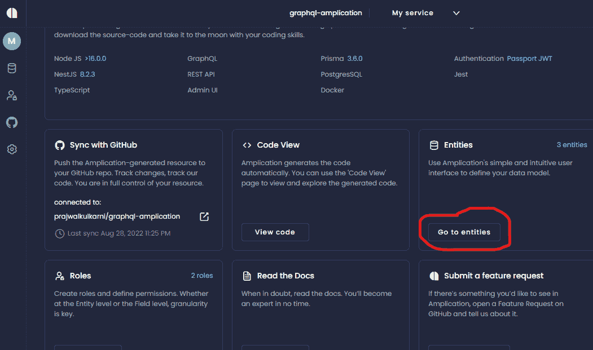
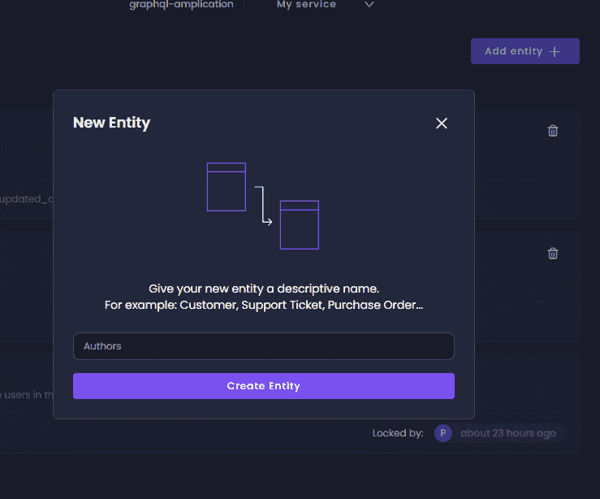
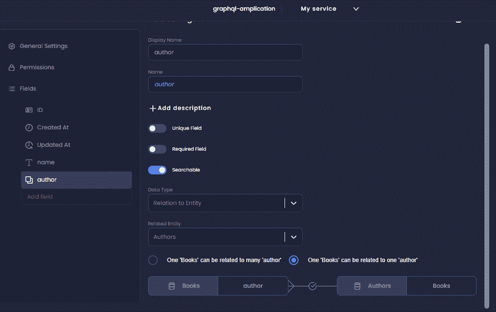

# 支持 Node.js 后端的 GraphQL API 入门

> 原文：<https://javascript.plainenglish.io/getting-started-with-graphql-api-with-node-js-backend-support-aab39c841861?source=collection_archive---------6----------------------->

## GraphQL 通过减少网络调用的数量，支持高效地从服务器获取数据


Photo by [Алекс Арцибашев](https://unsplash.com/@lxrcbsv?utm_source=unsplash&utm_medium=referral&utm_content=creditCopyText) on [Unsplash](https://unsplash.com/s/photos/graph?utm_source=unsplash&utm_medium=referral&utm_content=creditCopyText)

GraphQL 是脸书开发的 API 开源查询语言，于 2015 年开源。与传统的 REST API 相比，它专注于简化数据查询，并通过向客户提供他们所请求的内容来提高过程的效率。你会问，怎么会？

通常，REST API 需要多个端点来获取不同的数据组合，这意味着客户端需要发出不止一个请求来获取所需的数据。为了更好地理解，让我们考虑一个基本的例子，我们将在整篇文章中需要的地方使用它。

本文假设您已经使用并理解了 REST APIs，尽管这不是强制性的，但最好对它有所了解。

考虑以下数据:

```
const authors = [
 { id: 1, name: ‘J. K. Rowling’ },
 { id: 2, name: ‘J. R. R. Tolkien’ },
 { id: 3, name: ‘Brent Weeks’ }
]const books = [
 { id: 1, name: ‘Harry Potter and the Chamber of Secrets’, authorId: 1 },
 { id: 2, name: ‘Harry Potter and the Prisoner of Azkaban’, authorId: 1 },
 { id: 3, name: ‘Harry Potter and the Goblet of Fire’, authorId: 1 },
 { id: 4, name: ‘The Fellowship of the Ring’, authorId: 2 },
 { id: 5, name: ‘The Two Towers’, authorId: 2 },
 { id: 6, name: ‘The Return of the King’, authorId: 2 },
 { id: 7, name: ‘The Way of Shadows’, authorId: 3 },
 { id: 8, name: ‘Beyond the Shadows’, authorId: 3 }
]module.exports = {
 authors,
 books
}
```

假设这是服务器/数据库上可用的数据，假设我们应该获取作者以及他们写的书。当使用 REST API 时，我们希望首先获取所有作者，然后使用作者 id 获取他们写的所有书籍。

端点看起来如下所示:

获取所有作者:

```
domain.com/api/books
```

按作者获取图书:

```
domain.com/api/:authorId/author
```

请注意，需要为所有作者获取第二个端点，假设有 100 个不同的作者，这意味着要访问服务器 100 次才能获得所需的数据。更不用说从服务器返回后应该做的数据重排了。

相比之下， [GraphQL](https://graphql.org/) 使用单个端点返回数据，而不是使用多个端点或查询参数。需要返回的数据由客户端发送的查询决定。可以根据需要灵活地编写查询。通过这种方式，网络调用的数量大大减少，从而提高了应用程序的性能。此外，还可以在一次调用中获得数据的目标组合，例如:上面例子中的书籍及其作者。

# 理解 GraphQL 查询

可以使用花括号{}组成查询。这组花括号进一步包含需要返回的字段，这些字段可以具有嵌套字段，以过滤必要的属性或获取与其他相关数据相关联的数据。

## #查询所有图书名称

```
query {
 books{
 name
 }
}
```

上述语句中的关键字“query”是可选的，可以省略。

## #查询所有作者及其 id

```
{
 authors{
 name,
 id
 }
}
```

需要在服务器中定义相应的模式，根据查询计算并返回数据。

让我们创建数据模型，并使用 [Node.js](https://nodejs.org/en/) 服务器启动 GraphQL 服务，我们将使用 Amplication 来完成这项工作。

# 使用 Node.js 创建 GraphQL 服务

如上所述，我们必须创建数据模型，以便在查询时帮助检索数据，为此我们需要一个服务器，我们将使用 Node.js 服务器。

第一步是安装 GraphQL 和其他所需的库。

```
npm install express graphql express-graphql
```

安装完必要的依赖项后，创建一个指向任何端点的中间件('/graphql ')，处理所有发送的查询。

中间件功能是一个 express GraphQL，它接受包含所有数据模型的模式。

```
app.use(‘/graphql’, expressGraphQL({
 schema: schema,
 graphiql: true
}))
app.listen(3000, () => {
 console.log(‘Server started on port 3000’);
} );
```

模式包含根查询，根查询进一步包含所有字段。

```
const RootQuery = new GraphQLObjectType({
 name: ‘RootQueryType’,
 fields: () => ({
 books : {
 type: new GraphQLList(BookType),
 resolve: () => books
 },
 authors: {
 type: new GraphQLList(AuthorType),
 resolve: () => authors
 }
 })
})const schema = new GraphQLSchema({
 query: RootQuery
})
```

“字段”属性是一个返回所有可查询属性的函数。这些属性中的每一个都定义了它的类型和它所解析的内容。这个 resolve 函数接受一个指向其外部属性的参数，当嵌套在另一个属性中的数据之间存在关联时，可以利用这个参数。

在上面的代码片段中，我们可以看到像 **GraphQLList、**这样的包装器，这些是 GraphQL 提供的包装器，应该适当地使用它们来告诉 GraphQL 这是一个 AuthorType 类型的列表。AuthorType 是作者数据结构的自定义类型定义。

# 使用 Amplication 创建 Node.js 应用程序

上面我们看到，将 GraphQL 集成到 Node.js 应用程序中、创建数据模型、建立关联等等是多么乏味。实现这一点的一个简单方法是使用扩增。

对于那些不知道的人来说，[amplification](https://amplication.com/)是一个用于创建 Node.js 应用程序的开源平台。它允许您创建数据模型，以及开箱即用的基于角色的访问控制。此外，您还可以立即下载生成的 sour 代码或将其推送到 Github 上的存储库中。它为创建数据模型和建立不同模型之间的关系提供了一个 GUI，这使得开发过程直观而高效。

去 Amplication，然后[用 GitHub 创建一个账户](https://amplication.com/)。必须有一个 GitHub 帐户才能在 Amplication 中创建帐户。创建帐户后，你必须创建一个新项目。

一旦创建了一个新项目，您就必须创建一个包含源代码、实体、角色等等的新服务。点击右上角的**“新服务”**按钮，创建一个新服务，并根据自己的喜好命名服务。

创建服务后，现在是时候构建数据模型并将它们与其他模型相关联了。

点击“转到实体”。



现在我们必须添加所需的不同数据的实体，在我们的例子中，它是作者和书籍。

点击右上角的“添加实体”,添加实体“作者”和“书籍”



一旦创建了一个实体，我们可以观察到像 id、created_at、updated_at 这样的属性是默认添加的，在我们的例子中最后两个属性是可选的，所以您可以保留它或者删除它。

我们应该添加的唯一其他属性是“名称”。添加字段并相应地配置字段(单行文本，最大长度:1000)。

添加完实体和必填字段后，下一步是在它们之间创建一个关联。这相当简单，只需打开“图书”实体>添加字段。

将字段名设置为“作者”。

由于作者不是原始数据类型，因此将数据类型设置为“与实体的关系”，并将相关实体设置为“作者”。

关系是每本书可以有一个作者，所以选择“一本书可以与一个作者相关”。为清晰起见，请参考下图。



现在，如果你返回到作者实体，你可以看到“一个作者可以与许多本书相关”的关系是自动建立的，这不是很酷吗？

这标志着数据模型的创建，您现在可以通过提交更改来构建应用程序，一旦构建完成。，您可以访问源代码或将其连接到 GitHub 存储库，并在每次构建后推送更改。

源代码也可以下载到您的本地环境中，并根据需要进行微调。

GraphQL 不仅提供从服务器查询数据，还允许您修改数据，很像 POST 或 PUT 请求，但这是另一个故事的一部分。如果你有兴趣知道如何改变数据，我建议你进一步阅读[突变](https://www.freecodecamp.org/news/a-beginners-guide-to-graphql-86f849ce1bec/)。

# 结论

GraphQL 能够通过减少网络调用的数量来有效地从服务器获取数据，并支持灵活的查询来准确地给出客户机想要的内容。像 Amplication 这样的工具有助于利用 GUI 直观地构建数据模型。这项技术相对较新，许多组织仍然使用不要使用 GraphQL 服务器，因此这种查询在 REST APIs 上是不可能的，但是重要的是根据正在解决的问题选择技术，而不是选择技术然后挑问题。

*更多内容请看*[***plain English . io***](https://plainenglish.io/)*。报名参加我们的* [***免费周报***](http://newsletter.plainenglish.io/) *。关注我们关于*[***Twitter***](https://twitter.com/inPlainEngHQ)[***LinkedIn***](https://www.linkedin.com/company/inplainenglish/)*[***YouTube***](https://www.youtube.com/channel/UCtipWUghju290NWcn8jhyAw)*[***不和***](https://discord.gg/GtDtUAvyhW) *。对增长黑客感兴趣？检查* [***电路***](https://circuit.ooo/) *。***