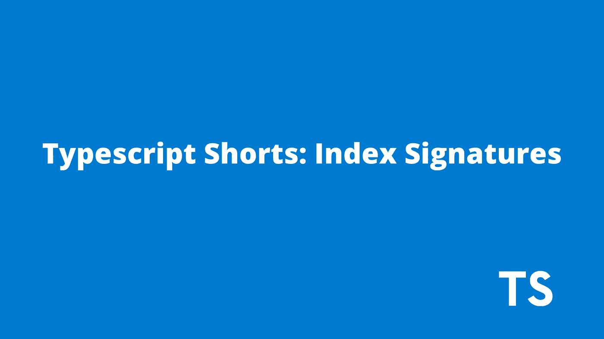

# TypeScript 中的索引签名入门

> 原文：<https://javascript.plainenglish.io/getting-started-with-index-signatures-f2b8e15f3c0d?source=collection_archive---------5----------------------->

## **关于 TypeScript 中索引签名概念的教程。**



# 什么是索引签名？

当对象的值是一致的类型时，索引签名用于表示对象/字典的类型。

**语法** : `{ [key: KeyType] : ValueType }`

假设我们有一个主题对象，它允许我们配置可以在整个应用程序中使用的颜色属性。这些值将与类型**字符串一致。**这为我们提供了一个应用指数签名的绝佳机会******

```
let colorsTheme = {
  palette: {
    success: {
      main: "green",
    },
    error: {
      main: "red",
    },
    warning: {
      main: "orange",
    },
  },
}
```

让我们看看如何为下面的**字典添加类型定义:**

```
let ColorsTheme : {
  [key: string]: {
    [key: string]:{
      [key: string]: string
    }
  }
} ColorsTheme = {
  palette: {
    success: {
      main: "green",
    },
    error: {
      main: "r...
```

[游乐场链接](https://www.typescriptlang.org/play?#code/DYUwLgBAwg9sMCcDOAVAFiAtiCAuCA3gFAQQDaA1iAJ75JgICWAdgOYC6+xpplNdDFh1zcevKrQj0mbTlMFsSPAL5LVqkrHjJ0WHAF5CSgA4BDUGDAguS0kgCuAY0cgkSG2NKZTLfACJWBBAQZj8AGlsIZQixEAQERA9Pb18IPyCAE3DI6MiAd1MEZiEksRTmf0RTNhBssVzSXNUgA)

*如果我们试图添加一个不同类型的值，而不是索引签名中定义的类型，该怎么办？*

如果我们试图添加一个类型为`number`的值，那么 typescript 就会开始大喊。看看下面的例子:


```
let ColorsTheme : {
  [key: string]: {
    [key: string]:{
      [key: string]: string
    }
  }
} ColorsTheme = {
  palette: {
    success: {
      main: "green",
    },
    error: {
      main: "red",
    },
    warning: {
      main: 1231313,
    },
  },
}
```

在上面的例子中，我们已经将索引签名中的值的类型定义为字符串，但是对于键`main`，我们给出的值是一个数字`1231313`。

我们将从 TypeScript 中得到的错误:

```
(property) main: number
Type 'number' is not assignable to type 'string'.(2322)
input.tsx(61, 7): The expected type comes from this index signature.
```

我们如何解决上述错误？我们修改了`ColorsTheme`的类型定义，以接受一个字符串或数字。

```
let ColorsTheme : {
  [key: string]: {
    [key: string]:{
      [key: string]: string | number 
    }
  }
} ColorsTheme = {
  palette: {
    success: {
      main: "green",
    },
    error: {
      main: "red",
    },
    warning: {
      main: 1231313,
    },
  },
}
```

*注意:然而，如果索引签名是属性类型的联合，则不同类型的属性是可接受的——属性类型* [类型脚本文档](https://www.typescriptlang.org/docs/handbook/2/objects.html#index-signatures)。

```
interface NumberOrStringDictionary {
    [index: string]: number | string | boolean;
    length: number; 
    name: string; 
    isVisible: boolean; }
```

如果我们尝试为索引签名添加一个键，而不是字符串、数字或符号，会怎么样？

如果我们尝试将索引签名中的键的类型添加为布尔值，TypeScript 又会开始大喊，因为索引签名参数类型必须是“字符串”、“数字”、“符号”或模板文字类型。

```
let foo: {
  [key: boolean] : number // Error : An index signature parameter type must be 'string', 'number', 'symbol', or a template literal type
} foo = {
  bar: 1
}
```

# 快速回顾:

索引签名可用于定义对象的类型，该对象的值具有一致的类型，或者您不知道正在处理的对象的结构。

# 结论:

差不多就是这样。感谢您花时间阅读这篇博文。我希望，每个人都理解指数签名的概念。

如果你觉得这篇文章有用，把❤️加进去，如果我错过了什么，请在评论区告诉我。非常欢迎对博客的反馈。

让我们在推特上联系:

[](https://twitter.com/karthik_coder) [## JavaScript 不可用。

### 编辑描述

twitter.com](https://twitter.com/karthik_coder) 

# 参考资料:

1.  [打字稿文件](https://www.typescriptlang.org/docs/handbook/2/objects.html#index-signatures)
2.  [打字稿中的索引签名](https://dmitripavlutin.com/typescript-index-signatures/)

*更多内容看* [***说白了就是***](https://plainenglish.io/) *。报名参加我们的* [***免费周报***](http://newsletter.plainenglish.io/) *。关注我们关于*[***Twitter***](https://twitter.com/inPlainEngHQ)*和*[***LinkedIn***](https://www.linkedin.com/company/inplainenglish/)*。加入我们的* [***社区***](https://discord.gg/GtDtUAvyhW) *。*