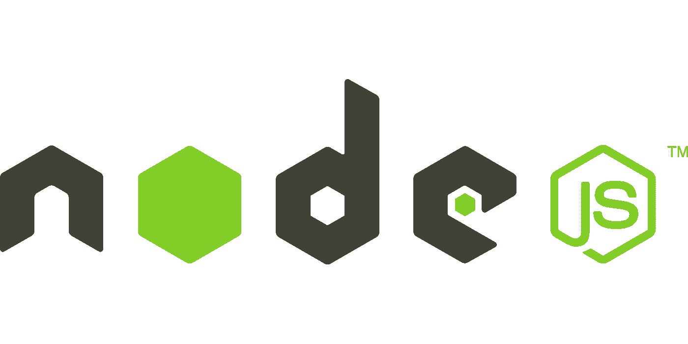
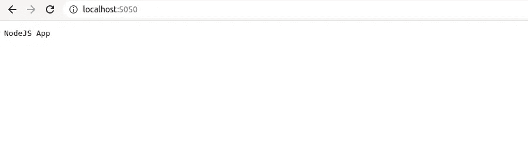

# 如何开始使用 Ubuntu 上的 node . js |初学者指南

> 原文：<https://javascript.plainenglish.io/getting-started-with-node-js-on-ubuntu-beginner-guide-4d3f67138377?source=collection_archive---------5----------------------->



# 介绍

Node.js 是一个服务器端的 Javascript，使得开发人员可以更快更有效地用 Javascript 编写 web 应用程序的前端和后端。Node.js 是麻省理工学院许可下的一个开源应用程序。

本文将讨论如何设置您的第一个 Node.js 应用程序，所以请随身携带一大杯咖啡准备好您的笔记本电脑，☕️💻。

# 学习 Node.js 的先决条件

在开始使用 Node.js 之前，您必须首先学习以下内容。

*   Java Script 语言

> *JavaScript 是世界上最流行的语言，主要用于前端，通过 Node.js，它现在可以被用作后端编程语言。这是一种轻量级的解释编程语言，也很容易学习。* [*点击此处*](https://www.w3schools.com/js/) *了解更多信息。*

# 步伐

1.  从 Ubuntu 存储库中安装 Node.js。
2.  安装节点包管理器(NPM)。
3.  初始化节点. js 应用程序。
4.  启动您的第一个 node.js web 服务器。

# Node.js 安装

从更新 ubuntu 上的包开始，这将确保你总是为每个包使用最新的版本

```
sudo apt update
```

然后，我们将把 node.js 安装到您的系统上

```
sudo apt install nodejs
```

让它在完成后加载一段时间，它会将 node.js 的最新版本安装到您的系统上，您可以用这个来验证它

```
node -v#Output (at the time of creating this article this may change)
v14.15.4
```

## 可选步骤

如果你想安装一个特定版本的 node.js，那么我们有一个叫做 Node Version Manager (NVM)的东西，这将允许我们安装任何特定版本的 Node . js，你可以通过改变 **0.35 来替换任何你喜欢的版本。**运行该命令

```
curl -sL https://raw.githubusercontent.com/nvm-sh/nvm/v0.35.0/install.sh -o install_nvm.sh
```

然后通过以下方式安装它

```
sudo bash install_nvm.sh
```

然后重新启动您的终端，并检查安装是否正常工作

```
command -v nvm#Output 
nvm
```

## 使用 nvm 安装 Node.js 的最新 LTS 版本

```
nvm install --lts# Output
Installing latest LTS version.
Downloading and installing node v16.17.1...
Downloading https://nodejs.org/dist/v16.17.1/node-v16.17.1-darwin-x64.tar.xz...
######################################################################## 100.0%
Computing checksum with sha256sum
Checksums matched!
Now using node v16.17.1 (npm v6.14.10)
Creating default alias: default -> lts/* (-> v16.17.1)
```

# 安装节点包管理器

这用于安装 node.js 的任何包，这可以使用这个命令来安装

```
sudo apt install npm
```

通过以下方式验证其安装

```
npm -v# Output
6.14.10
```

# 初始化节点. js 应用程序

深呼吸，此时你只完成了目标的 50%😊。现在我们将初始化我们的 node.js 应用程序

```
sudo mkdir node-app
cd node-app/
```

在名为 *app.js* 的目录中创建一个文件，并粘贴以下代码。

```
console.log("Hello World")
```

在 node-app 目录中使用此命令编译代码

```
node app.js# Output
Hello World
```

# 制作小型网络服务器

Node.js 安装在您的系统上完成，现在使用这段代码在一个名为 server.js 的新文件中创建一个简单的 web 服务器应用程序

```
var http = require('http');
var server = http.createServer(function (req, res) {
        res.writeHead(200,{'Content-Type': 'text/plain'});
        res.end('NodeJS App');
});
server.listen(5050);
console.log('Server is running at [http://localhost:5050/](http://localhost:5050/)');
```

现在使用编译代码

```
node sever.js# Output
Server is running at [http://localhost:5050/](http://localhost:5050/)
```



Web app running on localhost

最后，您准备好轻松创建 Node.js 应用程序了。

# 奖金提示

## Nodemon

Nodemon 是一个依赖于大约 300 万个项目的实用程序**，它会监控源代码中的任何变化，并自动重启服务器。非常适合发展。**

交换 **nodemon** 而不是**节点**来运行您的代码，现在当您的代码改变时，您的进程将自动重启。要安装，获取 [Node.js](https://nodejs.org/) ，然后从您的终端运行:

```
npm install -g nodemon
```

感谢你一直读到最后，如果你觉得这很有帮助，请鼓掌并评论你的观点和疑问，还有任何其他疑问，你可以在 LinkedIn 上关注我。

[](https://www.linkedin.com/in/jaykishan-khemani-a0452850/) [## Jaykishan Khemani —解决方案工程师— GAMMASTACK | LinkedIn

### 查看 Jaykishan Khemani 在世界上最大的职业社区 LinkedIn 上的个人资料。Jaykishan 列出了 3 个工作…

www.linkedin.com](https://www.linkedin.com/in/jaykishan-khemani-a0452850/) 

*更多内容看* [***说白了就是 io***](https://plainenglish.io/) *。报名参加我们的* [***免费周报***](http://newsletter.plainenglish.io/) *。关注我们关于*[***Twitter***](https://twitter.com/inPlainEngHQ)，[***LinkedIn***](https://www.linkedin.com/company/inplainenglish/)***，***[***YouTube***](https://www.youtube.com/channel/UCtipWUghju290NWcn8jhyAw)***，以及*******不和****