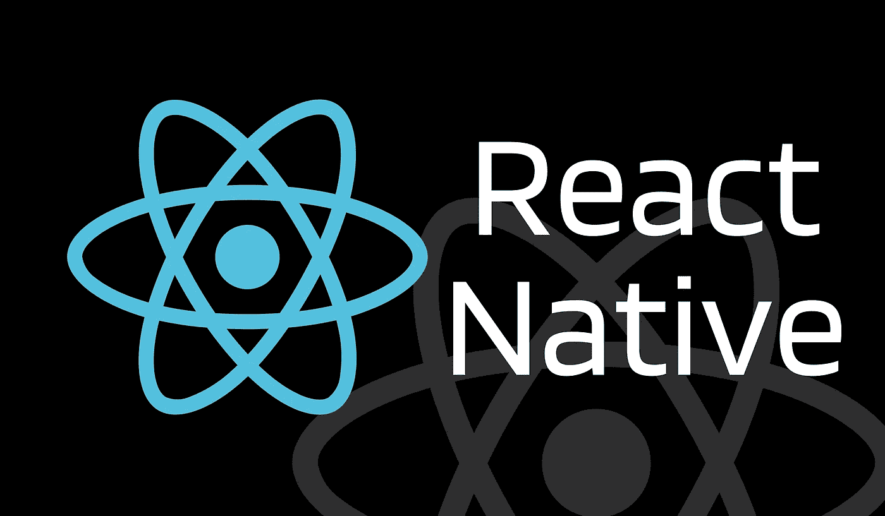

# React Native 入门

> 原文：<https://javascript.plainenglish.io/getting-started-with-react-native-731d0a54c4b6?source=collection_archive---------10----------------------->

## 开始学习跨平台移动应用程序开发



Image created by the author on Canva

# 什么是 React Native？它是如何工作的？

React Native 是由 Meta Platforms，Inc .开发的开源、跨平台移动应用开发框架。它允许我们使用 React 库和本机功能来构建 Android 和 iOS 系统的本机应用。简单来说，React Native 是一个 JavaScript 框架，用于使用原生组件而不是 web 组件来开发移动应用。

React Native 允许我们构建与我们使用 Java 和 Objective C 等原生编程语言创建的应用程序完全相同的移动应用程序。它为 Android 和 iOS 提供了一个通用的代码库，我们可以在其中使用 JavaScript 编写代码，这些代码稍后将被编译为原生代码。

# 移动应用程序中的视图

在任何 Android 或 iOS 移动应用程序开发中，视图都是用户界面的基本构件。它可以是屏幕上的一个小矩形块，用于显示图像或用户输入，包括最小的元素，如单行文本或按钮。一些视图中可以包含其他视图，这意味着整个应用程序都有视图。

# 本地组件

我们曾经用 Java 或 Kotlin 为 Android 应用程序编写应用程序的视图，用 Swift 或 Objective-C 为 iOS 应用程序编写视图。在 React Native 中，我们将使用 JavaScript 和 React 组件创建视图，然后在运行时为我们的组件创建相应的 Android 和 iOS 视图。React Native 能够提供这种灵活的开发环境，因为它的组件由 Android 和 iOS 的相同视图提供支持。这些平台支持的组件被称为 ***本地组件*** 。

# 核心组件

React Native 提供了一系列基本的本地组件，可以用来开发我们自己的应用程序。这些内置组件被称为 React Native 的 ***核心组件*** 。有许多核心组件，包括视图、文本、图像、ScrollView、TextInput、样式表、按钮、开关和平面列表。React Native 还允许我们创建自己的本地组件来满足应用程序的需求。

# 开发环境设置

我们有两种不同的开发环境来构建应用程序。如果您是本地和移动应用程序开发的新手，我建议您使用 Expo CLI。

Expo 是一套围绕 React Native 构建的工具，它允许我们直接开始开发我们的项目。使用 Expo CLI 开发我们的应用程序，我们只需要一个最新版本的 Node.js 和一部电话或仿真器来测试我们的应用程序。然而，如果你愿意，你也可以在你的网络浏览器中测试这个应用。

第二种方式有点耗时，就是使用 React Native CLI。我们需要有 Xcode 或 Android Studio 已经安装并以这种方式运行。如果它们没有正确安装和运行，您应该考虑多花一个小时来安装和配置它们。

# 构建您的第一个移动应用

这里举一个简单的例子，我将使用 Expo CLI，稍后，我将发表一篇单独的文章来帮助您使用 React Native CLI。假设您已经安装了节点 14 或更高版本，您可以使用 npm 通过以下命令安装 Expo CLI:

```
*// Using npm*
**$ npm install -g expo-cli***// Using yarn*
**$ yarn global add expo-cli**
```

就这样，又快又简单。我们已经准备好构建我们的第一个移动应用程序。我使用 VS 代码来启动我的应用程序。如果你想使用相同的，只需在你想启动你的应用程序的代码中打开你的文件夹。然后，运行以下命令创建并运行一个名为“MyFirstApplication”的新 React 本机应用程序:

```
*// Initializing our application.*
**$ expo init MyFirstApplication***// Change directory to our application directory.*
**$ cd MyFirstApplication***// Start running the application.*
**$ npm start** *// you can also use: expo start*
```

在执行完最后一个命令后，我们的开发服务器应该会启动，您可以在您的终端中看到一个二维码。现在，在您的 iOS 或 Android 手机上安装 [Expo](https://expo.io/) 客户端应用程序，该应用程序必须与您的开发设备连接到同一个网络。使用 Android 设备上的 Expo 应用程序或 iOS 设备上的相机应用程序扫描终端中显示的二维码。这样做将在我们的设备上运行应用程序。

现在让我们在浏览器中运行应用程序。看看终端上显示的类似“***http://localhost:19002***上运行的开发者工具”的消息。只需在您的浏览器中打开网址，并在网页浏览器中选择“**”*选项显示在页面左侧。您的应用程序现在应该正在 web 浏览器中运行。*

*我们的应用程序现在已经成功运行。为了修改应用程序，打开项目的 App.js 文件，根据需要进行修改。这只是开始，所以不要担心。在我接下来的文章中，我们将了解更多关于 React Native 的内容。现在，只要摆弄一下你的代码，看看它有多棒！*

# *结论*

*本文的主要目的是了解 React 本地应用程序开发的基本背景。我在文章中解释了 React Native 的定义和工作流，以及视图、本机和核心组件、开发环境设置，并构建了第一个跨平台应用程序。我希望这篇文章能帮助你理解 React Native 的基础知识。请跟随我阅读更多类似这样有趣的文章。*

*[](https://medium.com/@kardaniyagnik/membership) [## 通过我的推荐链接加入 Medium-Yagnik Kardani

### 作为一个媒体会员，你的会员费的一部分会给你阅读的作家，你可以完全接触到每一个故事…

medium.com](https://medium.com/@kardaniyagnik/membership) [](https://www.buymeacoffee.com/kardaniyagnik) [## Yagnik Kardani 正在创建帮助他人成长的技术学习材料。

### 你好👋，我是一名媒体方面的技术作家。我喜欢学习并帮助他人在软件开发和云计算方面成长…

www.buymeacoffee.com](https://www.buymeacoffee.com/kardaniyagnik) 

*更多内容请看*[***plain English . io***](https://plainenglish.io/)*。报名参加我们的* [***免费周报***](http://newsletter.plainenglish.io/) *。关注我们关于*[***Twitter***](https://twitter.com/inPlainEngHQ)*和*[***LinkedIn***](https://www.linkedin.com/company/inplainenglish/)*。查看我们的* [***社区不和谐***](https://discord.gg/GtDtUAvyhW) *加入我们的* [***人才集体***](https://inplainenglish.pallet.com/talent/welcome) *。**