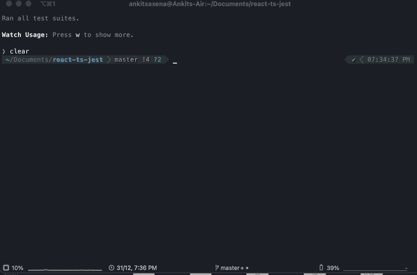

# React 测试库和 Jest 入门

> 原文：<https://javascript.plainenglish.io/getting-started-with-react-testing-library-and-jest-ccdc4d333b10?source=collection_archive---------2----------------------->

## 面向初学者的 Jest 和 React 测试库介绍。


Photo by [James Harrison](https://unsplash.com/@jstrippa?utm_source=medium&utm_medium=referral) on [Unsplash](https://unsplash.com?utm_source=medium&utm_medium=referral)

React 测试库已经成为为 React 应用程序编写测试用例的最流行的选择。这些测试案例类似于用户如何使用您的应用程序。如果您使用的是 create-react-app 工具的最新版本，那么您已经安装了 Jest 和测试库。



在深入研究代码之前，让我们快速回顾一下 Jest 的基础知识。

```
const expected = true;
const actual = false;
describe("simple jest test", () => {
  test("it works", () => {
    expect(actual).toBe(expected);
  });
});
```

上面的代码是一个简单的 Jest 测试的例子。它包含以下内容:

1.  将我们的测试套件分解成组件。

2.`test`功能是一个测试用例。

3.`expect`功能是每次你想测试一个值时使用的。

现在让我们看看 react 代码。


完整源代码: [Github 回购链接](https://github.com/ankitsaxena21/React-ts-RTL)。

下面是一个用 react 和 typescript 构建的简单的 todo 应用程序。它所做的只是接受一些文本作为输入，并在按下 enter 时，将输入的文本添加到列表中。接下来，我们将为这个应用程序编写测试用例。

## **1。基本测试**

首先，让我们测试 react 应用程序的基本渲染功能。例如，组件或元素是否正确地呈现在屏幕上。

```
import Todo from './Todo';it('Renders without crashing', () => {
   render(<Todo />);
   const linkElement = screen.getByText(/Todo App/i);
   expect(linkElement).toBeInTheDocument();
});
```

这里我们导入了我们的<todo>组件，并使用 render()函数对其进行虚拟渲染。我们将使用查询来获得我们想要的 DOM 元素。查询用于查找页面上的元素(RTL 文档[中关于查询的更多信息](https://testing-library.com/docs/queries/about#types-of-queries))。</todo>

我们使用 RTL 提供的 getByText()查询。它将为我们提供所有具有文本节点的元素，该文本节点的 textContent 与给定的 TextMatch 匹配(即“Todo App”)。

Jest 提供了。toBeInTheDocument()匹配器，可用于断言元素是否在文档的主体中。


**提示**:我们可以使用 screen.debug()来查看组件当前的 HTML 输出。

## **2。测试事件**

现在我们将检查如何测试事件。例如 onChange、onClick 等。

```
it("When the Enter button is pressed, it creates a new todo item", () => {
    const { getByTestId, getByText } = render(<Todo />);
    const event = { target: { value: "test val" } };
    fireEvent.change(getByTestId("todo-input"), event);
    expect(getByTestId("todo-input")).toHaveValue("test val");
    fireEvent.submit(getByTestId("add"));
    expect(getByText("test val")).toBeInTheDocument();
  });
```

在上面的代码中，首先，我们通过 getByTestId()获取输入。这是从 DOM 树中获取具有特定 data-testid 属性的元素的另一种方式。([RTL 文档中关于 getByTestId 的更多信息](https://testing-library.com/docs/queries/bytestid/))。

我们使用 RTL 提供的 fireEvent 属性来测试事件。传递给 fireEvent 的第二个参数(即 eventProperties)是将分配给接收事件的节点的属性。换句话说，触发事件时元素应该具有的值。([RTL 文档中关于 fireEvent 的更多信息](https://testing-library.com/docs/dom-testing-library/api-events/#fireevent))。

```
const { getByTestId, getByText } = render(<Todo />);
 const event = { target: { value: "test val" } };
 fireEvent.change(getByTestId("todo-input"), event);
```

一旦事件被触发，我们就检查 DOM，看看输入的值是否与传递给 fireEvent 的值相同(在第二个参数中)。

```
expect(getByTestId("todo-input")).toHaveValue("test val");
```

然后，我们对表单提交事件做了同样的事情，然后检查输入框中输入的值是否呈现在列表中。

```
fireEvent.submit(getByTestId("add"));
expect(getByText("test val")).toBeInTheDocument();
```

**注意**:使用 RTL 测试事件的另一种方式是通过用户事件。([RTL 文档中关于用户事件的更多信息](https://testing-library.com/docs/ecosystem-user-event/))

## **3。奖励:测试 API 的**

任何 react 应用程序的另一个重要部分是我们使用的 API。为了测试这些 API 的工作情况，我们将模拟服务人员。这是在测试中嘲弄`axios`和`fetch`的一种简单而有效的方式。

下面是一个简单的 JavaScript 函数，它将使用 axios 进行 API 调用( [Animechan API Link](https://animechan.vercel.app/guide) )，并返回给我们一个随机的动画名称。

```
import axios from 'axios';const fetchData = () => {
    return axios.get('[https://animechan.vercel.app/api/random'](https://animechan.vercel.app/api/random'))
        .then(res => {
            return res.data.anime
        })
        .catch(err => {
            console.log(err)
        })
};export default fetchData;11
```

这里我们不想发出实际的 API 请求，主要原因如下:

1.  它很慢
2.  这是不可预测的(从 API 返回的响应对于每个请求可能是不同的)

所以我们实际做的是创建一个模拟服务器，如下面的代码所示:

导入到这个测试文件中的前几个东西是`{rest} from ‘msw’`和`{setupServer} from ‘msw/node’`。然后我们创建一个`server`变量，并将其设置为等于`setupServer`函数。基本上`setupServer`正在做的是:

1.  设置服务器，即监听对所提供的 API 的任何请求。
2.  **拦截**它们，并且
3.  处理应该做出的响应。

在这里，beforeAll()和 afterAll()用于在每次测试运行之前和之后运行一些特定的代码(在本例中是启动和关闭服务器)。

现在，我们可以简单地使用“await fetchData()”来调用我们的 API，并使用 expect()来检查服务器是否返回预期的值。真正的 API 服务器可能会返回任何随机的动漫名称。然而，我们的模拟服务工作者拦截了请求并在响应中返回`‘naruto’`，因此我们的测试将通过！


完整源代码: [Github 回购链接](https://github.com/ankitsaxena21/React-ts-RTL)。

视频解释:

*更多内容看* [*说白了。报名参加我们的*](http://plainenglish.io/) [*免费每周简讯*](http://newsletter.plainenglish.io/) *。在我们的* [*社区*](https://discord.gg/GtDtUAvyhW) *获得独家写作机会和建议。*