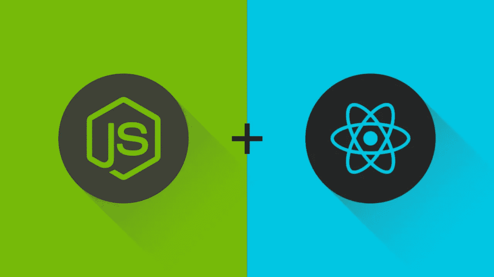
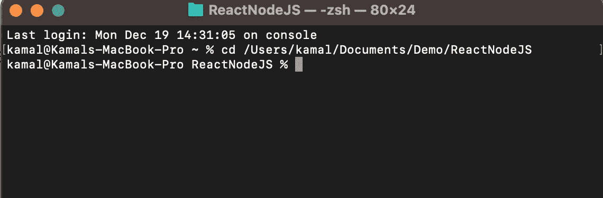
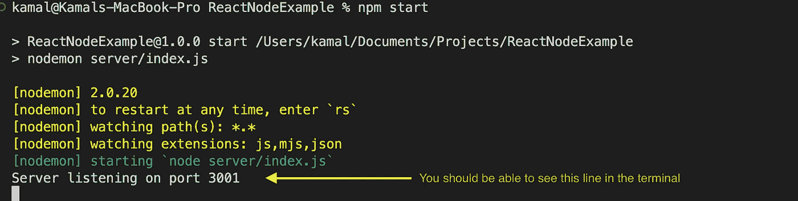
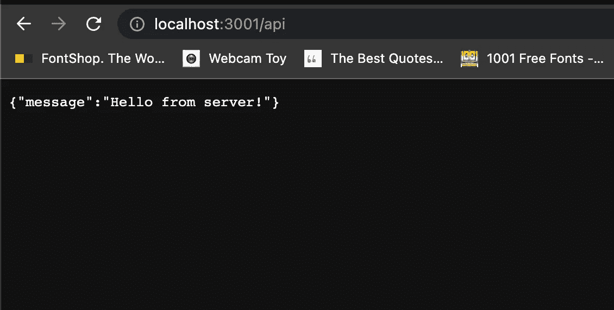
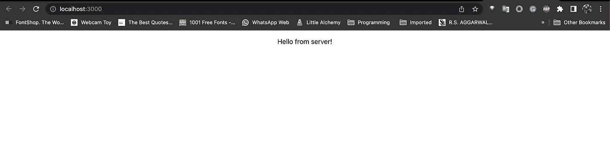

# React 和 Node.js 入门

> 原文：<https://javascript.plainenglish.io/getting-started-with-reactjs-and-nodejs-1499a46df076?source=collection_archive---------1----------------------->

## 如何用 Node.js 配置 React 项目的分步指南



大家好，今天我们将学习如何为我们的 React + Node.js 应用程序做一个非常简单的设置。

这将是如何用 Node.js 配置 React 项目的分步指南。

1.  首先，创建一个文件夹，假设我们将其命名为 ***ReactNodeJS***
2.  然后`cd`进入那个文件夹。



3.现在运行`npm init -y`，这将为我们创建一个默认配置的新项目，这里 **-y** 表示*是*所有默认设置或配置。

4.然后在命令行运行`npm i express`，这将安装 express 库，express 是一个后端 web 应用框架，用于用 Node.js 构建 RESTful APIs

5.在 package.json 中，将它添加到脚本块中

```
"start": "node server/index.js"
```

6.现在在您的***react nodejs****文件夹中创建另一个文件夹，并将该文件夹命名为 ***服务器。****

*7.在您的 Visual Studio 代码或任何您喜欢的 IDE 中打开您的项目，在 ***服务器*** 文件夹中创建 index.js 文件，并将以下代码添加到该文件中*

```
*// server/index.js
const express = require("express");
const PORT = process.env.PORT || 3001;
const app = express();
app.listen(PORT, () => {
  console.log(`Server listening on ${PORT}`);
});*
```

*为了确认到目前为止一切正常，在终端上运行`npm start`并检查您的终端，您应该能够看到这一行:“服务器监听端口 3001”*

**

*8.在后端项目的 index.js 文件中创建一个端点*

```
*app.get("/api", (req, res) => {
  res.json({ message: "Hello from server!" });
});*
```

*9.重新启动节点服务器*

*10.现在再次运行`npm start`，在你的浏览器上转到[http://localhost:3001/API](http://localhost:3001/api)，你应该能看到如下输出*

**

*现在我们的后端已经准备好了，只需要 10 个简单的步骤，现在让我们开始应用程序的前端部分。*

1.  *使用`npx create-react-app client`创建前端应用程序，这里**客户端**是你的应用程序的名称。*
2.  *现在在前端项目的 package.json 中添加一个代理，代理主要用在开发环境**中，方便服务器和 UI** 之间的通信。我们需要有一个后端服务器和 UI 在不同的端口上运行。*

```
*"proxy": "http://localhost:3001",*
```

*3.现在，我们可以像这样调用 react 项目中的 API*

```
*React.useEffect(() => {
    fetch("/api")
      .then((res) => res.json())
      .then((data) => setData(data.message));
  }, []);*
```

*现在，保持你的后端项目运行，打开另一个终端`cd`进入 ***客户端*** 文件夹，运行`npm start`并在你的浏览器上进入 [http://localhost:3000/](http://localhost:3000/) 。*

*您应该能够看到输出。*

**

*我有一个工作库，如果你在任何一个步骤中遇到困难，请随时联系或检查库中的代码。*

*GitHub 资源库链接:-[https://GitHub . com/Kamal-Walia/react node/blob/main/readme . MD](https://github.com/Kamal-Walia/ReactNode/blob/main/README.md)*

**更多内容看* [***说白了。报名参加我们的***](https://plainenglish.io/) **[***免费周报***](http://newsletter.plainenglish.io/) *。关注我们关于* [***推特***](https://twitter.com/inPlainEngHQ)[***LinkedIn***](https://www.linkedin.com/company/inplainenglish/)*[***YouTube***](https://www.youtube.com/channel/UCtipWUghju290NWcn8jhyAw)*[***不和***](https://discord.gg/GtDtUAvyhW) ***。********

*****对缩放您的软件启动感兴趣*** *？检查* [***电路***](https://circuit.ooo/?utm=publication-post-cta) *。***