# 在本地机器上开始使用 Tyk API Gateway

> 原文：<https://javascript.plainenglish.io/getting-started-with-tyk-open-source-on-your-local-machine-6468d1c4f7b?source=collection_archive---------4----------------------->

## 用 Node.js 和 Express 创建一个简单的 API 端点，然后创建一个本地 TYK 网关(开源)。


Source — [T](https://tyk.io/docs/img/diagrams/gateway4.png)YK Documentation

在本文中，我们将使用 Node.js 和 Express 创建一个简单的 API 端点，然后创建一个本地 Tyk 网关(开源),它将在没有仪表板的情况下与这个 API 端点进行交互。

# 介绍

Tyk API 网关于 2014 年发布。它是用 Golang 写的，使用 Golang 自己的 HTTP 服务器。

Tyk 提供了一个快速、可扩展的现代开源 API 网关。Tyk 还提供了一个完整的生命周期 API 管理平台，包括 API 网关、API 分析、开发人员门户和 API 管理仪表板。

Tyk 提供许多与网关集成的[开源产品](https://tyk.io/docs/apim/open-source/)。Tyk 是一个开源的企业 API 网关，支持 REST、GraphQL、TCP 和 gRPC 协议。

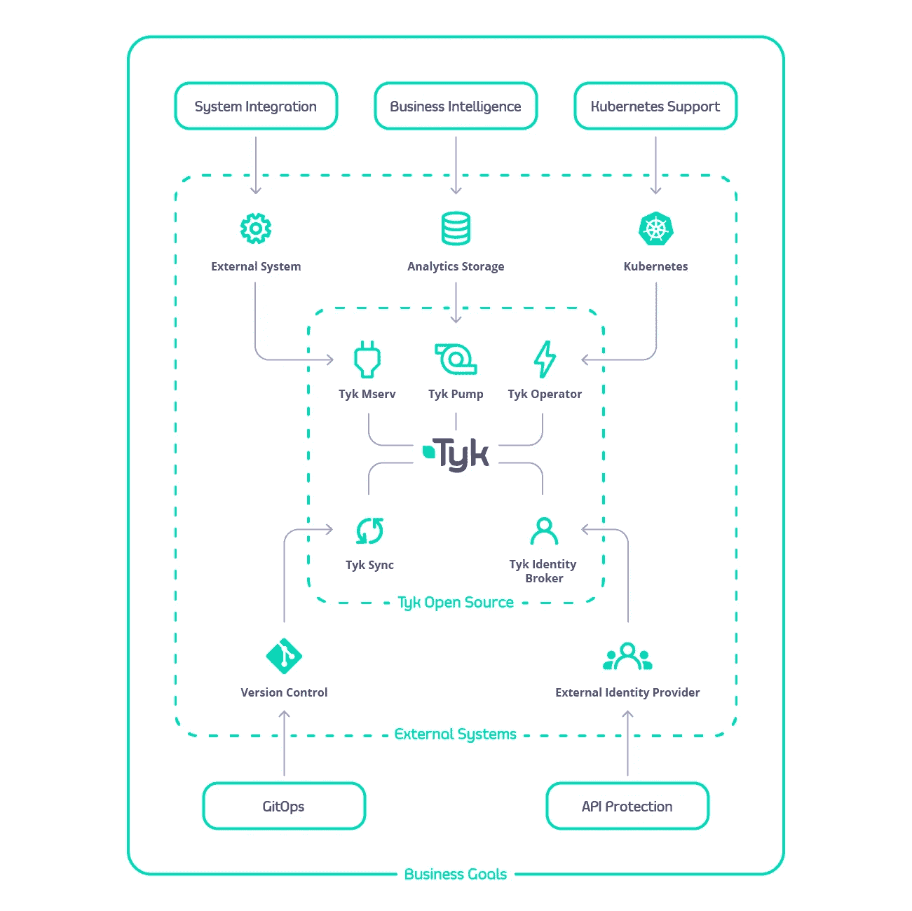

Source — TYK Documentation

# TYK 建筑

Tyk 网关可以完全独立运行，只需要一个 Redis 数据库，并且可以水平扩展:

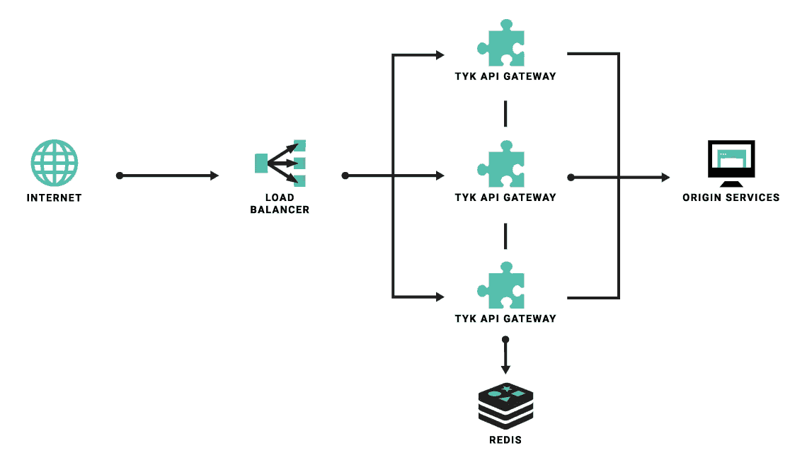

Source — TYK Documentation

# **开始安装开源软件**

我们将使用 docker-compose 在本地安装 tyk，这是最快的方法

**步骤 1 —克隆 docker-compose 库**

```
git clone https://github.com/TykTechnologies/tyk-gateway-docker
```

**第 2 步—转到新目录**

```
cd tyk-gateway-docker
```

**步骤 3 —部署 Tyk 网关和 Redis**

```
docker-compose up -dORdocker-compose up
```

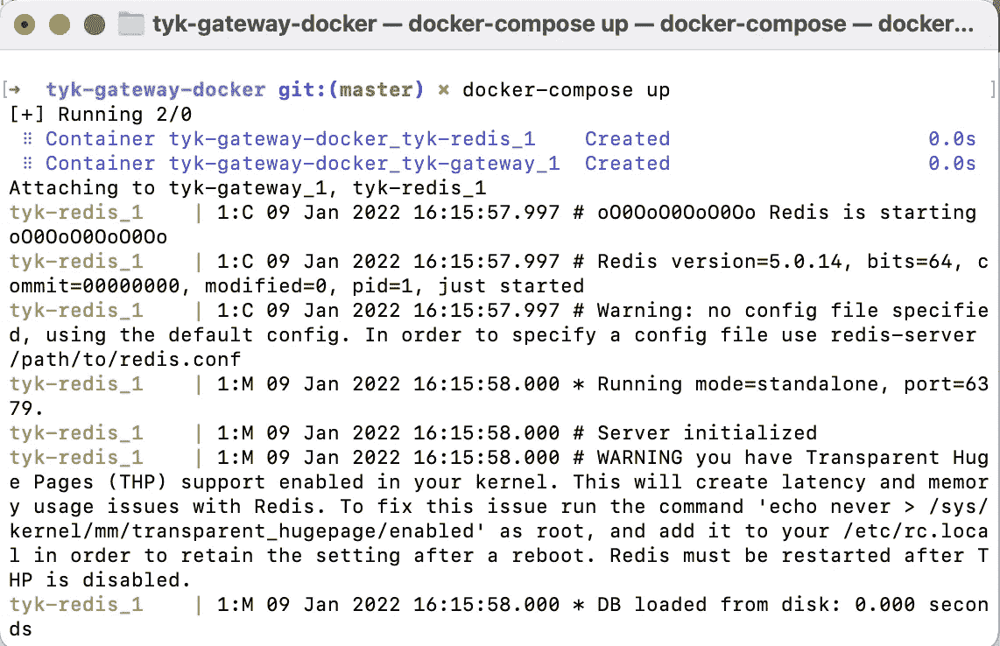

**Deploy Tyk Gateway and Redis**

**步骤 4 —测试网关是否正在运行**

tyk 网关 API 的 Swagger 文档可在此处获得[https://tyk.io/docs/tyk-gateway-api](https://tyk.io/docs/tyk-gateway-api/)。下一步，我们将使用 TYK 网关 API，我们将使用 p [ostman](https://www.postman.com/) 客户端进行 API 调用。

```
API - http://localhost:8080/hello
METHOD - GET
```

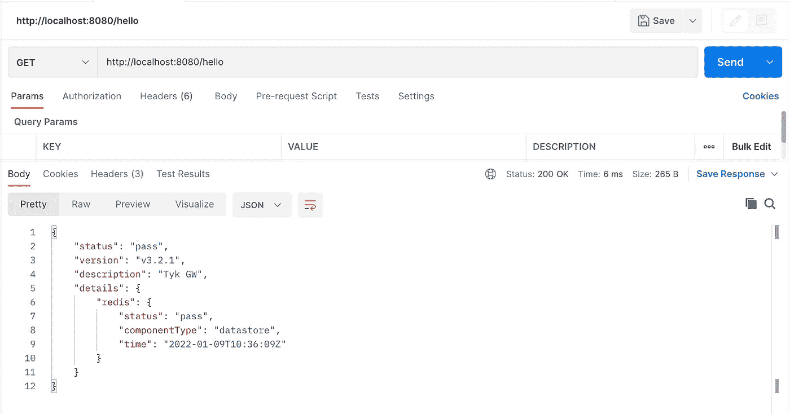

**Test the Gateway is running or not**

**步骤 5 —创建演示 Node.js 应用程序**

对于本文，我们将使用已经使用 TypeScript 和 Express 创建的 [Node.js 样板](https://github.com/santoshshinde2012/node-boilerplate)代码。

[](https://github.com/santoshshinde2012/node-boilerplate) [## GitHub-Santosh shinde 2012/Node-Boilerplate:用于微服务的节点类型脚本样板…

### 微服务的节点类型脚本样板。用 TypeScript 编写的 Node.js 应用程序的框架(带有安装说明…

github.com](https://github.com/santoshshinde2012/node-boilerplate) 

```
// clone the application
git clone https://github.com/santoshshinde2012/node-boilerplate.git

// change to the new directory
cd node-boilerplate

// install the all modules
npm install

// start the application
npm start
```

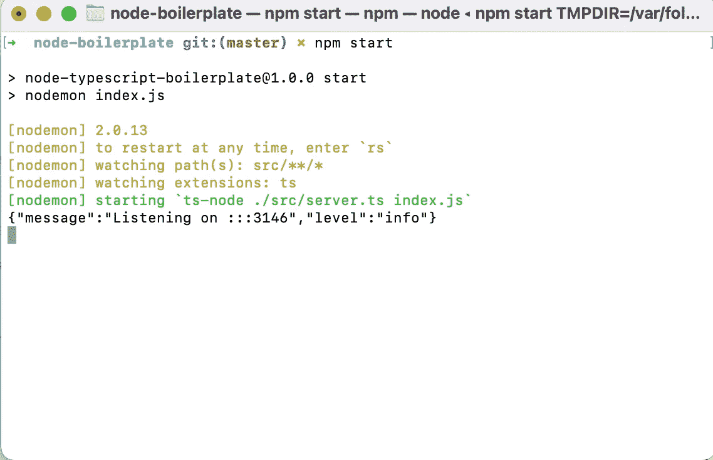

**Run Demo Node JS Application**

有关更多信息，请参考以下文章:

[](/skeleton-for-node-js-apps-written-in-typescript-444fa1695b30) [## 用 TypeScript 编写的 Node.js 应用程序的框架

### 包含 ESLint、Prettier 和 Husky 的设置说明。

javascript.plainenglish.io](/skeleton-for-node-js-apps-written-in-typescript-444fa1695b30) 

**步骤 6 —在公共 URL 上发布节点 JS 应用**

通过隧道( [ngrok](https://ngrok.com/) )，我们将把本地主机暴露给互联网，ngrok 是一个跨平台的应用程序，它使开发人员能够以最小的努力将本地开发服务器暴露给互联网。

请使用以下命令在您的系统中全局安装`ngrok`:

```
npm install -g ngrok
```

假设我们的应用程序运行在端口`3146`上，那么我们只需要使用下面的命令在公共 url 上运行它:

```
ngrok http 3146
```

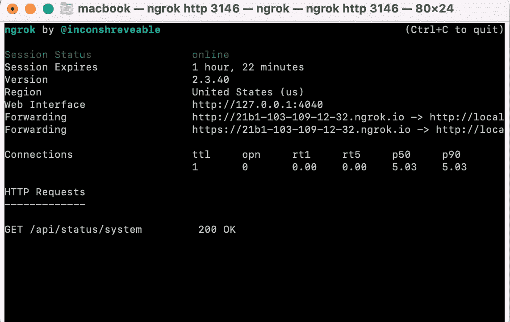

**Publish Node JS application on public URL**

[](https://community.tyk.io/t/http-proxy-error-dial-tcp-127-0-0-1-connect-connection-refused/5132) [## Http:代理错误:拨号 tcp 127.0.0.1:3030: connect:连接被拒绝

### 我正在使用下面的存储库在本地设置 tyk 开源网关，但是我没有连接到节点…

community.tyk.io](https://community.tyk.io/t/http-proxy-error-dial-tcp-127-0-0-1-connect-connection-refused/5132) 

**第 7 步—添加/创建新的 API**

确保我们知道我们的 API secret，我们的 Tyk 网关 API secret 存储在您的 tyk.conf 文件中，该属性称为 secret，您将需要使用它作为名为 **x-tyk-authorization** 的头来调用网关 API。如果你正在使用 Docker-compose，那么默认的 secrete 是`**foo**`，它可以在 Docker compose 文件的 environment 部分找到。

```
environment:
      - TYK_GW_SECRET=foo
```

我们将使用 POST API `{{baseUrl}}/tyk/apis`创建一个 API，这里的基本 URL 是`http://localhost:8080`。带表头`x-tyk-authorization: foo`和正文如下。

*   `proxy.listen_path`:监听的路径，如`/api`或`/`。在 Tyk 被配置为运行的端口上，任何进入主机的请求都将应用 API 定义中定义的规则。我们的演示将基于我们系统的状态 API 端点`[/api/status/system](http://21b1-103-109-12-32.ngrok.io/api/status/system).`
*   `proxy.target_url`:这定义了如果请求通过了 Tyk 中的所有检查，它应该被代理到的目标 URL。示例— `[http://21b1-103-109-12-32.ngrok.io/api/status/system](http://21b1-103-109-12-32.ngrok.io/api/status/system).`

[](https://tyk.io/docs/tyk-apis/tyk-gateway-api/api-definition-objects/proxy-settings/) [## API 定义中的代理设置

### 代理部分概述了 API 代理功能。你可以定义 Tyk 应该在哪里听，以及 Tyk 应该在哪里…

tyk.io](https://tyk.io/docs/tyk-apis/tyk-gateway-api/api-definition-objects/proxy-settings/) 

```
API - http://localhost:8080/tyk/apis
HEADER - x-tyk-authorization: foo
METHOD - POST
Body -{
    "slug": "system-status",
    "name": "system-status",
    "api_id": "system-status",
    "org_id": "1",
    "auth": {
        "auth_header_name": "Authorization"
    },
    "definition": {
        "location": "header",
        "key": "x-api-version"
    },
    "version_data": {
        "not_versioned": true,
        "versions": {
            "Default": {
                "name": "Default",
                "use_extended_paths": true
            }
        }
    },
    "proxy": {
        "listen_path": "/api/status/system",
        "target_url": "http://21b1-103-109-12-32.ngrok.io/api/status/system",
        "strip_listen_path": true
    },
    "active": true
}
```

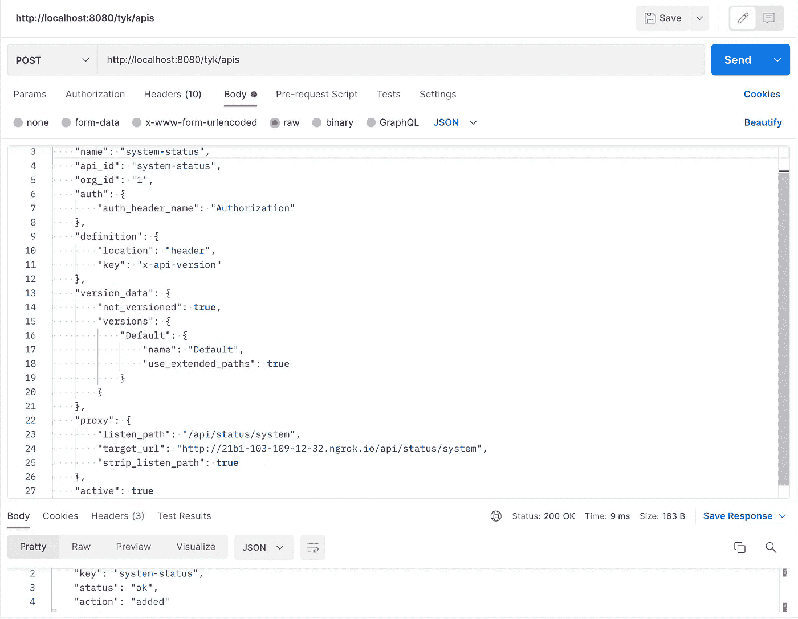

**Add/Create new API**

**步骤 8 —重启或热重装**

一旦我们创建了 API，我们将需要重新启动 Tyk 网关或发出一个热重新加载命令:

```
API - http://localhost:8080/tyk/reload/group
HEADER - `x-tyk-authorization: foo`
METHOD - GET
```

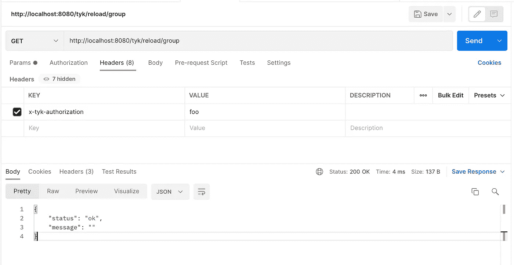

**Restart or hot reload**

**步骤 9——创建 API 密钥**

要创建一个 API 密匙，我们需要我们希望授予密匙访问权限的 API ID，然后创建密匙是一个非常简单的对端点的 API 调用。

```
API - http://localhost:8080/tyk/keys/create
HEADER - `x-tyk-authorization: foo`
METHOD - POST
BODY -

{
  "quota_max": 0,
  "rate": 2,
  "per": 5,
  "org_id": "1",
  "access_rights": {
      "system-status": {
          "api_name": "system-status",
          "api_id": "system-status",
          "versions": [
              "Default"
          ],
          "allowed_urls": [],
          "limit": null,
          "allowance_scope": ""
      }
    }
}
```

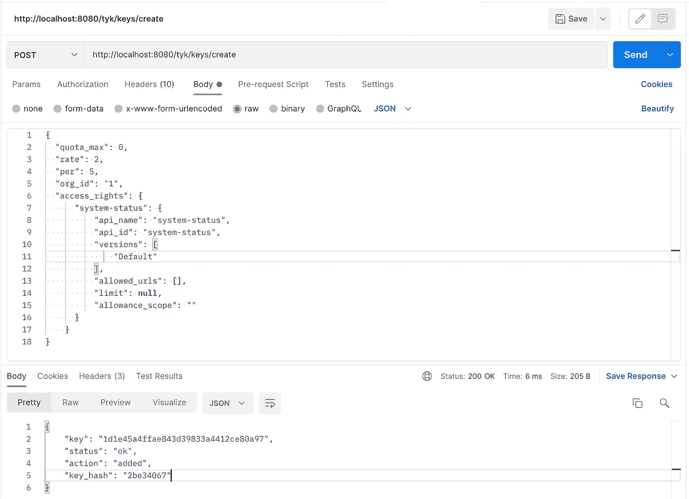

**Create API Key**

例如，API 将向我们返回以下响应:我们在 JSON 对象中收到的密钥，它是授权头。

```
{
    "key": "1d1e45a4ffae843d39833a4412ce80a97",
    "status": "ok",
    "action": "added",
    "key_hash": "2be34067"
}
```

**步骤 10 —通过网关访问 API**

我们现在可以通过 Tyk 网关访问 REST API 端点。这里我们需要从上一个 API 接收到的密钥。

如果我们试图在没有授权头的情况下访问 API，那么它将返回**未授权**和 **401** 状态码。

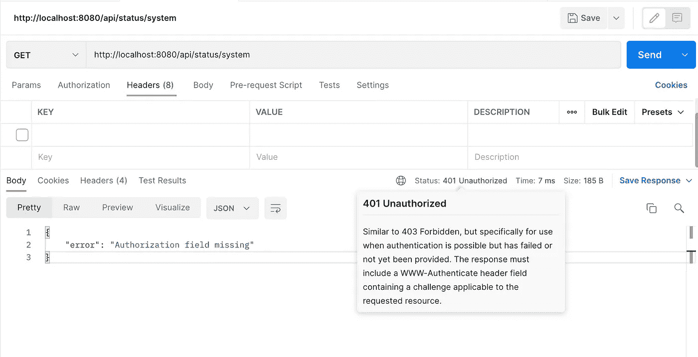

API via gateway without an Authorization header

```
API - http://localhost:8080/api/status/system
METHOD - GET
Header - `Authorization: 1d1e45a4ffae843d39833a4412ce80a97`
```

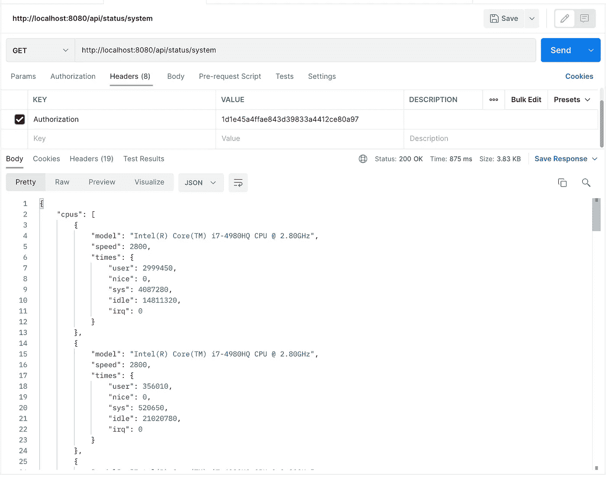

API via gateway with Authorization header

感谢阅读，请分享你的评论，如果这个博客增加了你的学习价值，请鼓掌。

*更多内容看* [***说白了就是 io***](http://plainenglish.io/) *。报名参加我们的* [***免费周报***](http://newsletter.plainenglish.io/) *。在我们的* [***社区获得独家访问写作机会和建议***](https://discord.gg/GtDtUAvyhW) *。*