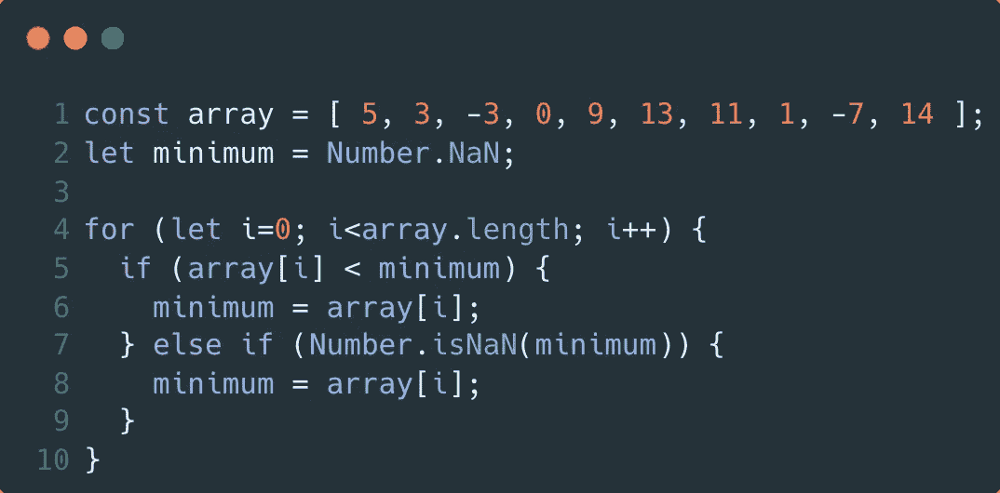

# 获取 JavaScript 中最大、最小和平均的数组元素值

> 原文：<https://javascript.plainenglish.io/getting-the-largest-smallest-and-average-array-element-value-in-javascript-70624e117ee6?source=collection_archive---------8----------------------->

Photo by [Juanjo Jaramillo](https://unsplash.com/@juanjodev02?utm_source=medium&utm_medium=referral) on [Unsplash](https://unsplash.com?utm_source=medium&utm_medium=referral)

应用程序通常需要找到列表中的最大值或最小值。事实上，基准测试工具用来寻找一种有效的方法来合并 JavaScript 中的数组，需要获得最高和最低的运行时。在*这篇*文章中使用了一个类似的基准测试工具来确定一种以简单的*方式有效获取 JavaScript 数组中最大和最小值的方法。为了实现这个目标，必须首先识别数组元素的类型。*

数组由包含原始值和/或对象的元素组成。出于这个原因，本文将讨论每种元素的主题。首先，您将看到如何有效地在原始值数组中找到最大值和最小值。然后，您将看到如何根据属性值获取对象数组中的最高值和最低值。最后，本文将提供一个结果分析，这让我很惊讶。如果你时间不够，这里有一些建议:

> 外卖(或 TL；博士)
> 
> 您需要确定在您的场景中速度和规模哪个更重要。最安全的方法是使用 for 语句。如果速度很关键，你应该*考虑*使用 JavaScript 的数学。[max/min]函数适用于较小的阵列。但是这些函数不适用于更大的数组。因此，您应该用尽可能多的元素来测试您的方法，以避免意想不到的后果。

上面的要点是通过实现本文的 **32** 函数确定的。这篇文章的源 repo 可以在[这里](https://github.com/ecofic/article-get-largest-and-smallest-array-value-in-javascript)找到。该报告包括以下部分中显示的示例和一个基准工具。如果你觉得这些都有帮助，请[现在就跟我来](https://medium.com/@chad.campbell)了解类似的内容。我们开始吧。

# 寻找原始值数组中的最大值和最小值

JavaScript 使您能够以多种方式找到数组中的最大值和最小值。对于本文，我实现了 16 个函数，试图找到从原始值数组中获取这些值的“最佳”方法。在本文的上下文中，“最佳”意味着 a)快速可读的实现 b)健壮的实现，以及 c)平均高效的执行。考虑到这些目标，创建了以下 8 个示例来查找数组中的最小值:

sample 1

sample 2

sample 3

sample 4

sample 5

sample 6

sample 7

sample 8

示例 1–8 显示了获取原始值数组中最低值的不同方法。如本文开头所述，简单是一个目标。因此，这些示例使用了内置的 JavaScript 特性。流行的计算机科学算法如分治法和组合配对法*不*包括在这个分析中。这些算法也不用于根据属性值获取对象数组中的最高值和最低值。

# 根据一个属性值获取对象数组中的最高值和最低值

JavaScript 允许您以几种方式从数组中获取最大值和最小值。使用之前传达的相同目标，创建了以下 8 个样本来查找对象数组中的最低值:

sample 9

sample 10

sample 11

sample 12

sample 13

sample 14

sample 15

sample 16

示例 9–16 显示了获取对象数组中最小值的不同方法。这些图像与图像 1–8 几乎相同，只是有一些细微的差别。然而，当你分析性能时，事情变得有趣了。

# 分析查找数组中最大值和最小值的性能

根据我的经验，没有什么比一些基准测试更能吸引工程师对代码块的注意了。基准测试和代码会立即被检查是否有任何不合适的地方或者可以改进的地方。这可能是一件好事。如果你有礼貌，我愿意😉。首先，这里是我在一台 2020 年的 13 英寸 MacBook Air 上运行本文的[源代码库](https://github.com/ecofic/article-get-largest-and-smallest-array-value-in-javascript)中的基准测试工具时观察到的结果，这台机器运行的是谷歌 Chrome 96.0.4664.55 中的 macOS 版本 12.0.1。

image 17 — benchmark results

图 17 显示了针对多个场景运行基准测试时的结果汇总。此摘要是其他四个表共享的结果[此处](https://github.com/ecofic/article-get-largest-and-smallest-array-value-in-javascript/tree/live/images)。每个场景用 1、10、100、1，000、10，000、100，000 和 1，000，000 个元素运行 100 次。根据这些测试运行和出现的数据，我得出了以下结论:

*   数学。[最大/最小]函数平均速度最快
*   数学。[max/min]在更大的数组上*不*工作。
*   Array.map 函数也不能在更大的数组上工作
*   for…in 语句是平均而言执行速度最慢的*方法。*
*   老式的 for 和 while 语句似乎是速度和安全性的最佳组合。

为了更准确地度量每种方法的效率，应该使用 Big-O 符号。如果你想学习大 O 记谱法，可以看看下面的关于教育的的附属[大 O 记谱法课程。为了简化讨论，图 17 中使用了毫秒。](https://www.educative.io/courses/big-o-notation-for-interviews-and-beyond?aff=x4mY)

这些观察让我想到了本文开头分享的要点。我鼓励你自己运行基准，自己进行实验。就我个人而言，我希望你能记住这些观察，这样你就能创造更好的应用和服务。我写这篇文章的全部原因是因为我在一个应用程序中遇到了一个范围错误。RangeError 显示消息:*超过了最大调用堆栈大小*。我继承的代码使用 Math.min 和 Math.max 作为源代码。虽然实现看起来是正确的，但这是一个细节出问题的例子。

在本文中，您看到了如何在 JavaScript 中获取最大和最小的数组元素值。如果你找到了更有效的方法，我希望你能在下面的评论中分享。如果你觉得这篇文章有帮助，请鼓掌👏，或者拍手，在下面。这让我和其他人知道您发现这篇文章很有用。如果你想了解类似的内容，我鼓励你[现在就跟我来](https://medium.com/@chad.campbell)。感谢阅读。

*更多内容看* [***说白了就是 io***](http://plainenglish.io/) *。报名参加我们的* [***免费周报***](http://newsletter.plainenglish.io/) *。在我们的* [***社区获得独家访问写作机会和建议***](https://discord.gg/GtDtUAvyhW) *。*