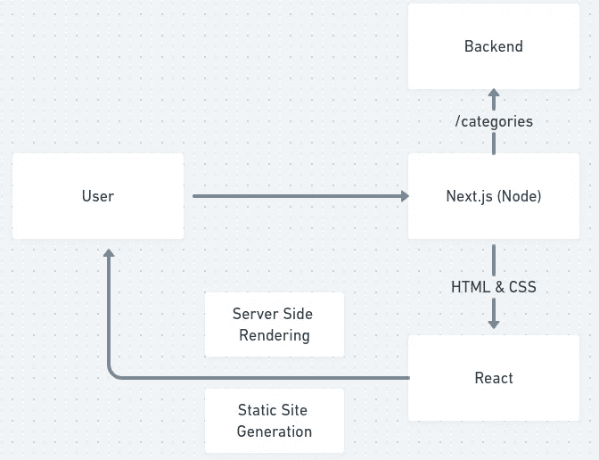

# 面向初学者的 Next.js 介绍

> 原文：<https://javascript.plainenglish.io/getting-to-know-next-js-c52cc4df5a08?source=collection_archive---------12----------------------->

## 熟悉 Next.js


如果您使用 React 已经有一段时间了，那么您会知道在创建由搜索引擎索引的项目时存在困难。在这种情况下出现了 Next.js，它是一个框架，与 Node.js 中前端和后端之间的中间层一起工作。

## React + Node.js = Next.js

如果你已经编程很长时间了，你可能还记得我们用 PHP 或者。Net 中，每个页面都是在服务器端构建并返回给客户端的。Next.js 以类似的方式工作，页面通过运行在中间层的 Node.js 服务器呈现并传递给已经组装好的前端。这种功能被称为 SSR(服务器端呈现)，它允许我们将页面中的所有数据一次返回到前端(React ),搜索引擎将能够读取包含所有内容的页面。



除了 SSR 之外，Next.js 还允许您使用 SSG(静态站点生成)创建项目，这是可以随时更新的静态页面。

值得指出的是，Next.js 并没有消除任何灵活性，也没有添加更多我们已经知道的东西来进行反应，因此它的使用不会影响您现有的项目，您仍然可以继续构建您的 SPA 项目(单页应用程序)，但是您将拥有 SSR 和 SSG 的优势。

## Next.js 为 React 添加的特性

在进入 SSR 和 SSG 的细节之前，我们应该注意到 Next.js 有一些其他的功能被添加到 React 中。

*   热代码重新加载:正在开发的项目中的代码变化被实时地自动传输到本地应用程序。
*   自动代码分割:该功能只允许页面的某些部分根据它们需要的包来呈现。
*   自动路由:我们不需要配置来路由应用程序中的页面，URL 是基于 pages 文件夹进行映射的，因此该文件夹中的一个文件将成为一个路由，如果需要的话，可以对其进行定制。
*   国际化:您可以使用国际化将页面实时翻译成不同的语言。
*   TypeScript 支持:Next.js 支持 TypeScript，如果您不知道它是什么，请单击此处查看有关该主题的文章。
*   CSS 模块:我们可以模块化我们的 CSS，这样一个页面的 CSS 就不会干扰另一个页面。
*   图像优化:Next 有一个用于图像优化的组件。

## 服务器端渲染

SSR 提供了一种不同的策略，不同于通常使用的从 API 消费数据的策略，我们通常使用 useEffect。这里的要点是，当使用 useEffect 时，数据不会在页面呈现给浏览器的那一刻被加载，因此搜索引擎将无法索引 API 返回的信息。

这种策略被称为客户端获取，并且应该在不需要搜索引擎对数据进行索引时使用。您可以通过在浏览器中禁用 javascript 来验证这一点，您会看到来自 API 的内容将不会被加载。

```
import React, { useEffect, useState } from 'react';

import api from '../service/api';

interface ICategories {
    id: number;
    name: string;
}

export default function Categories() {
    const [categories, setCategories] = useState<ICategories[]>([]);

    // Chamada à API com Client Side Fetching
    useEffect(() => {
        api.get('<http://localhost:3333/categories>').then(response => {
          setCategories(response.data);
        })
    }, []);

    return (
        <div>
          <h1>Categories</h1>

          <section>
            <ul>
              {categories.map(category => {
                  return (
                      <li key={category.id}>
                        {category.name}
                      </li>
                    )
                })}
            </ul>
          </section>
        </div>
      )
}
```

为了解决这个问题，我们使用了 SSR，这是使 Next.js 如此出名的特性。在这里，我们将 useEffect 放在一边，使用一个名为 getserverseadprops 的函数，该函数的类型为 getserverseadprops。接下来，js 将返回带有该函数结果的预先呈现的页面，可以通过必须预先键入以便于访问的属性来访问该函数的返回。

```
import { GetServerSideProps } from 'next';
interface ICategories {
    id: number;
    name: string;
}
interface CategoryProps {
  categories: ICategories[];
}
export const getServerSideProps: GetServerSideProps<CategoryProps> = async() => {
  const response = await api.get('<http://localhost:3333/categories>');
  const categories = await response.data;

  return {
    props: {
      categories
    }
  }
}
export default function Home({ categories }: CategoryProps) {
    return(
      <div>
        <h1>Categories</h1>

        <section>
          <ul>
              {categories.map(category => {
                  return(
                      <li key={category.id}>
                        {category.name}
                      </li>
                    )
                })}
            </ul>
        </section>
      </div>
    )
}
```

通过服务器端渲染，我们解决了搜索引擎索引的问题，但我必须指出，这是有成本的，并且只有当搜索引擎索引信息时，才应该使用该资源。

## 静态站点生成

以博客或电子商务为例，这些页面总是向用户呈现相同的内容，并且更新频率很低。在这种情况下，Next.js 引入了静态站点生成，在这里我们有一个静态页面，它不会不断更新，而且当以这种方式提供页面时，我们有非常高的性能增益。

为了创建一个具有这种功能的页面，我们使用了 GetStaticProps，这与在 SSR 中使用的 GetServerSideProps 非常相似，但是这里有一个重要的细节。我们必须通过一个名为**重新验证**的属性，在几秒钟内向函数指示内容何时应该更新。

在下面的代码中可以看到如何在相同的类别示例中使用 GetStaticProps，更新时间为 60 秒:

```
import { GetStaticProps } from 'next';
interface ICategories {
    id: number;
    name: string;
}
interface CategoryProps {
  categories: ICategories[];
}
export const getStaticProps: GetStaticProps<CategoryProps> = async () => {
  const response = await api.get('<http://localhost:3333/categories>');
  const categories = await response.data;

  return {
    props: {
      categories
    },
		revalidate: 60,
  }
}
export default function Home({ categories }: CategoryProps) {
    return (
      <div>
        <h1>Categories</h1>

        <section>
          <ul>
              {categories.map(category => {
                  return (
                      <li key={category.id}>
                        {category.name}
                      </li>
                    )
                })}
            </ul>
        </section>
      </div>
    )
}
```

## 结论

因此，Next.js 是一个集合，允许我们同时拥有 SPA、SSR 和 SSG 项目。但是，我们必须仔细评估在我们的项目中使用每个函数的位置，因为它用途广泛且易于学习，因为它被用于许多项目中。

我希望这篇文章对你有用，如果你喜欢它，和你的朋友分享它，不要忘记访问博客上的其他内容。

参考文献:

[](https://nextjs.org/docs/getting-started) [## 开始|下一步. js

### 欢迎使用 Next.js 文档！如果您刚接触 Next.js，我们建议您从学习课程开始。…

nextjs.org](https://nextjs.org/docs/getting-started) 

*更多内容请看*[***plain English . io***](https://plainenglish.io/)*。报名参加我们的* [***免费周报***](http://newsletter.plainenglish.io/) *。关注我们关于*[***Twitter***](https://twitter.com/inPlainEngHQ)*和**[***LinkedIn***](https://www.linkedin.com/company/inplainenglish/)*。加入我们的* [***社区***](https://discord.gg/GtDtUAvyhW) *。**