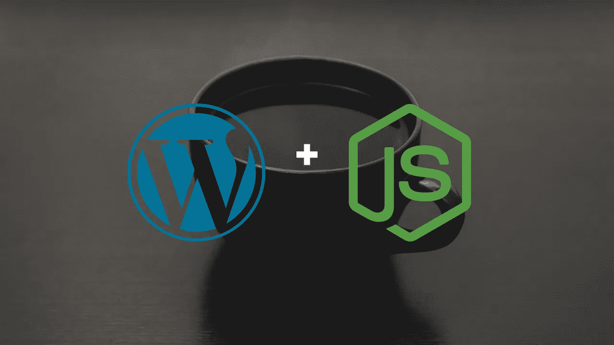
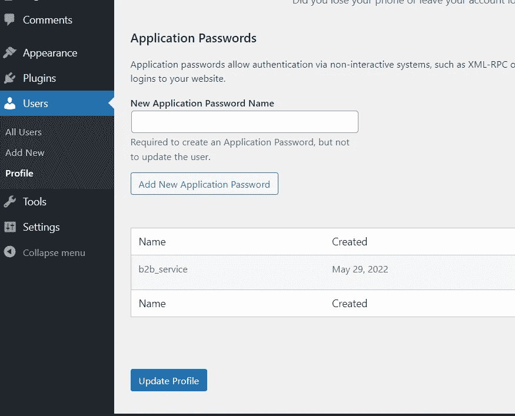

# 让 WordPress REST API 最终准备好使用 Node.js

> 原文：<https://javascript.plainenglish.io/getting-wordpress-rest-api-finally-ready-to-work-with-nodejs-10e54fc3101a?source=collection_archive---------1----------------------->

## 如何让 WordPress REST API 使用 Node.js 的教程

在谷歌中获得成千上万的结果是一件很棒的事情，但是当你找到的帖子过时时，情况就变得更加复杂了。最近，当我试图让我的 Node.js 应用程序与 WP REST API 一起工作时，我就遇到了这种情况。我希望这个帖子不会太快过时，你会发现它很有帮助。



我的任务很简单——创建一个 WordPress 网站，并使用 Node.js 添加一个新帖子。

**当前形势**

我是在 WP 6.0 出来几天后写的这个帖子。我知道它从 5.6 开始对 REST API 有很好的支持，所以集成应该相对容易。在 5.6 WordPress 团队增加了一个内置的应用程序密码选项，所以我决定不再使用**和第三方插件进行认证。此外，我使用基本的节点获取来做一个 POST 请求，**，没有来自 npm** 的任何类型的 WP 集成包。**

## **WordPress 安装和配置**

首先，我们需要一个 WP 实例和 SSL 证书。

*如果没有 SSL，您的网络或您的站点与授权应用程序之间的网络上的攻击者可能会看到应用程序密码。* [*https://make . WordPress . org/core/2020/11/05/application-passwords-integration-guide/*](https://make.wordpress.org/core/2020/11/05/application-passwords-integration-guide/)

无 SSL 应用程序密码选项被禁用。当 SSL 准备就绪，我们的网站在 HTTPS 提供服务时，我们可以在 Users 部分创建一个新的应用程序密码(为此我将使用“AP”)。

首先，什么是 AP？这是一个仅为 REST 请求创建的密码。它可以有自己的名字，可以随时删除。它可以在不泄露你真实的 WordPress 凭证的情况下使用。



这是第一个误导部分。您在一个特定的用户配置文件下创建一个新的 AP——在我的例子中是 admin，并为它命名。几个小时以来，我一直认为这个名称和生成的密码是我的 API 请求的新凭证。不幸的是，密码的名称只针对您，它在 REST 请求中不起任何作用。

您将在请求中使用的登录名是您的主要 WordPress 登录名，而不是提供的密码名称。

这是你在 WordPress 仪表盘中唯一需要做的事情。我发现了这么多过时的资源，其中提到我必须编辑的。htaccess 文件或者安装[基本认证](https://github.com/WP-API/Basic-Auth)插件(很久没更新了)或者其他一些第三方插件。
不，对于基本认证，您只需要一个 SSL 和一个 AP。

## **Node.js**

在这里你也不需要太多。如果你有最新的 Node.js，你甚至不需要安装[取节点](https://www.npmjs.com/package/node-fetch)，因为它已经内置了

您的所有请求 URL 都以下列开头:

```
[https://your-website/wp-json](https://your-website/wp-json)
```

你可以在[文档](https://developer.wordpress.org/rest-api/reference/)中了解更多。

安装 node-fetch 并将其导入文件后，我创建新帖子的代码如下所示:

您将收到创建的帖子详细信息作为回应。您可以将它全部包装在 try/catch 块中。

这里需要记住几件事:

1.  您的 WP 端点必须是 HTTPS。
2.  请求的主体必须与内容类型相匹配
3.  我对登录和密码使用缓冲区，因为我认为这是最可靠的处理方式。

以下是获取所有帖子的方法:

## **结论**

我不想使用 [node-wp-api](https://github.com/wp-api/node-wpapi) ,因为它将来可能不适合我——与 WooComerce 和 ACF 集成。我想要纯粹的 WP 和 JS 体验。

有了当前版本的 WordPress 和 Node.js，即使没有额外的 js 框架，建立连接也是非常容易的。

由于 WordPress 和 Node.js 最近的变化，StackOverflow 上的许多主题已经过时了。

编码快乐！

*更多内容看* [***说白了。报名参加我们的***](https://plainenglish.io/) **[***免费周报***](http://newsletter.plainenglish.io/) *。关注我们*[***Twitter***](https://twitter.com/inPlainEngHQ)*和*[***LinkedIn***](https://www.linkedin.com/company/inplainenglish/)*。查看我们的* [***社区不和谐***](https://discord.gg/GtDtUAvyhW) *加入我们的* [***人才集体***](https://inplainenglish.pallet.com/talent/welcome) *。***