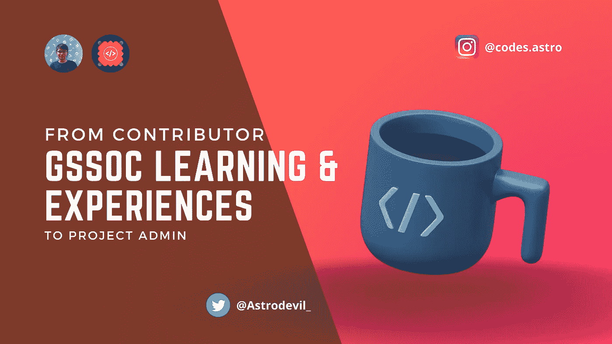

# GirlScript 代码学习和体验之夏:从贡献者到项目管理员

> 原文：<https://javascript.plainenglish.io/girlscript-summer-of-code-learning-and-experiences-from-contributor-to-project-admin-6efe45761ed5?source=collection_archive---------16----------------------->

## 我从开源项目的贡献者到项目管理员和导师的经历。

GSSoC 代表 [GirlScript 代码之夏](https://gssoc.girlscript.tech/)。这是一个由 GirlScript 基金会为初学者开展的为期三个月的开源项目。今年，我被选为该项目的项目管理员。(GSSOC'22)

在这篇文章中，我将分享我从一个开源项目的贡献者到一个项目的管理员和导师的经历。

# 我是如何开始的？

我的第一个开源贡献是给一个朋友的知识库。在做了一些小小的贡献后，我开始了解 GSSoC 项目，并参加了它。这是我对任何开源项目的第一次重大贡献。在那之前，我有一些为**电子书基金会/免费编程书籍**撰稿的经验。从那以后，我学会了就问题进行沟通，并恰当地提出拉动式请求。在 GirlScript 代码之夏期间，之前的工作对我帮助很大。

# 我学到了什么？

项目期间的成功贡献无疑是我信心的助推器。现在，我更有信心从事任何开源项目。在投稿时，我经历了一些项目维护者讨论的问题和请求，我试图理解他们的工作流程，以及他们如何管理事情。

过了一段时间，我决定作为一名项目管理员参加一个开源项目。Hacktoberfest 是这样做的最佳时机，因为许多新手将在 10 月份开始他们的开源贡献。

# 接下来呢？

我创建了一个存储库来托管小型 JavaScript 项目。它最初是供个人使用的，但在决定作为项目管理员参与后，我创建了一个 GitHub 组织 [ZeroOctave](https://github.com/ZeroOctave) ，并在其中添加了相同的存储库。Hacktoberfest 就要开始了，所以我想碰碰运气，正如所料，一些好的贡献被添加到了资源库中。我很享受我作为维护者的角色，同时指导贡献者为我的库做贡献。

就在 Hacktoberfest 之后，一些更多的开源项目即将启动，所以我申请了我的知识库，并被其中的两个接受了。那些程序分别是[无限克隆阴谋](https://icc-techsahead.netlify.app/)&[DWoC’21](https://dwoc.io/)。这些程序不够大，不足以吸引很多贡献者，但仍然有一些好的项目被添加到我们的库中，一些新成员也加入了 GitHub 组织。

# GSSoC！

GSSoC 代表 GirlScript 代码之夏。正如我前面提到的，GSSoC’21 是我开源之旅的第一步。1 年后，当 GSSoC 的另一个版本回来时，我决定这次参加我的项目。我填写了我的组织和项目详细信息的注册表，并被选为项目管理员。这是一个为期 3 个月的计划，目前正在进行，许多新的贡献将进入我们的组织库。zero octave Javascript Projects 是我们的项目库，是 GS SOC’22 的一部分。到目前为止，创建了 200 多个问题，合并了 200 多个拉式请求。

在做项目管理员的工作和与项目维护人员协调的同时，我也专注于提高我的技术技能。这样我就可以为一些好的开源项目做贡献了。

# 给你的邀请！

如果你是初学者，欢迎你为我们的组织做贡献。如果你是一个积极的开源贡献者或维护者，欢迎你加入 ZeroOctave。加入 zeroOctave 来添加你的项目，指导新手或者写与开源相关的文章。

**邀请链接**

*   [加入 ZeroOctave GitHub 组织](https://github.com/ZeroOctave)
*   [参与项目](https://github.com/ZeroOctave#what-you-can-do-here)
*   [加入 ZeroOctave 博客团队](https://hashnode.com/teams/invite/0013e746-aa30-4335-9196-5dd3bed50715)

**如果你❤️我的内容！在**[**Twitter**](https://mobile.twitter.com/Astrodevil_)**上联系我，或者通过** [**请我喝咖啡**](https://www.buymeacoffee.com/Astrodevil) **☕来支持我！您也可以通过** [**Gumroad**](https://astrodevil.gumroad.com/) 在我的商店购买数码产品

*更多内容看* [***说白了. io***](https://plainenglish.io/) *。报名参加我们的* [***免费周报***](http://newsletter.plainenglish.io/) *。关注我们关于*[***Twitter***](https://twitter.com/inPlainEngHQ)*和*[***LinkedIn***](https://www.linkedin.com/company/inplainenglish/)*。加入我们的* [***社区***](https://discord.gg/GtDtUAvyhW) *。*