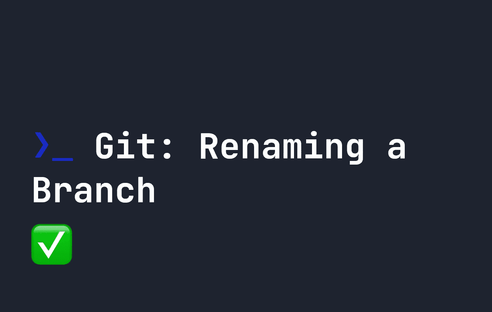

# git——如何重命名分支

> 原文：<https://javascript.plainenglish.io/git-how-to-rename-a-branch-c2530ae15ef7?source=collection_archive---------10----------------------->

## 在 Git 中有没有错误地命名过分支？了解如何在 Git 中重命名分支。



Git [分支](https://fjolt.com/article/git-branches)是管理我们代码的一种简单方式，当我们想要处理特定的特性时，可以将我们的代码副本分开。然后，我们可以将我们的代码合并回我们的主分支，或者甚至对它进行重新排序。

有时，虽然我们在分行的命名上犯了错误。可能你写的是`fea-ui-design`而不是`feat-ui-design`，也可能你只是想彻底重命名你的分支。幸运的是，重命名分支很容易。首先使用`checkout`切换到您想要重命名的分支:

```
git checkout my-branch
```

然后使用`branch`上的`-m`选项将其重命名。

```
git branch -m new-branch
```

现在`my-branch`改名为`new-branch`——就这么简单！

*更多内容看* [***说白了。报名参加我们的***](https://plainenglish.io/) **[***免费周报***](http://newsletter.plainenglish.io/) *。关注我们关于* [***推特***](https://twitter.com/inPlainEngHQ) ，[***LinkedIn***](https://www.linkedin.com/company/inplainenglish/)*，*[***YouTube***](https://www.youtube.com/channel/UCtipWUghju290NWcn8jhyAw)*，* [***不和***](https://discord.gg/GtDtUAvyhW) *。对增长黑客感兴趣？检查* [***电路***](https://circuit.ooo/) *。***