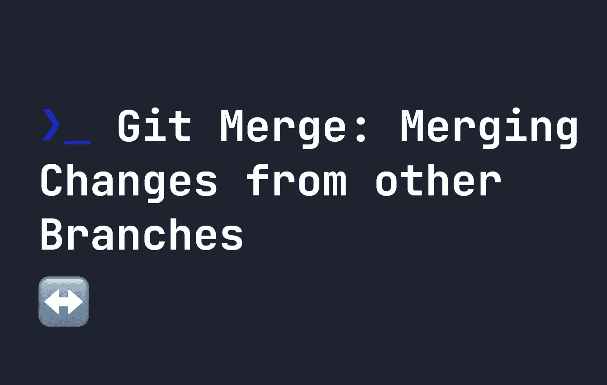

# Git 合并:合并来自其他分支的变更

> 原文：<https://javascript.plainenglish.io/git-merge-merging-changes-from-other-branches-f665f99efd26?source=collection_archive---------9----------------------->

## 合并是 Git 非常重要的一部分。了解 Git 合并是如何工作的。



Git 通过让我们创建[分支](https://fjolt.com/article/git-branches)提供了一个强大的工具。当我们的分支完成后，我们经常想要将它合并回我们的`main`或`master`分支——或者甚至可能将它完全合并到另一个分支中。与 git 合并很简单。在本指南中，我们将介绍`merge`命令。

# 合并您的 git 分支

合并非常简单。假设您在您的`main`分支上，并且您想要合并一个名为`my-branch`的分支。您只需运行以下命令:

```
git merge my-branch
```

为了形象化这一点，请看下图。这里，`main`分支显示为绿色。在我们执行合并之前，我们正在提交标记为`main commit`的文件。之后，`merge`创建一个新的合并提交，标记为`new merge commit`。这意味着无论何时进行合并，都会进行提交:


# 执行合并

如前所述，您需要使用`git merge`将另一个分支合并到您当前的分支中。但是，在这样做之前，您必须提交当前分支上的所有内容。因此，首先，确保检查您想要合并内容的分支:

```
git checkout main
```

然后添加并提交分支上的任何文件:

```
git add -A
git commit -m "Some merge message"
```

最后，您准备将一些内容合并到您的分支中:

```
git merge my-branch
```

# 快速向前合并

因为分支在这里分叉，所以只进行一次新的提交。然而，如果分支没有分叉，那么被称为“快速前进”合并的东西被提交。这是将特性的整个提交历史复制到`main`分支的地方。例如，如果我们有一个`main`分支，我们创建了一个分支，然后**只有**改变了分支，而`main`没有，那么将创建一个快速前进合并。

这意味着我们的提交历史将看起来像这样:


您可以通过使用`--no-ff`来避免快进合并:

```
git merge --no-ff my-branch
```

还有一些其他的`ff`选项:

*   `--ff` -默认-可能时会快进。
*   `--ff-only` -只有在可以快进的情况下才会合并。否则什么都不会发生。

# 解决合并冲突

合并代码有时会导致合并冲突。这就是当你试图合并代码时，Git 不能自动确定应该发生什么的时候。在这些情况下，您必须在完成合并之前手动解决它。如果你认为你现在不能解决它，你可以通过运行`git merge --abort`退出合并。

[你可以在这里了解更多关于合并冲突及其解决方法的信息](https://fjolt.com/article/git-merge-conflicts)。

# 设置合并提交消息

正如我提到的，合并还会在您的 git 历史中创建一个新的提交。如果您想添加自定义消息，您可以像使用`git commit`一样使用`-m`标志:

```
git merge my-branch -m "Some commit message"
```

# 防止自动提交

有时候，一个合并消息是不够的——你想把你的代码合并到一个分支中，稍微修改一下，然后完成你的提交。您可以使用`--no-commit`合并一个分支，而不需要创建一个提交:

```
git merge --no-comit my-branch
```

之后，您可以对代码进行任何想要的更改，然后在空闲时进行新的提交:

```
git add -A 
git commit -m "New commit message"
```

# 结论

在本指南中，我们已经介绍了您需要了解的关于合并的主题。在 git 中，合并代码是与他人协作和管理分支的一个重要主题。如果你遇到合并冲突，你可以在这里阅读。否则，[点击这里](https://fjolt.com/category/git)查看更多 git 内容。

*更多内容请看*[***plain English . io***](https://plainenglish.io/)*。报名参加我们的* [***免费周报***](http://newsletter.plainenglish.io/) *。关注我们关于*[***Twitter***](https://twitter.com/inPlainEngHQ)[***LinkedIn***](https://www.linkedin.com/company/inplainenglish/)*[***YouTube***](https://www.youtube.com/channel/UCtipWUghju290NWcn8jhyAw)*[***不和***](https://discord.gg/GtDtUAvyhW) *。对增长黑客感兴趣？检查* [***电路***](https://circuit.ooo/) *。***