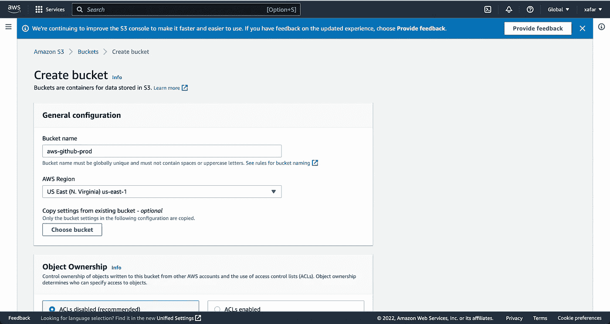

# 使用 Github 操作将 React 应用程序部署到 AWS

> 原文：<https://javascript.plainenglish.io/github-actions-aws-and-react-app-98ef1847ed5?source=collection_archive---------3----------------------->

## 关于如何使用 Github 操作将 React 应用程序部署到 AWS 的教程。

在我之前的文章中，我演示了如何使用 Gitlab CI/CD 管道将 [react 应用程序部署到 AWS。在这篇文章中，我将遵循同样的方法，但是，这一次我将使用 Github 动作。](https://betterprogramming.pub/deploying-react-app-to-aws-using-gitlab-ci-cd-1fd5d6a14b38)

让我们按照下面的步骤开始做一些有趣的事情。

## **创建 React 项目**

首先，让我们在本地创建 react 项目。为此，我们将使用 CRA。使用下面的命令创建一个 react 项目。

```
npx create-react-app aws-github
```

## 创建 GitHub 项目

现在我们已经在本地创建了项目，是时候在 GitHub 上创建一个新项目了。登录你的 GitHub 账户，创建一个新项目，如下图所示。


GitHub Create New Project

点击`New repository`，将进入下一页。


GitHub New Project

在`Repository name`给出名字`aws-github`，向下滚动到底部，点击`Create repository`按钮。然后，您将被重定向到下面的页面。


New Repository Page on GitHub

因为我们已经在本地创建了一个新项目。只需从上面的页面抓取下面的命令。

```
git remote add origin git@github.com:zafar-saleem/aws-github.git
```

并遵循以下步骤。

```
> cd aws-github
> rm -rf .git
> git init
> git remote add origin git@github.com:zafar-saleem/aws-github.git
```

在第一行中，我们将 cd 放入本地项目的根文件夹。然后我们去掉`.git`文件夹，将父文件夹初始化为一个新的存储库。最后，将我们在上一步中获取的命令粘贴到这里并运行它，这将把我们的 GitHub repo 作为源添加到我们的本地存储库中。

## 获取 AWS 密钥

是时候从我们的 AWS 控制台获取凭证了。登录 AWS 控制台，点击屏幕右上角的用户名，如下所示。然后点击`Security Credentials`。


AWS Credentials for CI/CD

你应该在下一页着陆。点击`Access keys(...)`选项卡展开其内容，并点击`Create New Access Key`按钮。将使用您的凭据打开一个模式。要么下载它们，要么把它们复制到安全的地方，或者两者都做。我们很快就会需要。


AWS Credentials for CI/CD

## 向 GitHub 存储库添加凭据

因为我们已经从 AWS 获得了凭证，所以让我们通过将它们添加到我们的 GitHub 存储库中来完成这一步。如下所示，进入 GitHub `aws-github`库的`security`选项卡。


GitHub Adding Credentials for AWS

然后点击`Secrets`，然后点击`Actions`。然后点击`New Repository Secret`。


GitHub Actions Credentials for AWS

在这里添加您在上一步中从 AWS 下载的`Access Key`。


GitHub Actions Credentials for AWs

再次点击`New Repository secret`，这次添加`Secret Access Key`。


GitHub Actions Credentials for AWS

最后，按照相同的步骤添加生产环境的密钥，即点击`New Repository secret`。


GitHub Actions Production Environment Key for AWS S3 Bucket

我们必须在 AWS 控制台中创建上述`aws-github-prod` S3 桶。

## 创建和设置 AWS S3 时段

现在我们有了 GitHub 设置，我们需要有一个 S3 存储桶来部署我们的 react 应用程序。这个桶的名字必须与我们添加到 GitHub 上面的`Secret`相匹配，上面的`aws-github-prod`。

打开你的 AWS 控制台，点击 S3。


Creating AWS S3 Bucket

点击`Create bucket`。


AWS Creating S3 Bucket

一旦你进入下面的页面，输入存储桶的名称`aws-github-prod`。



AWS Creating S3 Bucket

向下滚动并取消选中`Block all public access`并检查您的`acknowledgement`。


Creating AWS S3 Bucket

现在向下滚动并点击`Create bucket`按钮。

现在，您应该能够查看新创建的 bucket 了。

## 创建存储桶策略

从 S3 主页列表中点击您的存储桶名称，即`aws-github-prod`。在下一页中，单击权限。


Adding AWS S3 Bucket Policy

向下滚动至存储桶政策部分，并点击`Edit`。


Adding AWS S3 Bucket Policy

粘贴以下内容并点击`Save changes`。


Adding AWS S3 Bucket Policy

接下来点击`aws-github-prod` S3 页面上的`Properties`。


AWS S3 Bucket Public Access

向下滚动到底部的静态网站托管。点击`Edit`。


AWS S3 Bucket Public Access

在`static website hosting`下检查`Enable`。


Add AWS S3 Bucket Public Access

向下滚动并输入`index.html`值至`Index Document`和`Error Document`。然后点击下方页面底部的`Save changes`按钮，您必须滚动到页面底部。


Add AWS S3 Bucket Public Access

## GitHub 操作工作流程

该是我们写`YAML`文件的时候了。在项目的根目录下创建`.github`文件夹。在创建的`workflows`文件夹中创建如下的`production.yml`文件。

```
mkdir .github
cd .github
mkdir workflows
cd workflows
touch production.yml
```

打开`production.yml`文件并粘贴以下代码。

```
name: Production Build
on:
  push:
    branches:
      - master
jobs:
  build:
    runs-on: ubuntu-latest

    strategy:
      matrix:
        node-version: [17.x]

    steps:
    - uses: actions/checkout@v1
    - name: Use Node.js ${{ matrix.node-version }}
      uses: actions/setup-node@v1
      with:
        node-version: ${{ matrix.node-version }}
    - name: Yarn Install
      run: |
        yarn install
    - name: Development Build
      run: |
        yarn build
    - name: Deploy to S3
      uses: jakejarvis/s3-sync-action@master
      env:
        AWS_S3_BUCKET: ${{ secrets.AWS_PROD_BUCKET_NAME }}
        AWS_ACCESS_KEY_ID: ${{ secrets.AWS_ACCESS_KEY_ID }}
        AWS_SECRET_ACCESS_KEY: ${{ secrets.AWS_SECRET_ACCESS_KEY }}
        SOURCE_DIR: "build"
```

当我们创建一个`git push`到`master`的分支时，上面的作业将会运行。节点 17 是要使用的版本。最后，它将遵循`steps`区域下的步骤，在那里它将安装依赖项，为生产进行构建，并最终将其部署到`aws-github-prod` S3 存储区。

如果有效的话，让我们试一试。准备、提交和推送您的更改到主分支。

```
git add -A
git commit -m "initial commit"
git push origin master
```

下面是在`aws-github`存储库页面的 github `Actions`选项卡上运行作业的一些截图。


现在我们的 react 应用程序已经成功部署，是时候运行了。进入你在 AWS 上的 S3 Bucket home，点击`Properties`并滚动到底部，在那里你应该能够看到一个链接，点击它，你应该能够看到你的 react 应用程序。


你可以在下面找到 GitHub 项目。

[](https://github.com/zafar-saleem/aws-github) [## 吉图布-扎法尔-萨利姆/AWS-吉图布

### 此时您不能执行该操作。您已使用另一个标签页或窗口登录。您已在另一个选项卡中注销，或者…

github.com](https://github.com/zafar-saleem/aws-github) 

您也可以在我的以下网站和社交媒体资料中关注我。

 [## Zafar Saleem | JavaScript | React | React Hooks | Redux | Node | Express | MongoDB

### 这是 Zafar Saleem 的个人网站，在这里你可以找到他的技术/软件工程技能和他的媒体链接…

扎法尔-萨利姆. github.io](https://zafar-saleem.github.io) 

## 来自 [Zafar](https://zafarsaleem.medium.com) 的更多文章

1.  [AWS DynamoDB & Nextjs 构建现实世界 App](https://www.webwinx.com/2023/01/28/building-real-world-app-by-combining-aws-dynamodb-nextjs/)
2.  [如何破解 Algolia 搜索增强 React](https://www.webwinx.com/2023/02/03/how-to-hack-algolia-search-to-enhance-react/)
3.  [使用 Grafbase 实现 GraphQL 后端的无服务器化](https://www.webwinx.com/2023/01/30/go-serverless-for-graphql-backend-with-grafbase/)
4.  [使用 React 的基于事件的架构](https://www.webwinx.com/2023/01/29/event-based-architecture-using-react/)

*更多内容请看*[***plain English . io***](https://plainenglish.io/)*。报名参加我们的* [***免费周报***](http://newsletter.plainenglish.io/) *。关注我们关于*[***Twitter***](https://twitter.com/inPlainEngHQ)[***LinkedIn***](https://www.linkedin.com/company/inplainenglish/)*[***YouTube***](https://www.youtube.com/channel/UCtipWUghju290NWcn8jhyAw)*[***不和***](https://discord.gg/GtDtUAvyhW) *。对增长黑客感兴趣？检查* [***电路***](https://circuit.ooo/) *。***