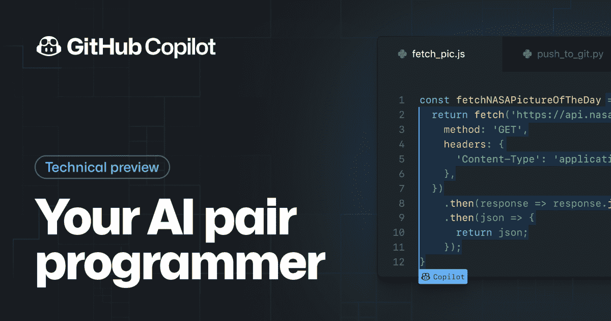
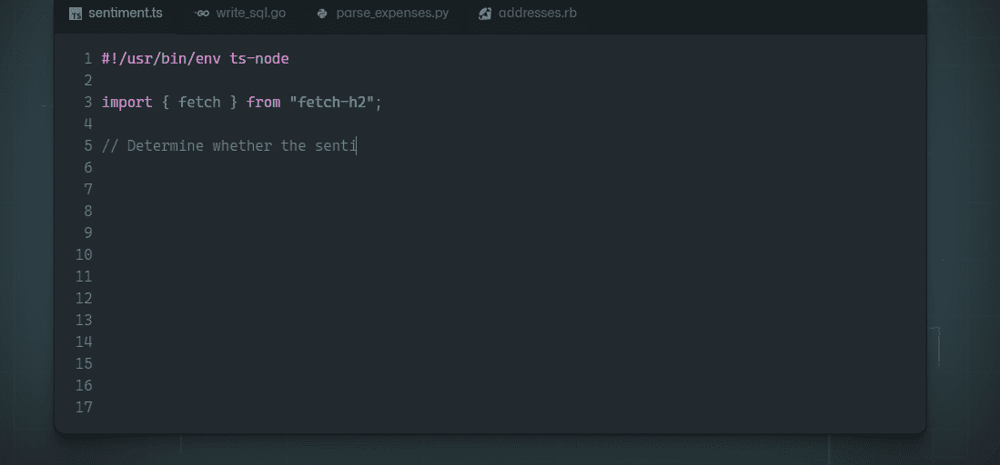

# VS 代码中的 GitHub Copilot

> 原文：<https://javascript.plainenglish.io/github-copilot-in-vs-code-2c3d3062c707?source=collection_archive---------6----------------------->

## VS 代码

## 什么是 GitHub Copilot，如何在 VS 代码中使用？

GitHub Copilot 是一款像 GitHub 官网描述的*“你的 AI 结对程序员”的工具。这是一个助手工具，可以用来自动完成你的代码，帮助你修复错误，或者节省时间。*

## 什么是 GitHub Copilot？

通过这个工具，您可以在决定如何编写您想要的代码方面获得更快的支持。它为您提供了一系列代码建议，您可以浏览并接受您最喜欢的代码。

该机器人接受了一系列英语语言和来自公开来源的源代码的训练，包括公共 GitHub 库持有的由其用户创建的代码。

GitHub Copilot 可以嵌入的每种编程语言都有一组用于创建注释的字符。在这种情况下，注释用于描述您希望 bot 生成的代码的范围(最多 10 条建议)。该机器人还可以在评论中为您的请求生成一个结尾。

每次你想生成你的请求，在评论上就会出现一个菜单栏，里面有几个带有快捷键的选项:

*   *下一条*或`Ctrl + ]` —将显示列表中的下一条建议；
*   *上一条*或`Ctrl + [` —将显示列表上的上一条建议；
*   *接受*或`Tab` —将为您生成一个代码，提示您已接受；
*   *打开 GitHub Copilot* 或`Ctrl + Enter`——将在左侧打开一个侧窗口，最多显示 GitHub Copilot 提供的 10 条建议

## 如何获得？

这个问题有两种答案。要让这个机器人在 VS 代码中工作，你可以去 VS 代码市场搜索 GitHub Copilot，第一个显示的就是我们需要的。

虽然看起来这是我们所需要做的，但不幸的是，这并不奏效。这个机器人有一个队列类型的系统来获取对这个软件的访问。首先，你需要有一个 GitHub 账户来注册 Copilot。

在此期间，您的 GitHub 帐户将接受技术审查。这个过程可能需要长达几个月的时间，但有些情况下确实需要等待更长时间。在等了大约 3 个月之后，我被接受拥有这个工具。

## 它不应该用来做什么？

这个软件只是为了帮助你完成你的代码之旅，而不是把它从你身边带走。它不是为了取代开发人员或您的工作而创建的，而是为了帮助实现心中的某个目标。

GitHub Copilot 是一个非常强大的工具，它的想法是正确的，但它远非完美。它只能做人们能做的事，它不能做好每一件事。

## 是免费的吗？

目前，它是完全免费的，如果你愿意注册 GitHub 的候补名单。尽管 GitHub Copilot 已经上市——可以免费注册，但它仍处于测试阶段，因此还在等待名单中。

我们可以假设 GitHub 在这个机器人的第一个主要版本发布后，使它成为一个付费服务，因为它仍然是一个改变世界的工具，但这些只是假设。

## 结论

GitHub Copilot 是一个令人难以置信的工具，直到今天，只有少数人工智能被制造出来，而且远没有那么成功。正如我前面说过的，像朋友一样使用它是正确的，它会指导你，有时会帮助你，但不会为你写所有的东西。有了正确的想法，你可以实现伟大的项目和光明的未来，希望你明智地使用这个工具。

*更多内容请看*[***plain English . io***](https://plainenglish.io/)*。报名参加我们的**[***免费周报***](http://newsletter.plainenglish.io/) *。关注我们关于*[***Twitter***](https://twitter.com/inPlainEngHQ)*和*[***LinkedIn***](https://www.linkedin.com/company/inplainenglish/)*。查看我们的* [***社区不和谐***](https://discord.gg/GtDtUAvyhW) *加入我们的* [***人才集体***](https://inplainenglish.pallet.com/talent/welcome) *。**