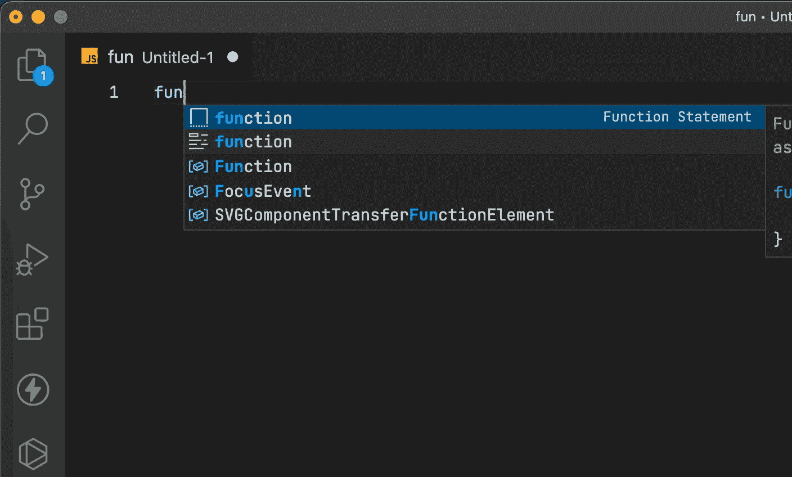
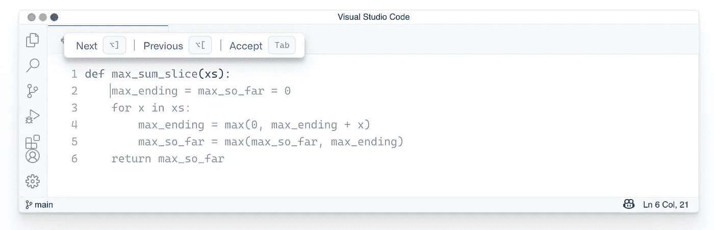
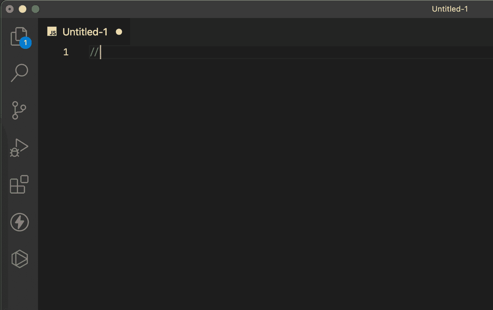
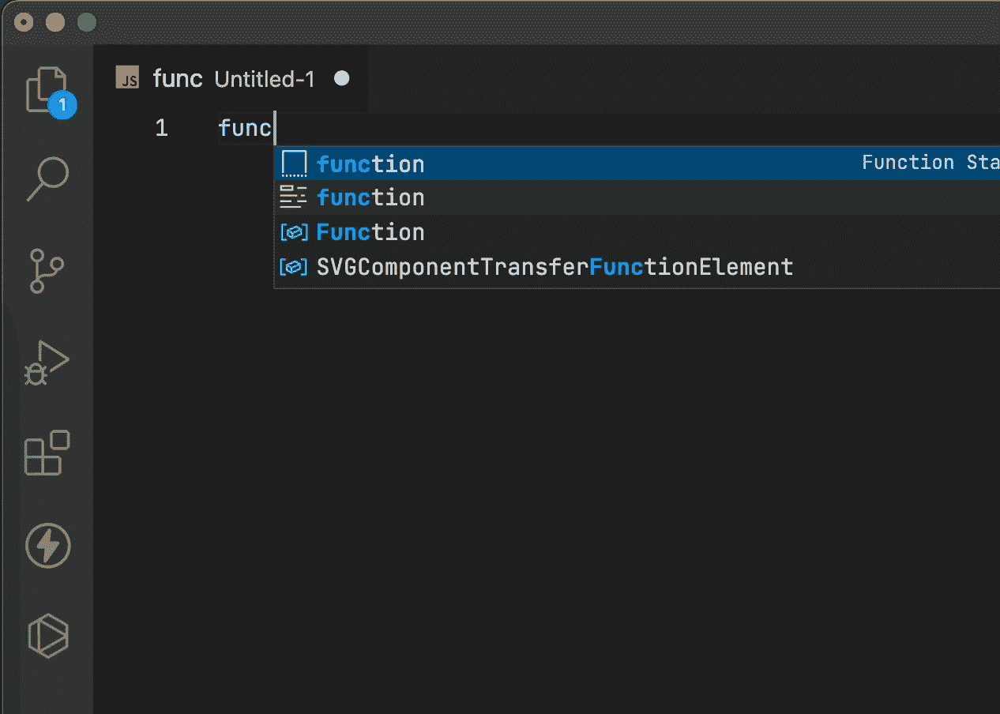
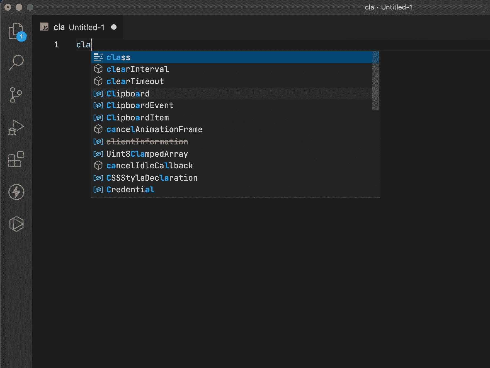
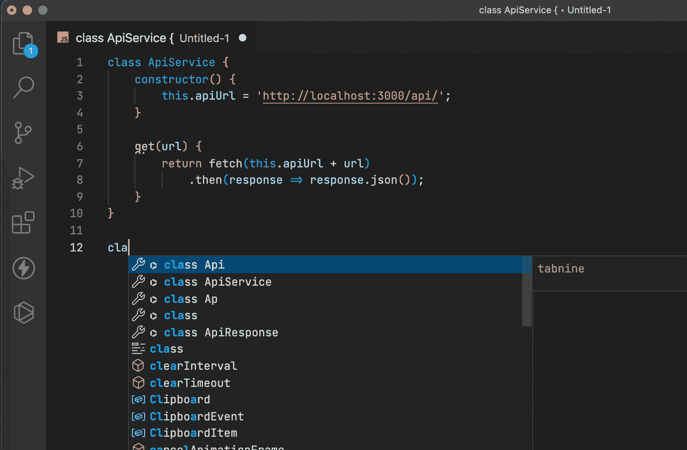
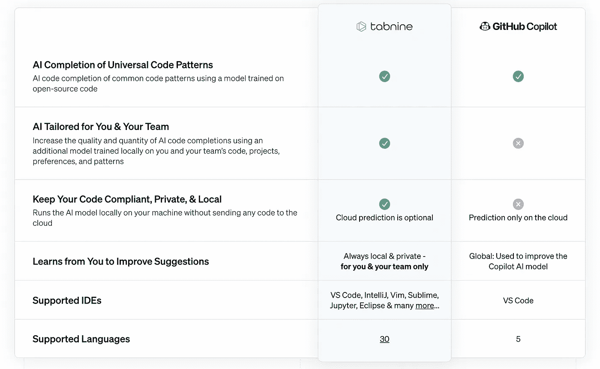

# Github Copilot:使用 3 个月后的回顾及示例

> 原文：<https://javascript.plainenglish.io/github-copilot-review-after-3-months-of-usage-with-examples-74335cd45478?source=collection_archive---------1----------------------->

## 它在真正的项目中是如何进行的，它真的有帮助吗？

Purchased on Shutterstock, edited by me 😊

三个月前，我被允许用我的私人 Github 账户使用 Github Copilot，从那时起，我可以在日常编程中使用这个工具。在这期间，我有机会用基于 LitElement、Node.js (TS)和 VanillaJS 项目的 Angular web 组件对它进行测试。那么，让我们看看配对编程的人工智能是如何帮助我们的，它真的有帮助吗？

# GitHub 副驾驶到底是什么？

GitHub Copilot 是由 GitHub 和 OpenAI 创建的一个人工智能工具，用来帮助程序员使用自动完成编写代码。Visual Studio Code、Neovim 和 JetBrains 用户已经可以使用这个插件了。

GitHub Copilot 由 OpenAI Codex 模型提供动力，在自然语言和数十亿公共源代码行(包括 GitHub 项目)上接受过培训。

GitHub 上的 Copilot 工具可以编写代码，也可以提供另一种选择。该服务支持所有编程语言，但最适合 Python、JavaScript、TypeScript、Ruby、Java 和 Go。

根据他们的数据，在 2021 年 7 月试用期过后，GitHub 上 50%的开发人员继续使用该服务。

# 如何使用它？

副驾驶当前处于“技术预览”状态。技术预览对有限数量的测试人员开放。要加入候补名单，请访问[copilot.github.com](https://copilot.github.com/)。

要使用 GitHub Copilot，您首先需要安装 Visual Studio 代码扩展。

1.  访问 Visual Studio Code Marketplace(或 JetBrains marketplace)上的 [GitHub Copilot 扩展版](https://marketplace.visualstudio.com/items?itemName=GitHub.copilot)页面并安装该扩展版。
2.  打开 Visual Studio 代码。登录 GitHub 时，系统会提示您授权该扩展。
3.  在您授权扩展后，Github 会将您返回到 Visual Studio 代码。

安装后，您需要打开或为支持的语言创建一个新文件，并开始键入代码。

例如:

1.  创建一个新的 JavaScript()。js)文件。
2.  开始声明任何函数并等待魔法。

A function declaration with Github Copilot

就这样。如果您不喜欢建议的代码，您可以使用键盘快捷键在选项之间切换。

Picture from [copilot.github.com](https://copilot.github.com/) documentation

# 可用性

我会从消极的方面开始，因为没有太多的话题，以积极的方面结束总是更令人愉快。

## 有什么可以改进的

首先，我想在上面的 GIF 上强调我是如何删除 Copilot 后面的多余括号的。在这三个月里，我经常这样做。尤其是当您编写条件或新函数时。

对我来说，第二个问题是 HTML。我知道它没有被列为一种受支持的语言，但是默认情况下，Copilot 总是提出代码。也许我在写一个超级不可预测的布局，或者也许我不够幸运，但是我从来没有收到过可接受的代码自动完成。

就是这样。现在我只想谈谈积极的事情，因为这是真正的魔法。

## 什么是好的

Github Copilot 最重要的价值是节省您阅读文档的时间。例如，你记得箭头按钮的按键代码来处理点击吗？我也不知道。幸运的是，有了 Copilot，**你不必记住关键代码**或在谷歌搜索它。取而代之的是，只需输入你想要什么。

Keyboard events handling with Copilot

而且，你甚至不需要搜索**公式**。比如**如何把华氏温度换算成摄氏温度**。

Convert Fahrenheit to Celsius degrees with Copilot

太棒了，对吧？

但是它不仅在流行的功能上工作得很好。它可以完美地识别文件的上下文，并尝试编写代码，而不是重用现有的变量和函数。

让我向你展示如何使用 GitHub Copilot 编写一个 API 服务类。

Writing API service with Copilot.

你看到了吗？从一开始，它甚至提出了整个类的方法。但是当我更改构造函数并添加主机和 JWT 字符串时，它采用并建议使用我的变量编写 get 和 post 方法。

此外，它还能识别 JWT 变量名，并知道如何使用它。它给请求添加了一个头:`“Authorization”: “Bearer “ + this.jwt`。

最后但并非最不重要的是它如何在类之间工作。例如，Copilot 可以分析导入或现有的方法，并重用它们。即使它们在其他类或对象中。

Reusing service methods in another classes with Copilot

# 与泰伯宁相比，它是如何工作的？

像 Github Copilot VS Tabnine 这样的话题很受欢迎，Tabnine 网站上甚至还有对比页面。

Comparison from Tabnine site

> 是的，对于 Copilot 来说，这是一个重大的不利因素，因为你的代码会被传到云端进行分析，这对大公司来说是一个巨大的安全问题。所以在使用之前，要确保你被允许这样做。

出于这个原因，我不会冒险从事我主要工作的项目。Tabnine 在本地工作，保护您的隐私。还有，Tabnine 离线工作。

但是我看不出有什么理由去比较其他的东西，因为你可以理想地一起使用它们。我不得不不时地删除多余的括号，但这种情况即使在标准与代码智能感知中也会发生。

可以开始打东西了。首先，Tabnine 会建议一些方法，然后 Copilot 会编写剩下的代码🤖。

这些公司还有一个陷阱。面试时，公司经常要求应聘者完成测试任务。例如，编写算法或实现聚合填充。

如果候选人在自己安装了 Copilot 的笔记本电脑上完成任务，他可以简单地输入他的任务作为评论，Copilot 会完成剩下的工作。我已经有机会在实际面试中遇到这样一位“聪明”的候选人。

像许多其他新技术一样，Copilot 不仅带来了许多生活改善，也带来了政策和程序方面的问题。无论如何，我真的很喜欢它，并将它用于我的项目。

感谢阅读！并确保您的公司允许您使用 Copilot 扩展。

如果你喜欢我的帖子，出于某种原因，你仍然不是一个媒体成员，你可以支持我，并通过这个链接获得会员资格。

 [## 通过我的推荐链接加入媒体

### 作为一个媒体会员，你的会员费的一部分会给你阅读的作家，你可以完全接触到每一个故事…

golosay.medium.com](https://golosay.medium.com/membership) 

*更多内容看* [***说白了。报名参加我们的***](http://plainenglish.io/) **[***免费周报***](http://newsletter.plainenglish.io/) *。在我们的* [***社区获得独家访问写作机会和建议***](https://discord.gg/GtDtUAvyhW) *。***